# Week 02: Blender 5.0 설치 & 기초 조작

## 📑 목차

- [학습 목표](#학습-목표)
- [영상 구성](#영상-구성-총-42분)
- [설치](#설치)
- [프리퍼런스 설정](#프리퍼런스-설정)
- [UI 구조](#ui-구조)
  - [3D Viewport](#3d-viewport-뷰포트--메인-작업-공간)
  - [Outliner](#outliner-아웃라이너--씬-목록-관리자)
  - [Properties](#properties-프로퍼티--세부-설정-패널)
  - [Timeline](#timeline-타임라인--애니메이션-시간축)
- [뷰포트 조작](#뷰포트-조작)
- [Transform 기초](#transform-기초)
- [3D Cursor · Origin · Transform Pivot 완전 정복](#3d-cursor--origin--transform-pivot-완전-정복)
  - [3D Cursor (3D 커서)](#3d-cursor-3d-커서)
  - [Origin (오리진)](#origin-오리진)
  - [Transform Pivot Point](#transform-pivot-point)
- [Apply Transform & Origin](#apply-transform--origin)
  - [왜 따로 있을까? — Origin vs 3D Cursor](#-근데-왜-따로-있을까--origin과-3d-cursor가-분리된-진짜-이유)
- [Join / Separate / Bridge](#join--separate--bridge)
  - [Join (Ctrl+J)](#join-ctrlj--오브젝트-합치기)
  - [Separate (P)](#separate-p--오브젝트-분리)
  - [Bridge Edge Loops](#bridge-edge-loops--두-루프를-면으로-연결)
- [기본 도형으로 나만의 장면 만들기](#기본-도형으로-나만의-장면-만들기)
- [흔한 실수](#️-흔한-실수)
- [과제](#과제)
- [주차 체크리스트](#-주차-체크리스트)
- [참고 자료](#참고-자료)

---

## 학습 목표

### 🎯 핵심 5개 (수업 내 달성 목표)

- [ ] Blender 5.0을 설치하고 기본 환경 설정을 완료할 수 있다
- [ ] 뷰포트를 자유롭게 회전·이동·줌 할 수 있다
- [ ] G·R·S + 축 제한으로 오브젝트를 원하는 위치에 배치할 수 있다
- [ ] Apply Transform(Ctrl+A)을 습관처럼 적용할 수 있다 ⭐
- [ ] Blender MCP를 연결하고 기본 명령 실행에 성공할 수 있다

### 📎 부가 목표 (시간 여유 시 / 다음 주 이월 가능)

- [ ] Blender UI 4개 영역의 역할을 설명할 수 있다
- [ ] 3D Cursor를 Shift+S로 정밀 이동할 수 있다
- [ ] Origin(오리진)의 역할을 이해하고 Set Origin으로 조정할 수 있다
- [ ] Transform Pivot Point 5가지 옵션의 차이를 구분할 수 있다
- [ ] Join·Separate·Bridge 개념을 알고 있다 (심화는 Week 3에서)

> ⚠️ **강사 노트:** 9개 목표를 3시간에 모두 달성하기는 타이트합니다. 특히 Blender 미설치 학생이 많거나 MCP 설치에 문제가 생기면 시간이 부족해집니다.
>
> **시간 부족 시 우선순위:**
> 1. 핵심 5개는 반드시 완수
> 2. MCP 연결이 막히면 수업 시연만 하고 "MCP 설치는 과제로 제출"로 전환
> 3. 3D Cursor/Origin/Pivot Point는 Week 3 시작 시 복습 형태로 재소개 가능

---

## 영상 구성 (총 ~42분)

| # | 영상 제목 | 시간 |
|---|-----------|------|
| Seg A | 설치 & 환경설정 | 7분 |
| Seg B | 화면 구조 & 뷰포트 조작 | 10분 |
| Seg C | Transform & Apply Transform | 11분 |
| Seg D | 3D Cursor · Origin · Transform Pivot | 14분 |

---

## 설치

1. https://www.blender.org/download/ 에서 OS에 맞는 버전 다운로드
2. **Mac**: .dmg → Blender를 Applications 폴더로 드래그
3. **Windows**: .msi → Next → Install
4. 첫 실행 → Splash Screen에서 **General** 선택

> 💡 **Apple Silicon(M1·M2·M3) 사용자**: macOS Apple Silicon 버전을 받아야 합니다

---

## 프리퍼런스 설정

`Edit → Preferences` 에서 아래 항목 설정 후 **Save Preferences** 클릭

| 탭 | 설정 항목 | 값 |
|----|-----------|-----|
| System | GPU Compute | CUDA(NVIDIA) / Metal(Apple) 체크 |
| Input | Emulate Numpad | ✅ 체크 (노트북 필수) |
| Input | Emulate 3 Button Mouse | 마우스 휠 없으면 체크 |
| Interface | Resolution Scale | 고해상도 모니터는 1.2~1.5 |

---

## UI 구조

Blender를 처음 열면 4개의 주요 영역이 보입니다.
각 영역은 독립된 **Editor**이며, 좌상단 아이콘을 클릭해 언제든 다른 타입으로 바꿀 수 있습니다.

```
┌─────────────────────────────────────────────────────┐
│  Topbar  (File / Edit / Render / Window / Help)      │
├──────────────────────────────┬──────────────────────┤
│                              │  [🔍] Outliner       │
│     3D Viewport              │  ▾ Scene Collection  │
│     (작업 공간)               │    ▸ Camera          │
│                              │    ▸ Cube            │
│                              │    ▸ Light           │
│                              ├──────────────────────┤
│                              │  [🔧] Properties     │
│                              │  🖥 Scene            │
│                              │  🌍 World           │
│                              │  📐 Object          │
│                              │  ⚙ Modifier         │
│                              │  🎨 Material        │
├──────────────────────────────┴──────────────────────┤
│  [⏱] Timeline  ◀◀ ◀ ▶ ▶▶   Frame: 1   End: 250     │
└─────────────────────────────────────────────────────┘
```

---

### 3D Viewport (뷰포트) — 메인 작업 공간

> "3D 뷰포트는 Blender의 심장입니다. 모델링, 배치, 애니메이션까지 거의 모든 작업이 여기서 시작됩니다."

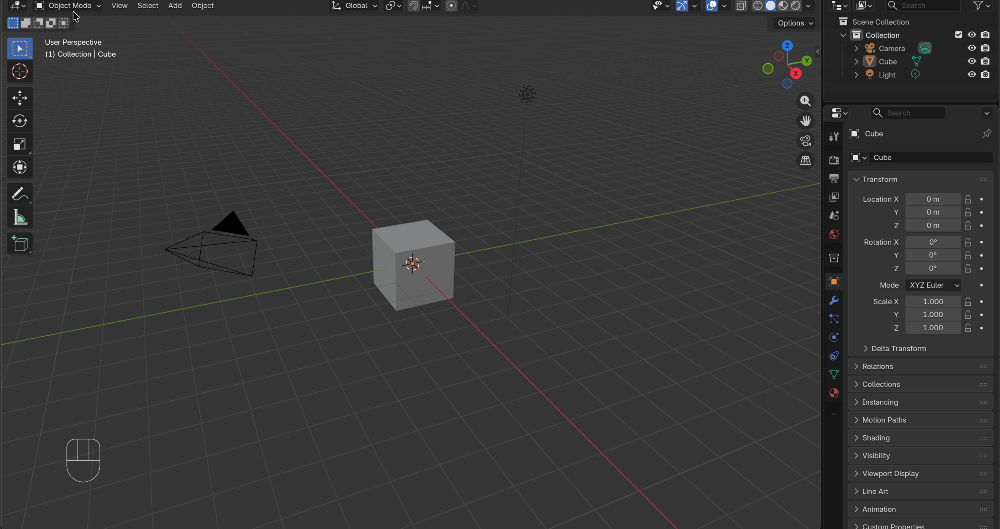

**뷰포트 Header (상단 바)**

뷰포트 최상단 줄에는 작업 맥락을 제어하는 핵심 컨트롤이 있습니다.

```
[Object Mode ▾]  [View] [Select] [Add] [Object]     [⬚ Overlay▾] [🔵 Shading]
      ①                  ②                                 ③           ④
```

| # | 이름 | 설명 |
|---|------|------|
| ① | **Mode Selector** | Object / Edit / Sculpt 등 작업 모드 전환 (`Tab` 키로도 전환) |
| ② | **메뉴 바** | View·Select·Add·Object 등 상황별 메뉴 |
| ③ | **Overlay** | 와이어프레임, 통계, 그리드 등 표시 옵션 |
| ④ | **Viewport Shading** | Solid / Wireframe / Material / Rendered 전환 |

**뷰포트 좌측 — Tool Shelf (T 패널)**

`T` 키를 누르면 좌측에 툴 팔레트가 나타납니다.

| 아이콘 | 도구 | 단축키 |
|--------|------|--------|
| 커서 | Select Box | W |
| 이동 화살표 | Move | G |
| 회전 원 | Rotate | R |
| 크기 화살표 | Scale | S |
| 변환 통합 | Transform | — |

> 💡 실제 작업에서는 마우스를 들지 않고 단축키(G·R·S)를 더 많이 씁니다. 툴 팔레트는 입문 단계에서 확인용으로 활용하세요.

**뷰포트 우측 — Item / View / Tool 패널 (N 패널)**

`N` 키를 누르면 우측에 수치 패널이 나타납니다.

| 탭 | 내용 |
|----|------|
| **Item** | 선택된 오브젝트의 위치(Location)·회전(Rotation)·크기(Scale) 수치 표시 |
| **View** | 카메라 렌즈·클리핑 거리 설정 |
| **Tool** | 현재 선택된 툴의 세부 옵션 |

> 💡 N 패널의 **Item 탭**은 G·R·S 조작 후 정확한 수치를 확인하거나 직접 입력할 때 매우 유용합니다.

**뷰포트 우상단 — Navigation Gizmo**

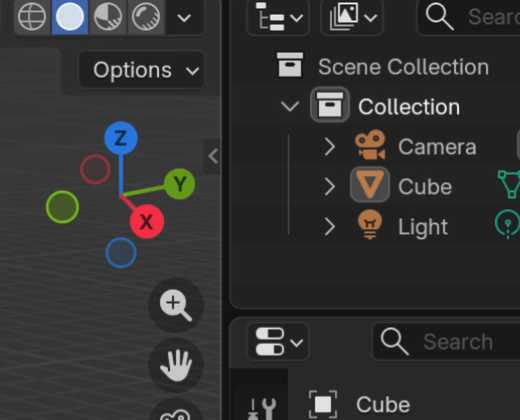

뷰포트 오른쪽 상단의 나침반 모양 기즈모입니다.

- **축 클릭** → 해당 방향 정면 뷰로 즉시 이동 (X = 측면, Y = 정면, Z = 상단)
- **가운데 격자** 클릭 → 원근(Perspective) ↔ 직교(Orthographic) 전환
- MMB 대신 **드래그**로도 뷰 회전 가능

**작업 모드 (Mode)**

`Tab` 키 또는 상단 Mode Selector로 전환합니다.

| 모드 | 용도 | 주로 쓰는 시기 |
|------|------|----------------|
| **Object Mode** | 오브젝트 배치·이동·복제 | 씬 전체 구성 |
| **Edit Mode** | 버텍스·엣지·페이스 편집 | 메시 형태 변경 |
| **Sculpt Mode** | 점토처럼 형태 조각 | 유기체 모델링 (Week 05) |

> ⚠️ 가장 흔한 실수: **Edit Mode**에서 작업해야 하는데 **Object Mode**에서 G를 눌러 오브젝트 전체가 이동되는 경우. 항상 상단 Mode 확인!

**Edit Mode 선택 모드 (1 · 2 · 3)**

Edit Mode(`Tab`)에 진입하면 상단 Header에 3가지 선택 모드 버튼이 나타납니다.

```
  [·]  [/]  [▣]
   1    2    3
```

| 키 | 모드 | 선택 단위 | 설명 |
|----|------|-----------|------|
| **1** | **Vertex** (점) | 꼭짓점 하나하나 | 가장 세밀한 조작. 점을 이동해 형태를 변형 |
| **2** | **Edge** (선) | 두 꼭짓점을 잇는 선분 | 엣지 루프 선택·슬라이드에 유용 |
| **3** | **Face** (면) | 면 하나 | 면 돌출(Extrude)·삭제 등에 사용 |

> 💡 `Shift`를 누르고 모드 키를 추가로 누르면 **복수 모드 동시 선택**도 가능합니다 (예: `1` 선택 후 `Shift+2` → Vertex + Edge 동시).

**선택 방법 정리**

| 조작 | 동작 |
|------|------|
| **클릭** | 요소 1개 선택 (기존 선택 해제) |
| **Shift + 클릭** | 추가/해제 선택 (기존 유지하며 토글) |
| **Alt + 클릭** | **루프 선택** — 연결된 요소를 한 줄로 쭉 선택 |
| **Shift + Alt + 클릭** | 루프를 **추가 선택** (기존 선택 유지하며 루프 추가) |
| **A** | 전체 선택 / 전체 해제 |
| **B** | Box Select — 드래그로 사각 영역 선택 |
| **C** | Circle Select — 브러시처럼 칠해서 선택 (휠로 크기 조절, 우클릭 종료) |
| **Ctrl + 클릭** | Shortest Path — 마지막 선택에서 클릭한 곳까지 최단 경로 선택 |
| **L** | Linked Select — 마우스 아래 연결된 덩어리 전체 선택 |

```
   Alt+클릭 예시 (Edge 모드에서)

   ┌──┬──┬──┬──┐         ┌──┬──┬──┬──┐
   │  │  │  │  │         │  ║  │  │  │
   ├──┼──┼──┼──┤   →     ├──╬══╬══╬══╡   Alt+클릭으로
   │  │  │  │  │         │  ║  │  │  │   세로 엣지 루프
   ├──┼──┼──┼──┤         ├──╬══╬══╬══╡   한 줄이 쭉 선택됨
   │  │  │  │  │         │  ║  │  │  │
   └──┴──┴──┴──┘         └──┴──┴──┴──┘
```

> 💡 **Alt+클릭 루프 선택**은 Bridge Edge Loops, Loop Cut, 부분 선택 후 Separate 등 거의 모든 Edit Mode 작업의 기본이 됩니다. 꼭 연습해 두세요!

---

### Outliner (아웃라이너) — 씬 목록 관리자

> "아웃라이너는 씬의 '레이어 목록'입니다. Photoshop의 레이어 패널과 같은 역할입니다."

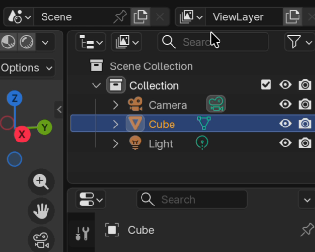

Blender를 처음 열면 기본으로 **Camera, Cube, Light** 3개의 오브젝트가 있습니다.

**아이콘으로 오브젝트 타입 파악**

| 아이콘 | 타입 |
|--------|------|
| ▲ (삼각형) | 메시 (Mesh) |
| 📷 | 카메라 |
| 💡 | 라이트 |
| 🦴 | 아마추어 (리깅용 뼈대) |
| 📦 | 컬렉션 (폴더) |

**우측 가시성 컨트롤 (클릭해서 토글)**

```
[오브젝트 이름]     👁  🖱  📷  🚫
                    ①  ②  ③  ④
```

| # | 아이콘 | 기능 |
|---|--------|------|
| ① | 👁 눈 | 뷰포트에서 보이기/숨기기 (`H` 키와 동일) |
| ② | 🖱 커서 | 뷰포트에서 선택 가능/불가 |
| ③ | 📷 카메라 | 렌더 시 포함 여부 |
| ④ | 🚫 제외 | 레이어캐스트·그림자 등 |

> 💡 **컬렉션(Collection)**을 활용하면 오브젝트를 폴더처럼 그룹화할 수 있습니다. 복잡한 씬에서 `M` 키로 컬렉션에 오브젝트를 넣어 정리하세요.

**계층(Hierarchy) 읽기**

```
▾ Scene Collection
  ▾ Collection
    ▸ Armature        ← 부모
      ▸ Body_Mesh     ← 자식 (들여쓰기로 표시)
      ▸ Head_Mesh
```

들여쓰기로 부모-자식 관계를 표시합니다. 부모를 이동하면 자식도 함께 움직입니다.

---

### Properties (프로퍼티) — 세부 설정 패널

> "Properties는 선택된 오브젝트의 모든 속성이 모인 '설정판'입니다. 탭마다 완전히 다른 내용을 담고 있습니다."

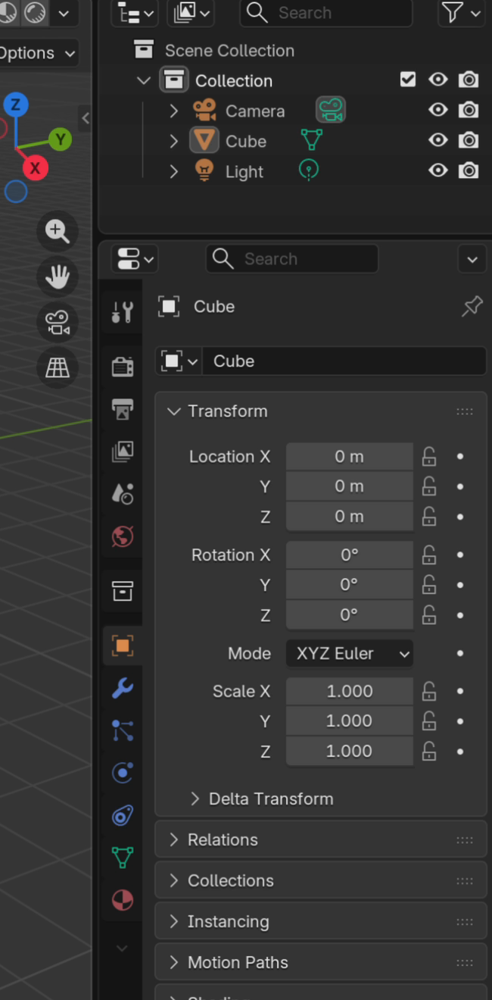

Properties 패널의 **왼쪽 세로 탭 목록**을 익히는 것이 핵심입니다.

**주요 탭 (상단 → 하단 순서)**

| 탭 아이콘 | 탭 이름 | 내용 | 자주 쓰는 시기 |
|-----------|---------|------|----------------|
| 📷 | **Render Properties** | 렌더 엔진, 해상도, 샘플 수 | 최종 렌더 설정 (Week 13) |
| 📤 | **Output Properties** | 저장 경로, 파일 형식 | 렌더 출력 |
| 🌍 | **World Properties** | 배경색, HDRI 환경 | 조명 설정 (Week 09) |
| 📐 | **Object Properties** | Location / Rotation / Scale 수치, 가시성 | Transform 확인 필수 |
| 🔧 | **Modifier Properties** | Subdivision, Boolean, Array 등 | 모델링 작업 (Week 03~) |
| 🔵 | **Material Properties** | 색상, 금속/비금속, 거칠기 | 재질 설정 (Week 06) |
| 📊 | **Object Data Properties** | 버텍스 그룹, UV 맵, Shape Key | 메시 세부 데이터 |

> 💡 지금 당장 가장 중요한 탭: **Object Properties (📐)** — 여기서 Scale이 (1,1,1)인지 확인합니다.

**Object Properties 탭 상세 (📐)**

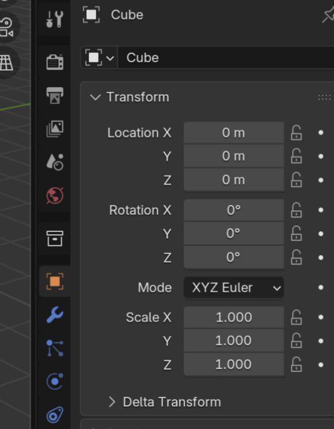

```
Transform
  Location X: 0 m   Y: 0 m   Z: 0 m
  Rotation  X: 0°   Y: 0°   Z: 0°
  Scale     X: 1    Y: 1    Z: 1    ← 이 값이 1,1,1이어야 정상

Visibility
  [✅] Show in Viewports
  [✅] Show in Renders
```

> ⚠️ Scale 값이 (1,1,1)이 아니면 → `Ctrl + A → Apply All Transforms`

---

### Timeline (타임라인) — 애니메이션 시간축

> "타임라인은 '애니메이션 전용 영역'입니다. 지금은 구조만 파악하고, 자세한 내용은 Week 10에서 다룹니다."

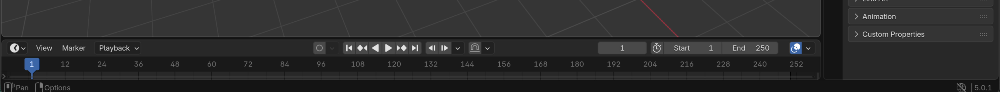

```
◀◀  ◀  ▶  ▶▶    Frame: [  1  ]    Start: 1   End: 250
  재생 컨트롤          현재 프레임        재생 구간
```

| 요소 | 설명 |
|------|------|
| **Playhead (파란 세로선)** | 현재 시간 위치 (드래그로 이동) |
| **▶ Play / Space** | 애니메이션 재생·정지 |
| **키프레임 마커 (노란 점)** | 해당 프레임에 저장된 오브젝트 상태 |
| **Start / End** | 애니메이션 재생 구간 (기본 1~250 프레임 = 약 10초) |

> 💡 지금 바로 써볼 것: Cube를 선택하고 `I` 키 → Location 선택 → 프레임 이동 → 다시 `I` → 재생! 키프레임의 원리를 미리 체험해보세요.

---

### 📸 스크린샷 촬영 가이드 (강의 자료용)

아래 이미지는 현재 `images/` 폴더에 채워두었습니다.
다음에 같은 자료를 다시 만들 때는 같은 구도로 촬영하면 강의 흐름을 유지하기 쉽습니다.

| 파일명 | 캡처 내용 | 팁 |
|--------|-----------|-----|
| `viewport_overview.png` | 3D 뷰포트 전체 (기본 Cube 씬) | Blender 기본 실행 상태 |
| `viewport_gizmo.png` | 우상단 Navigation Gizmo 클로즈업 | 줌인해서 캡처 |
| `outliner_overview.png` | Outliner 패널 (Camera, Cube, Light) | 아웃라이너 우클릭 메뉴까지 |
| `properties_tabs.png` | Properties 패널 탭 전체 목록 | 세로 탭 아이콘이 다 보이게 |
| `properties_object.png` | Object Properties 탭 열린 상태 | Scale (1,1,1) 보이게 |
| `timeline_overview.png` | Timeline 전체 (재생바 포함) | 기본 상태 |
| `3d_cursor_overview.png` | 뷰포트 안 3D Cursor가 보이는 상태 | 기본 씬에서 Cursor 빨간-흰 원 보이게 |
| `3d_cursor_snap_menu.png` | Shift+S 파이 메뉴 | Cursor 위에 열린 상태 |
| `origin_overview.png` | 오브젝트 선택 시 주황 점(Origin) 위치 | Cube 선택 후 Origin 점 클로즈업 |
| `origin_set_menu.png` | 우클릭 → Set Origin 메뉴 | 메뉴 항목 전부 보이게 |
| `origin_offcenter.png` | Origin이 어긋난 상태 vs 수정 비교 | 나란히 두 상태 캡처 |
| `pivot_point_menu.png` | 뷰포트 Header의 Pivot 선택기 드롭다운 | 5가지 옵션이 다 보이게 |
| `pivot_individual.png` | Individual Origins로 각자 스케일 비교 | 전후 상태 |
| `pivot_3dcursor.png` | 3D Cursor 기준 회전 결과 | Cursor 위치와 회전 중심 일치 확인 |

> Mac 스크린샷: `Cmd + Shift + 4` → 드래그 캡처
> Windows: `Win + Shift + S` → 캡처 도구

---

## 뷰포트 조작

> **핵심 개념**: 뷰포트 조작 = 오브젝트가 아닌 나의 시점(카메라)을 움직이는 것

| 조작 | 방법 |
|------|------|
| 뷰 회전 | Middle Mouse Button(MMB) 드래그 |
| 뷰 이동 | Shift + MMB 드래그 |
| 줌 | 마우스 휠 |
| 정면 뷰 | Numpad **1** |
| 측면 뷰 | Numpad **3** |
| 상단 뷰 | Numpad **7** |
| 카메라 뷰 | Numpad **0** |
| 원근/직교 전환 | Numpad **5** |

### Shading 모드 (Z 키 Pie Menu)

| 모드 | 용도 |
|------|------|
| **Solid** | 기본 작업 (빠름) |
| **Wireframe** | 메시 구조 확인 |
| **Material Preview** | 재질 미리보기 |
| **Rendered** | 렌더 결과 확인 (느림) |

> 💡 Gizmo(뷰포트 오른쪽 상단 나침반)를 클릭해도 뷰를 전환할 수 있습니다

---

## Transform 기초

| 키 | 기능 | 예시 |
|----|------|------|
| **G** | 이동 (Grab) | G → 마우스 이동 → 클릭 |
| **R** | 회전 (Rotate) | R → 마우스 → 클릭 |
| **S** | 크기 (Scale) | S → 마우스 → 클릭 |

### 축 제한 패턴

```
G + X          → X축으로만 이동
G + X + 2 + Enter  → X축으로 정확히 2 이동
R + Z + 45 + Enter → Z축 기준 45도 회전
S + 0.5 + Enter    → 절반 크기로 축소
G + Shift + Z  → Z 제외(XY 평면)에서만 이동
```

**취소**: 조작 중 우클릭 또는 ESC | **되돌리기**: Ctrl + Z

---

## 3D Cursor · Origin · Transform Pivot 완전 정복

> "이 세 가지를 구분하지 못하면 '왜 이상한 방향으로 회전하지?', '왜 새 오브젝트가 엉뚱한 곳에 생기지?' 라는 의문이 계속 생깁니다. 이 섹션을 읽고 나면 그 의문들이 한 번에 해결될 거예요!"

---

### 3D Cursor (3D 커서)

> 📌 **한 줄 요약**: "내가 원하는 곳에 꽂아두는 임시 표시핀"


**3D Cursor가 뭔가요?**

뷰포트 안에 떠있는 **빨간-흰색 조준십자 마커**입니다.
처음엔 그냥 장식처럼 보이지만, 알고 나면 없어서는 안 될 도구예요.

```
뷰포트 안에서 보이는 모습:

         ╋  ← 3D Cursor (빨간/흰 교차 원 + 십자선)
        / \
       ×   ×
        \ /
         ×
```

**3D Cursor의 두 가지 핵심 역할**

| 역할 | 설명 | 예시 |
|------|------|------|
| **새 오브젝트의 탄생 위치** | `Shift+A`로 추가하는 모든 오브젝트는 Cursor가 있는 곳에 생성됩니다 | "탁자 위에 컵을 놓고 싶어" → Cursor를 탁자 위로 이동 후 `Shift+A` |
| **Transform의 기준점** | Pivot을 "3D Cursor"로 설정하면 모든 회전·스케일이 Cursor를 중심으로 작동합니다 | "여러 의자를 테이블 중앙 기준으로 둥글게 배치" |

---

#### 3D Cursor 조작법

##### 위치 바꾸기 — `Shift + 우클릭`

```
Shift + 우클릭 → 클릭한 위치로 Cursor 이동
```

> 💡 예: 바닥 면의 정중앙에 기둥을 세우고 싶다면?
> 1. `Shift + 우클릭`으로 바닥 중앙에 Cursor 놓기
> 2. `Shift + A → Mesh → Cylinder` 추가
> 3. 기둥이 정확히 바닥 중앙에 생깁니다!

##### 원점으로 리셋 — `Shift + C`

```
Shift + C → Cursor를 월드 원점(0, 0, 0)으로 초기화 + 전체 씬 보기
```

> ⚠️ Cursor가 어디 있는지 모를 때: 새 오브젝트를 추가했더니 화면 밖 엉뚱한 곳에 생겼다면, `Shift+C`로 Cursor를 초기화하세요. 이게 **가장 흔한 초보 당황 상황 1위**입니다!

##### 정밀 배치 — `Snap → Cursor to Selected`

이미 만들어진 오브젝트나 버텍스의 **정확한 위치**로 Cursor를 이동하고 싶을 때 씁니다.

```
방법 1: Object Mode에서 오브젝트 선택
        → Header 메뉴 Object → Snap → Cursor to Selected

방법 2: Edit Mode에서 버텍스/엣지/페이스 선택
        → Mesh → Snap → Cursor to Selected
        (또는 Shift + S → Cursor to Selected)
```

```
예시 — 문 경첩 위치를 정확히 잡을 때:

  [문]         [경첩 버텍스]
   ──────────────●
                 ↑
            Cursor to Selected 후
            Cursor가 이 정확한 위치로 이동
```

**Shift + S — Snap Pie Menu (자주 쓰는 단축키)**

`Shift + S`를 누르면 파이 메뉴가 나타납니다.

```
          Cursor to World Origin
                  ↑
  Selected to    [●]    Cursor to Selected
     Cursor    ←   →
                  ↓
           Cursor to Active
```

| 메뉴 항목 | 동작 |
|-----------|------|
| **Cursor to Selected** | Cursor → 선택한 오브젝트/버텍스 위치 |
| **Selected to Cursor** | 선택한 오브젝트 → Cursor 위치로 이동 |
| **Cursor to World Origin** | Cursor → (0,0,0) 초기화 |
| **Cursor to Active** | Cursor → Active 오브젝트 위치 |

> 💡 `Shift+S`는 **정밀 배치**의 핵심입니다. 이것만 익혀도 "여기에 딱 맞게 놓는" 작업이 훨씬 쉬워져요!

**스크린샷 가이드**

| 파일명 | 캡처 내용 |
|--------|-----------|
| `images/3d_cursor_overview.png` | 뷰포트 안 3D Cursor가 보이는 상태 |
| `images/3d_cursor_snap_menu.png` | Shift+S 파이 메뉴 |

**공식 문서**: [3D Cursor — Blender Manual](https://docs.blender.org/manual/en/latest/editors/3dview/3d_cursor.html)

---

### Origin (오리진)

> 📌 **한 줄 요약**: "오브젝트에 붙어있는 '기준 주소지' 주황 점"


**Origin이 뭔가요?**

오브젝트를 선택하면 보이는 **주황색 점**입니다. 이 점이 해당 오브젝트의 "집 주소"예요.

```
  ╭──────────────╮
  │              │   ← 파란 테두리 = 선택된 오브젝트
  │      ●       │   ← 주황 점 = Origin (기준점)
  │              │
  ╰──────────────╯
```

**Origin의 세 가지 역할**

1. **이동·회전·스케일의 기준**: G·R·S 조작은 모두 Origin을 기준으로 계산됩니다
2. **N 패널 Location 수치**: Properties에 표시되는 Location(X,Y,Z) 값이 바로 Origin의 월드 좌표입니다
3. **부모-자식 관계의 연결점**: 리깅에서 뼈대가 오브젝트를 움직일 때 Origin을 기준으로 당깁니다

---

**Origin 위치 조정하기 — `우클릭 → Set Origin`**

오브젝트를 우클릭하면 "Set Origin" 메뉴가 나옵니다.

```
우클릭 → Set Origin
  ├─ Origin to Geometry         ← 메시 중심으로 (★ 가장 많이 씀)
  ├─ Origin to 3D Cursor        ← 3D Cursor 위치로
  ├─ Origin to Center of Mass   ← 물리적 무게 중심으로
  └─ Geometry to Origin         ← 오브젝트는 그대로, 메시를 Origin 쪽으로 이동
```

> **예시로 이해하기:**
>
> 🚪 **문을 경첩에서 회전시키고 싶을 때**
>
> ```
>  기본 상태:                  Origin 이동 후:
>
>  ●──────────┐               ┌──────────●
>  Origin이   │               │          Origin이
>  중앙에 있음│               │          경첩(왼쪽) 위치로
>             │               │
>  R 키 → 중앙 기준 회전       R 키 → 경첩 기준 회전  ✅
> ```
>
> 1. Edit Mode에서 경첩이 있을 왼쪽 엣지 선택
> 2. `Shift+S → Cursor to Selected` (Cursor를 경첩 위치로)
> 3. Object Mode로 복귀 후 `우클릭 → Set Origin to 3D Cursor`
> 4. 이제 `R` 키를 누르면 경첩 기준으로 회전!

**각 옵션 언제 쓰나?**

| 옵션 | 언제 쓰나 | 예시 |
|------|-----------|------|
| **Origin to Geometry** | 오브젝트 중앙으로 Origin 재설정 | Edit Mode에서 버텍스 이동 후 Origin이 어긋났을 때 |
| **Origin to 3D Cursor** | 특정 위치를 Origin으로 | 바닥 기준으로 스케일, 문 경첩 회전 |
| **Origin to Center of Mass** | 물리 시뮬레이션 준비 | Rigid Body 설정 전 |
| **Geometry to Origin** | Origin은 고정, 메시를 맞춤 | 여러 오브젝트의 Origin을 (0,0,0)으로 통일할 때 |

> ⚠️ **Origin ≠ 피벗을 움직이는 것이 아닙니다!**
> Origin을 이동해도 메시 자체는 뷰포트에서 같은 자리에 있습니다.
> 다만 N 패널의 Location 수치가 바뀝니다. 헷갈리지 마세요!

**원점이 어긋났을 때 빠른 수정**

```
증상: 오브젝트를 회전하면 엉뚱한 곳을 중심으로 빙글빙글 돔
원인: Origin이 메시 중앙에 없음

해결:
  Object Mode에서 오브젝트 선택
  → 우클릭 → Set Origin → Origin to Geometry ✅
```

**스크린샷 가이드**

| 파일명 | 캡처 내용 |
|--------|-----------|
| `images/origin_overview.png` | 오브젝트 선택 시 주황 점(Origin) 위치 |
| `images/origin_set_menu.png` | 우클릭 → Set Origin 메뉴 |
| `images/origin_offcenter.png` | Origin이 어긋난 상태 vs 수정된 상태 비교 |

**공식 문서**: [Object Origin — Blender Manual](https://docs.blender.org/manual/en/latest/scene_layout/object/origin.html)

---

### Transform Pivot Point

> 📌 **한 줄 요약**: "G·R·S 조작이 어디를 기준으로 일어날지 정하는 설정"


**Transform Pivot Point가 뭔가요?**

G(이동)는 기준점이 없지만, **R(회전)**과 **S(스케일)**은 반드시 "어디를 중심으로?" 라는 기준점이 필요합니다.
그 기준점을 설정하는 것이 **Transform Pivot Point**입니다.

```
뷰포트 Header (상단 바)에서 위치:

[Object Mode ▾]  [View] [Select] [Add] [Object]  [⬛▾]  [⬚ Overlay▾]
                                                    ↑
                                           Pivot Point 선택기
                                           (점 모양 아이콘)
```

**5가지 Pivot Point 옵션**

| 옵션 | 아이콘 느낌 | 설명 | 언제 쓰나 |
|------|------------|------|-----------|
| **Individual Origins** | 각자 점 | 각 오브젝트가 자기 Origin을 기준으로 회전/스케일 | 여러 나무를 각자 자리에서 키울 때 |
| **Median Point** | 가운데 점 | 선택된 모든 오브젝트의 가운데(평균 위치) | 여러 오브젝트를 묶어서 한꺼번에 조작 |
| **3D Cursor** | Cursor 표시 | 3D Cursor 위치를 기준으로 | 특정 점을 중심으로 오브젝트들을 둥글게 배치 |
| **Bounding Box Center** | 박스 중심 | 선택된 모든 것의 경계 상자 중심 | 복잡한 선택의 물리적 중앙 |
| **Active Element** | 주황 점 | Active(마지막 선택) 오브젝트의 Origin | 특정 오브젝트를 기준으로 나머지를 정렬 |

---

**실전 예시로 완벽 이해하기**

#### 예시 1: 꽃잎 5장을 꽃처럼 배치하기

```
목표: 꽃잎 하나를 만들고, 중앙을 기준으로 72도씩 회전해서 복제

방법:
  1. 꽃잎 오브젝트 만들기
  2. Shift+C로 Cursor를 원점(꽃 중심)으로
  3. Pivot → 3D Cursor 선택
  4. Shift+D → R → Z → 72 → Enter 로 꽃잎 복제+회전
  5. 반복 × 4 → 꽃 완성! 🌸
```

```
Pivot = Median Point 일 때:          Pivot = 3D Cursor 일 때:
  ●●●●●  → 전부 중앙 기준 뭉침       ●●●●● → Cursor(중심) 기준 퍼짐
  (잘못됨)                              (원하는 결과 ✅)
```

#### 예시 2: 여러 오브젝트를 동시에 키우기

```
목표: 방 안에 의자 5개가 있고, 모두 1.5배 키우되 각자 자기 위치에서

Pivot = Median Point:   모든 의자가 방 중앙으로 모임 (엉망)
Pivot = Individual Origins: 각자 자기 위치에서 1.5배 커짐 ✅
```

#### 예시 3: 건물 모서리 기준으로 스케일

```
목표: 건물을 왼쪽 아래 모서리는 고정, 오른쪽 위로만 키우기

  1. Edit Mode에서 왼쪽 아래 버텍스 선택
  2. Shift+S → Cursor to Selected
  3. Object Mode 복귀
  4. Pivot → 3D Cursor
  5. S → X → 2 → Enter : 왼쪽 모서리 고정한 채 X방향으로 2배 확장
```

---

**단축키 요약**

| 단축키 | 동작 |
|--------|------|
| **뷰포트 Header 아이콘 클릭** | Pivot Point 선택 메뉴 열기 |
| **`. (마침표)`** | 개별 원점(Individual Origins) 토글 |
| **`/ (슬래시)`** | 3D Cursor Pivot 토글 (일부 버전) |

> 💡 **Pivot 변경은 임시입니다!** 작업이 끝나면 원래 설정(Median Point)으로 되돌리는 습관을 들이세요.
> 다음 번에 회전이 이상하다면 십중팔구 Pivot Point 설정을 바꾼 채 잊어버린 경우입니다.

**스크린샷 가이드**

| 파일명 | 캡처 내용 |
|--------|-----------|
| `images/pivot_point_menu.png` | 뷰포트 Header의 Pivot 선택기 드롭다운 |
| `images/pivot_individual.png` | Individual Origins로 각자 스케일 비교 |
| `images/pivot_3dcursor.png` | 3D Cursor 기준 회전 결과 |

**공식 문서**: [Pivot Point — Blender Manual](https://docs.blender.org/manual/en/latest/editors/3dview/controls/pivot_point/index.html)

---

### 🔗 세 개념의 관계 한눈에 보기

```
┌─────────────────────────────────────────────────────────────┐
│                                                             │
│   3D Cursor ─────────────→  Origin 이동의 목적지가 된다     │
│       │          Set Origin to 3D Cursor                    │
│       │                                                     │
│       └─────────────────→  Pivot Point로 선택 가능          │
│                             (Transform → 3D Cursor)         │
│                                                             │
│   Origin  ────────────────→  Pivot Point로 선택 가능        │
│                              (Individual Origins,           │
│                               Active Element)              │
│                                                             │
│   Pivot Point ────────────→  R/S 조작의 중심점이 된다       │
│                                                             │
└─────────────────────────────────────────────────────────────┘
```

**비유로 기억하기**

| 개념 | 비유 | 역할 |
|------|------|------|
| **3D Cursor** | 포스트잇 메모 | "여기!" 표시해두는 임시 마커. 어디든 이동 가능 |
| **Origin** | 오브젝트의 주민등록 주소 | 오브젝트에 영구 귀속. 회전·스케일의 기본 기준 |
| **Transform Pivot** | 컴퍼스의 침 | 지금 이 작업에서 어디를 중심으로 할지 선택하는 설정 |

---

**공식 튜토리얼**

- [Blender Studio - 3D Cursor](https://studio.blender.org/training/blender-2-8-fundamentals/3d-cursor/)
- [Blender Studio - Object Origins](https://studio.blender.org/training/blender-2-8-fundamentals/object-origins/)

---

## Apply Transform & Origin

### Apply Transform (Ctrl + A)

**왜 필요한가?**
Scale 값이 (1,1,1)이 아닌 상태에서 Modifier나 내보내기를 하면 형태 왜곡, 리깅 오류 등이 발생합니다.

**언제 해야 하나?**
→ 모디파이어 추가 전 / 리깅 시작 전 / FBX·GLB 내보내기 전

```
Ctrl + A → Apply All Transforms
```
→ Location(0,0,0) / Rotation(0,0,0) / Scale(1,1,1) 확인

### Origin 설정 요약

> ℹ️ Origin의 개념과 Set Origin 옵션 전체는 위 **[Origin (오리진)](#origin-오리진)** 섹션에서 자세히 다뤘습니다.

**Apply Transform 후 Origin 확인 루틴**

```
Ctrl+A → Apply All Transforms 실행
  ↓
Scale (1,1,1) 확인 → OK
  ↓
Origin 위치 확인 (메시 중앙에 있는가?)
  → 어긋났다면: 우클릭 → Set Origin → Origin to Geometry
```

| 자주 쓰는 Set Origin 옵션 | 언제 |
|--------------------------|------|
| **Origin to Geometry** | Apply Transform 후 기본 정리 |
| **Origin to 3D Cursor** | 바닥 기준 스케일, 경첩 기준 회전 등 특수 작업 |

### 🤔 근데 왜 따로 있을까? — Origin과 3D Cursor가 분리된 진짜 이유

**비유: 문 경첩 vs 연필**

- **Origin = 문 경첩** — 문에 고정된 회전축. 문을 열고 닫을 때 항상 경첩을 중심으로 회전합니다.
- **3D Cursor = 연필** — 어디든 자유롭게 놓을 수 있는 표시. "여기에 새 가구 놓자" 표시하거나, "이 점을 기준으로 회전" 같은 임시 기준점으로 쓸 수 있습니다.

경첩을 떼어서 연필 자리로 옮길 수도 있지만 (`Set Origin to 3D Cursor`), 경첩 자체를 매번 옮기면 안 됩니다 — 매번 문의 회전이 달라지니까요.

**만약 둘이 합쳐져 있다면 무슨 문제가 생길까?**

1. **새 오브젝트 생성 위치를 바꿀 때마다** 기존 오브젝트의 회전 중심이 달라져 버림
2. **"저기를 기준으로 회전하고 싶다"를 표현할 수 없음** — 오브젝트와 독립적인 기준점이 필요
3. **여러 오브젝트가 하나의 공통 점을 기준으로** 회전하는 것이 불가능

**실전 예시 3가지:**

| 상황 | 쓰는 것 | 설명 |
|------|---------|------|
| "이 컵을 손잡이 위치에서 회전시키고 싶다" | Origin 이동 | Origin을 컵 아래쪽으로 → R을 누르면 그 점 기준 회전 |
| "저기 바닥 위에 새 오브젝트를 놓고 싶다" | 3D Cursor 이동 | Shift+RClick으로 Cursor 배치 → Shift+A로 추가 |
| "여러 개를 테이블 중앙 기준으로 돌리고 싶다" | 3D Cursor + Pivot | Cursor를 테이블 중앙에 → Pivot=3D Cursor → 전체 선택 후 R |

> 🔑 **핵심:** Origin은 오브젝트의 **영구적인 정체성** (= "나의 중심은 여기다")이고, 3D Cursor는 사용자의 **임시 도구** (= "여기를 기준점으로 쓰자")입니다. 이 구분이 있어야 "객체의 고유 중심"과 "작업자가 원하는 임의 중심"을 독립적으로 쓸 수 있습니다.

---

## Join / Separate / Bridge

> **핵심 개념**: 오브젝트를 합치고, 분리하고, 연결하는 3가지 기본 오퍼레이션

### 개념 개요

```
  ┌──────────────────────────────────────────────────────────┐
  │                  Object 구조 변환 3종                      │
  ├──────────────────────────────────────────────────────────┤
  │                                                          │
  │   JOIN (Ctrl+J)          여러 오브젝트 → 하나로 합치기     │
  │   ──────────────────────────────────────────              │
  │                                                          │
  │    🟦  🟩  🟥            🟦🟩🟥                            │
  │    A    B    C    →    A+B+C (하나의 오브젝트)              │
  │    (3개 오브젝트)        (1개 오브젝트, 3개 메시 덩어리)     │
  │                                                          │
  │   SEPARATE (P)          하나의 오브젝트 → 분리하기         │
  │   ──────────────────────────────────────────              │
  │                                                          │
  │    🟦🟩🟥                🟦  🟩  🟥                        │
  │    A+B+C (하나)   →    A    B    C                        │
  │    Edit Mode에서          (다시 3개 오브젝트)               │
  │    분리할 부분 선택                                        │
  │                                                          │
  │   BRIDGE (Bridge Edge Loops)  두 구멍을 면으로 연결        │
  │   ──────────────────────────────────────────              │
  │                                                          │
  │    ╭──╮      ╭──╮       ╭──╮══════╭──╮                   │
  │    │  │      │  │  →    │  │      │  │                   │
  │    ╰──╯      ╰──╯       ╰──╯══════╰──╯                   │
  │    (열린 루프) (열린 루프)   (면으로 연결됨)                 │
  │                                                          │
  └──────────────────────────────────────────────────────────┘
```

---

### Join (Ctrl+J) — 오브젝트 합치기

**사용 시기**: 여러 파트를 하나의 오브젝트로 만들고 싶을 때

```
1. Object Mode에서 합칠 오브젝트들을 Shift+클릭으로 복수 선택
2. 마지막에 선택한 것이 "Active Object" (주황 테두리)
3. Ctrl+J → Join
```

| 항목 | 설명 |
|------|------|
| **모드** | Object Mode에서만 가능 |
| **단축키** | `Ctrl + J` |
| **Active Object** | 마지막 선택된 오브젝트 → 이름/원점(Origin) 기준 |
| **결과** | 하나의 오브젝트, 여러 메시 덩어리(Loose Parts) |

> ⚠️ Join 후 Origin이 Active Object 기준으로 설정됩니다. 필요하면 `Right-click → Set Origin to Geometry`로 중심을 재설정하세요.

> 💡 Join은 "합체"이지 "합집합(Boolean Union)"이 아닙니다. 내부 면이 남아있을 수 있으므로 나중에 정리가 필요할 수 있습니다.

---

### Separate (P) — 오브젝트 분리

**사용 시기**: 하나의 오브젝트에서 특정 부분을 독립 오브젝트로 떼어내고 싶을 때

```
1. Edit Mode (Tab) 진입
2. 분리할 면/버텍스 선택
3. P 키 → Separate 메뉴
```

| 분리 방식 | 설명 | 사용 예 |
|-----------|------|---------|
| **Selection** | 현재 선택한 요소만 분리 | 특정 파트를 떼어낼 때 |
| **By Material** | 머티리얼별로 분리 | 색상별로 나눌 때 |
| **By Loose Parts** | 연결되지 않은 덩어리별 분리 | Join 후 다시 되돌릴 때 |

```
          ┌─────── Separate (P) ───────┐
          │                            │
     Selection      By Material     By Loose Parts
     (선택 기준)    (재질 기준)      (연결 기준)
          │              │              │
     선택한 면만      재질A → Obj1    덩어리1 → Obj1
     새 오브젝트로    재질B → Obj2    덩어리2 → Obj2
                     재질C → Obj3    덩어리3 → Obj3
```

> 💡 **By Loose Parts**는 Join(Ctrl+J)의 역연산입니다. Join으로 합쳤던 것을 다시 분리할 때 유용합니다.

---

### Bridge Edge Loops — 두 루프를 면으로 연결

**사용 시기**: 두 개의 열린 엣지 루프 사이를 면으로 채우고 싶을 때 (팔-몸통, 목-머리 연결 등)

```
1. 두 파트가 같은 오브젝트여야 합니다 (필요하면 Ctrl+J로 먼저 합치기)
2. Edit Mode → Edge 모드 (2)
3. 연결할 두 Edge Loop를 Alt+클릭으로 각각 선택 (Shift+Alt+클릭)
4. Edge 메뉴 → Bridge Edge Loops (또는 Ctrl+E → Bridge Edge Loops)
```

```
   Bridge 적용 전                    Bridge 적용 후
   ─────────────                    ─────────────

       ╭───╮                           ╭───╮
       │   │  ← Edge Loop 1           │   │
       ╰─○─╯                          ╰─┬─╯
                                        │ ← 자동 생성된 면
         (빈 공간)                       │
                                        │
       ╭─○─╮                           ╭─┴─╮
       │   │  ← Edge Loop 2           │   │
       ╰───╯                           ╰───╯
```

| 항목 | 설명 |
|------|------|
| **필수 조건** | 두 루프가 **같은 오브젝트** 안에 있어야 함 |
| **루프 조건** | 두 루프의 **버텍스 수가 같으면** 가장 깔끔 |
| **옵션** | Segments(중간 분할 수), Twist(꼬임 보정) 등 |
| **대안** | 수동으로 Face(F)를 하나씩 만드는 것보다 훨씬 빠름 |

> ⚠️ Bridge가 안 될 때 체크리스트:
> 1. 두 루프가 같은 오브젝트인가? → 아니면 `Ctrl+J`로 합치기
> 2. Edge Loop가 제대로 선택되었는가? → `Alt+클릭`으로 루프 선택
> 3. 열린 루프인가? → 닫힌 면이 있으면 삭제 후 시도

---

### 기본 도형으로 나만의 장면 만들기

기본 도형(Cube, Sphere, Cylinder, Cone, Torus 등)을 **3개 이상** 조합하여 자유롭게 장면을 구성해 봅니다.

**예시 아이디어** (택 1 또는 자유 주제)

| 아이디어 | 사용 도형 예시 | 핵심 조작 |
|----------|----------------|-----------|
| 눈사람 / 캐릭터 | Sphere × 3 + Cylinder(모자) + Cone(코) | G(배치) · S(크기 비율) |
| 탁자 + 의자 세트 | Cube(상판·좌석) + Cylinder(다리) | G·S + 축 제한 (S+Z 등) |
| 도시 풍경 | Cube 여러 개(건물) + Plane(바닥) | G·R·S + 수치 입력 |
| 나무 / 식물 | Cylinder(줄기) + Sphere(잎) + Cone | S 축별 비율 조절 |
| 자유 추상 조형물 | 아무 도형 조합 | 다양한 Transform 시도 |

**진행 순서**

```
Step 1: Shift+C → Cursor를 원점으로 초기화 (습관처럼!)
Step 2: Shift+A → Mesh 에서 도형 3개 이상 추가
Step 3: G·R·S + 축 제한으로 원하는 위치·크기·각도에 배치
Step 4: Shift+우클릭으로 Cursor를 원하는 위치에 옮긴 뒤 Shift+A로 정밀 배치 시도
Step 5: 완성 후 Ctrl+A → Apply All Transforms → Origin to Geometry 확인
Step 6: 여유가 되면 Ctrl+J로 합치기, P로 분리하기도 시도
```

> 💡 정답은 없습니다! G·R·S 조작과 축 제한에 익숙해지는 것이 목표입니다. 다양한 도형을 추가하고 Transform을 반복 연습해 보세요.

---

## ⚠️ 흔한 실수

| 실수 | 원인 | 해결 |
|------|------|------|
| Numpad 키가 안 됨 | 노트북 Numpad 없음 | Preferences → Emulate Numpad 체크 |
| 뷰 회전이 안 됨 | MMB 없음 | Emulate 3 Button Mouse 체크 |
| Modifier 적용 시 형태 왜곡 | Apply Transform 안 함 | Ctrl+A → Apply All Transforms |
| 회전 중심이 이상함 | Origin 위치 문제 | Set Origin to Geometry |
| 새 오브젝트가 엉뚱한 곳에 생김 | 3D Cursor가 이동된 상태 | `Shift+C` → Cursor 원점 초기화 |
| 여러 오브젝트가 한 점으로 몰려서 스케일됨 | Pivot이 Median Point인 상태 | Pivot → Individual Origins 변경 |
| 특정 점 기준으로 회전이 안 됨 | Pivot 설정 확인 필요 | Cursor를 원하는 위치로 → Pivot → 3D Cursor |

---

## 과제

- **제출:** Discord #week02-assignment 채널
- **내용:**
  - 1장: 기본 도형 **3개 이상**을 G·R·S로 조합하여 만든 캐릭터·장면·조형물 스크린샷
  - 1장: Properties에서 Scale이 (1,1,1)로 Apply된 상태 확인 스크린샷
  - (선택) 간단한 설명 한 줄 — 무엇을 만들었는지
  - (도전) 3D Cursor를 이용해 정확한 위치에 도형을 추가한 과정 스크린샷 1장
  - (도전) Transform Pivot을 Individual Origins으로 바꾸고, 두 오브젝트를 동시에 다른 방향으로 회전한 결과 스크린샷 1장
- **기한:** 다음 수업 전까지

## 📋 주차 체크리스트

- [ ] Blender 5.0 설치 + GPU 설정 확인
- [ ] Emulate Numpad 설정 (노트북)
- [ ] UI 4개 영역 위치 파악
- [ ] 뷰포트 회전·이동·줌 자유롭게 가능
- [ ] G·R·S + 축 제한 조작 가능
- [ ] Shift+우클릭으로 3D Cursor 이동, Shift+C로 리셋, Shift+S 파이 메뉴 활용
- [ ] Set Origin → Origin to Geometry 사용 가능
- [ ] Transform Pivot Point 옵션 전환 가능 (Median / Individual / 3D Cursor)
- [ ] Ctrl+A Apply Transform 습관화
- [ ] Join(Ctrl+J), Separate(P), Bridge Edge Loops 사용 가능

<!-- AUTO:CURRICULUM-SYNC:START -->
## 커리큘럼 연동 요약

> 이 섹션은 `course-site/data/curriculum.js` 기준으로 자동 갱신됩니다.

- 핵심 키워드: 화면 조작 · 오브젝트 변형 · 첫 모델링
- 예상 시간: ~3시간

### 실습 단계

#### 1. 프리퍼런스 세팅

본인 작업에 맞게 화면 등을 설정하는 기능

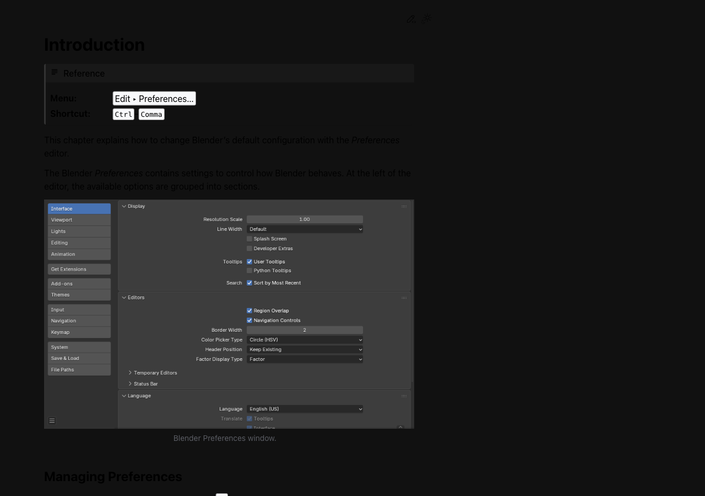

배울 것

- Preferences 위치를 안다
- 입력 장치 제약을 먼저 해결한다

체크해볼 것

- Edit → Preferences 직접 열어보기 (단축키: Ctrl + , (쉼표))
- Input → Emulate 3 Button Mouse 켜기 (마우스 휠 없는 경우)
- 저장 방식 Preferences에서 확인 (Auto-Save 설정 위치 파악)

#### 2. 화면 조작

구글 지도에서 거리뷰를 돌리는 것처럼, Blender 화면도 마우스로 돌리고 확대해요. 처음엔 어색하지만 10분만 하면 익숙해져요.

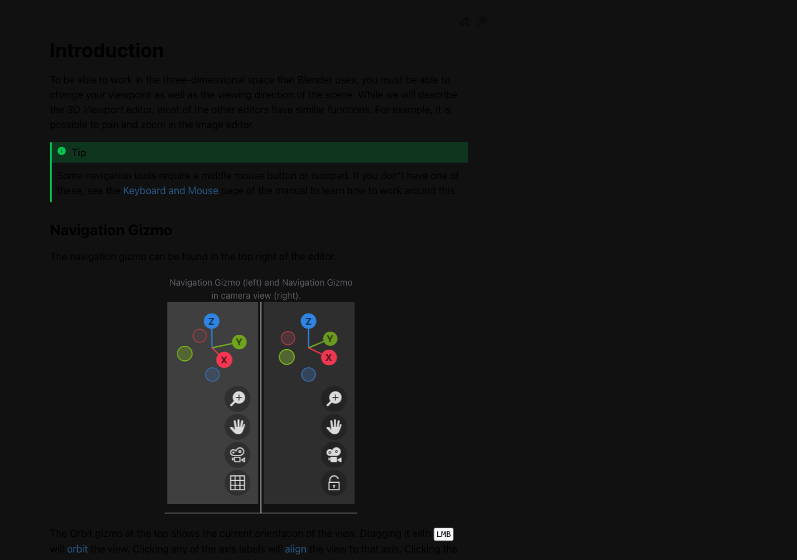

배울 것

- Orbit/Pan/Zoom을 자유롭게 쓴다
- 정면/측면/상면 뷰로 이동한다

체크해볼 것

- Numpad 1/3/7 로 뷰 전환 연습
- Scroll로 Zoom In/Out 해보기
- Middle Mouse로 Orbit 해보기 (없으면 Alt+LMB)

#### 3. 기본 변형 (G/R/S)

G/R/S 세 글자만 기억하면 돼요. G(잡아서 이동), R(돌리기), S(늘리거나 줄이기). 그 다음에 X/Y/Z를 누르면 방향도 고정할 수 있어요.

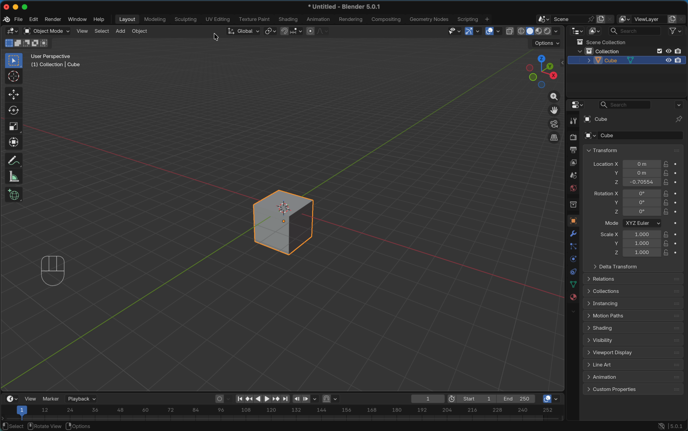

배울 것

- G/R/S 단축키를 손에 익힌다
- 축 고정 (X/Y/Z)을 이해한다

체크해볼 것

- G → X로 X축 방향으로만 이동
- S → 0.5 로 절반 크기로 줄이기
- R → Z → 45 로 45도 회전

#### 4. Edit Mode 모델링

Tab 키 하나로 '보는 모드'와 '편집 모드'를 오가요. Extrude(E)는 점토를 손으로 당기는 것처럼 면을 뽑아내는 거예요.

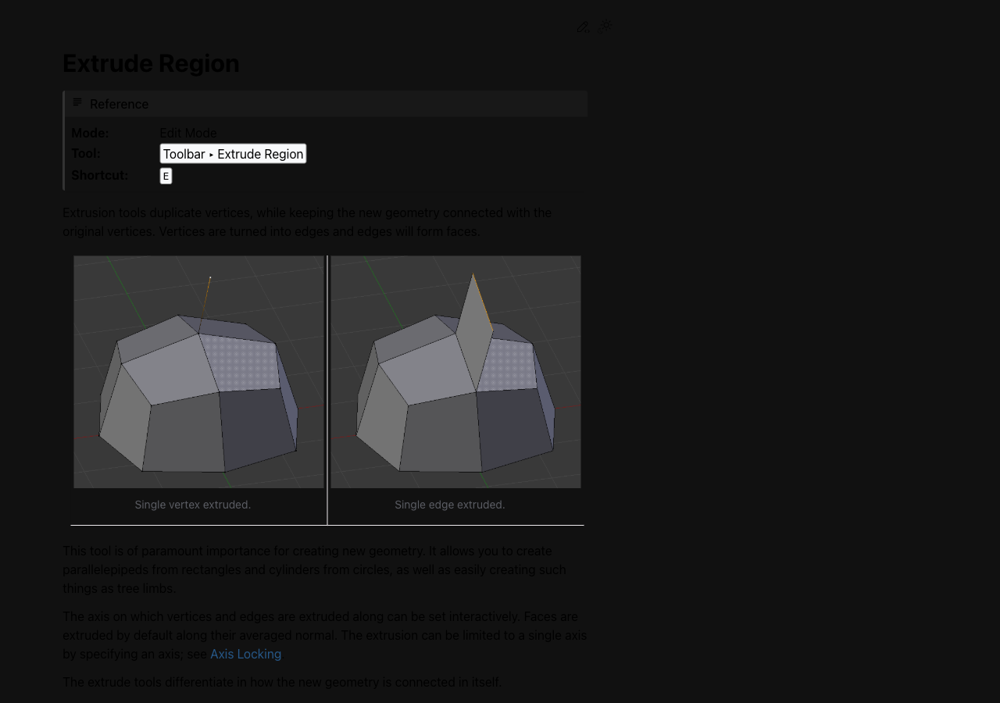

배울 것

- Object/Edit Mode 전환을 안다
- 면을 선택하고 Extrude로 뽑는다

체크해볼 것

- Tab으로 Edit Mode 진입/복귀
- 면 선택 후 E로 Extrude 하기 (위나 아래 방향으로 뽑기)
- I 키로 Inset 적용해보기 (면 선택 후 I → 드래그로 안쪽 면 생성)
- Ctrl+R로 Loop Cut 추가해보기 (마우스로 위치 조정 후 클릭)

#### 5. Bevel 마무리

날카로운 모서리를 부드럽게 깎는 거예요. 실제 제품 디자인에서도 안전을 위해 모서리를 깎는데 (Chamfer), 그게 Bevel이에요.

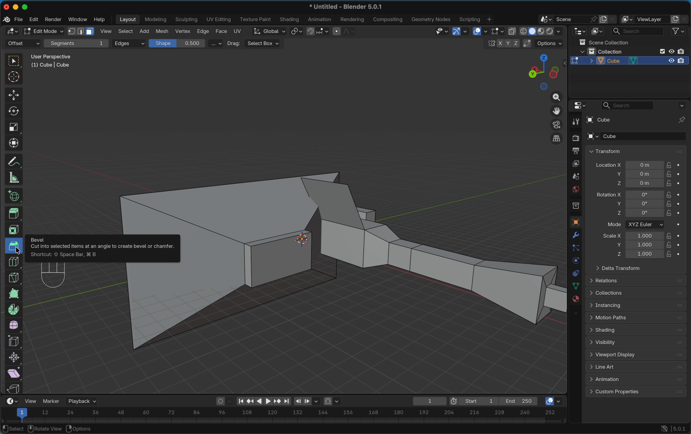

배울 것

- Bevel의 원리를 이해한다
- 최종 형태를 Object Mode에서 확인한다

체크해볼 것

- 모서리 선택 후 Ctrl+B로 Bevel (스크롤로 분할 수 조절)
- Tab으로 Object Mode 복귀 후 확인
- F12로 렌더 or 스크린샷 저장

#### 6. 뷰포트 셰이딩

같은 모델도 어떤 '조명 방식'으로 보느냐에 따라 전혀 다르게 보여요. Solid는 작업 중 기본 뷰, Material Preview는 재질 확인, Rendered는 실제 렌더 결과예요.

배울 것

- 4가지 Shading 모드를 구분한다
- 작업 목적에 맞는 모드를 선택한다

체크해볼 것

- Z 키로 Pie Menu 열어 모드 전환 (Wireframe / Solid / Material Preview / Rendered)
- Solid 모드에서 Cavity/Matcap 바꿔보기 (헤더 오른쪽 구 아이콘 클릭)
- Material Preview로 HDRI 환경 확인 (재질 없어도 형태는 확인 가능)

### 핵심 단축키

- `MMB Drag`: Orbit (시점 회전)
- `Shift + MMB`: Pan (시점 이동)
- `Scroll`: Zoom (확대/축소)
- `Numpad 1/3/7`: Front/Right/Top View
- `Numpad 5`: Perspective ↔ Orthographic 전환
- `Numpad 2/4/6/8`: Orbit 상/하/좌/우 회전
- `Numpad .`: Frame Selected (선택 오브젝트 포커스)
- `Ctrl + Numpad 1/3/7`: Back/Left/Bottom View
- `Shift + Numpad 4/6`: Roll (뷰 좌우 기울이기)
- `Numpad Plus`: Zoom In
- `Numpad Minus`: Zoom Out
- `G`: Grab (이동)
- `R`: Rotate (회전)
- `S`: Scale (크기 조절)
- `G + X/Y/Z`: 축 고정 이동
- `Tab`: Object ↔ Edit Mode 전환

### 과제 한눈에 보기

- 과제명: 기본 도형 배치 + MCP 테스트
- 설명: Blender 기본 뷰 조작과 Transform 기능을 활용해 기본 도형 5개 이상을 배치하고, Blender MCP 연결을 테스트한다.
- 제출 체크:
  - 기본 도형 5개 이상 배치 스크린샷
  - Transform(이동/회전/스케일) 적용 확인
  - Blender MCP 연결 테스트 스크린샷
  - 한줄 코멘트 작성
  - Discord #week02-assignment 제출 완료

### 자주 막히는 지점

- 탭(Tab) 키 없이 면을 클릭하려고 함 → Object Mode에선 편집이 안 돼요. Tab으로 Edit Mode로 먼저 들어가세요.
- 새 박스가 이상한 곳에 생겼어요 → 3D Cursor가 이동했을 때 생기는 현상. Shift+C로 원점으로 돌려놓으세요.
- 화면이 안 돌아가요 → 마우스 휠이 없는 경우, Preferences에서 [Emulate 3 Button Mouse]를 켜세요.

### 공식 영상 튜토리얼

- [Blender Studio - Viewport Navigation](https://studio.blender.org/training/blender-2-8-fundamentals/viewport-navigation/)
- [Blender Studio - Interface Overview](https://studio.blender.org/training/blender-2-8-fundamentals/interface-overview/)
- [Blender Studio - Select & Transform](https://studio.blender.org/training/blender-2-8-fundamentals/select-transform/)

### 공식 문서

- [Preferences](https://docs.blender.org/manual/en/latest/editors/preferences/introduction.html)
- [3D Navigation](https://docs.blender.org/manual/en/latest/editors/3dview/navigate/introduction.html)
- [Extrude Region](https://docs.blender.org/manual/en/latest/modeling/meshes/tools/extrude_region.html)
- [Inset Faces](https://docs.blender.org/manual/en/latest/modeling/meshes/tools/inset_faces.html)
- [Loop Cut](https://docs.blender.org/manual/en/latest/modeling/meshes/tools/loop.html)
- [Bevel](https://docs.blender.org/manual/en/latest/modeling/meshes/tools/bevel.html)
<!-- AUTO:CURRICULUM-SYNC:END -->

## 참고 자료

### 공식 문서 (Blender Manual)

| 주제 | 링크 |
|------|------|
| 3D Cursor | [docs.blender.org — 3D Cursor](https://docs.blender.org/manual/en/latest/editors/3dview/3d_cursor.html) |
| Object Origin | [docs.blender.org — Object Origin](https://docs.blender.org/manual/en/latest/scene_layout/object/origin.html) |
| Transform Pivot Point | [docs.blender.org — Pivot Point](https://docs.blender.org/manual/en/latest/editors/3dview/controls/pivot_point/index.html) |
| 3D Navigation | [docs.blender.org — 3D Navigation](https://docs.blender.org/manual/en/latest/editors/3dview/navigate/introduction.html) |
| Extrude / Loop Cut / Bevel | [Extrude](https://docs.blender.org/manual/en/latest/modeling/meshes/tools/extrude_region.html) · [Loop Cut](https://docs.blender.org/manual/en/latest/modeling/meshes/tools/loop.html) · [Bevel](https://docs.blender.org/manual/en/latest/modeling/meshes/tools/bevel.html) |

### 공식 영상 튜토리얼 (Blender Studio)

- [Viewport Navigation](https://studio.blender.org/training/blender-2-8-fundamentals/viewport-navigation/)
- [Interface Overview](https://studio.blender.org/training/blender-2-8-fundamentals/interface-overview/)
- [Select & Transform](https://studio.blender.org/training/blender-2-8-fundamentals/select-transform/)
- [3D Cursor](https://studio.blender.org/training/blender-2-8-fundamentals/3d-cursor/)
- [Object Origins](https://studio.blender.org/training/blender-2-8-fundamentals/object-origins/)

### 추가 참고

- [Blender 단축키 모음](../../resources/blender-shortcuts.md)
- Blender Guru 2026 Donut Part 1: https://www.youtube.com/watch?v=-tbSCMbJA6o
- 차녹 블렌더 기초: https://www.youtube.com/watch?v=gVteZaQGry0
- Ryan King Art (Quick Start Guides): https://www.youtube.com/@RyanKingArt
