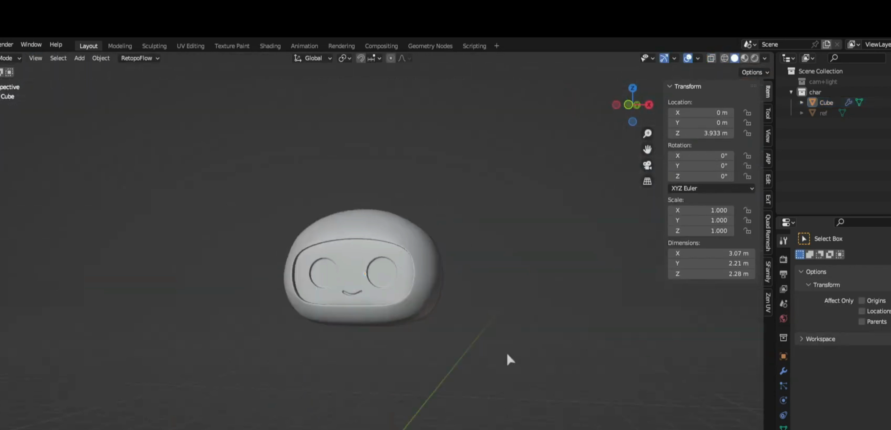
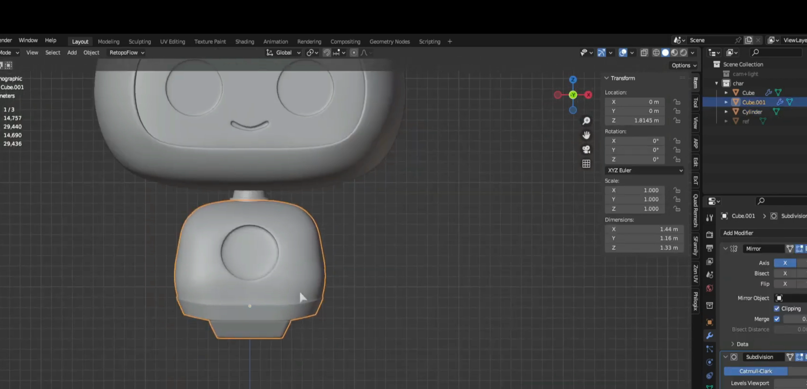
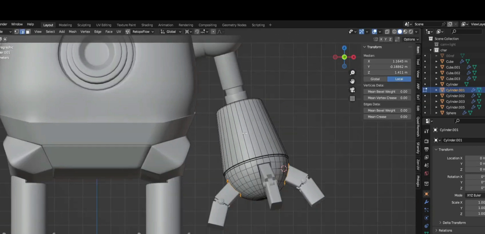
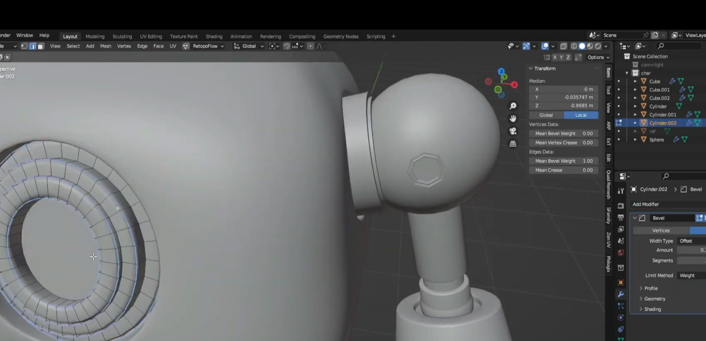
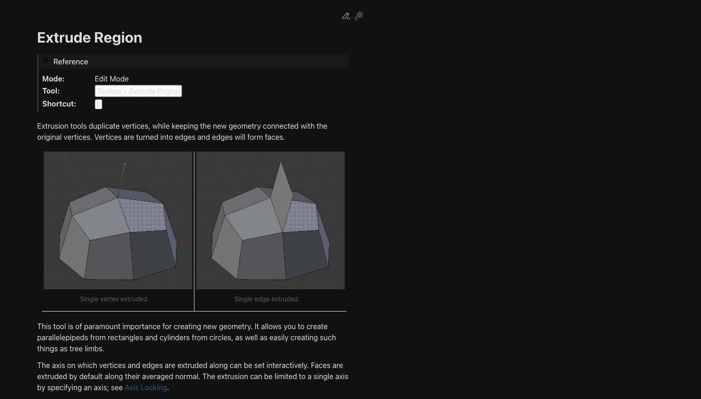
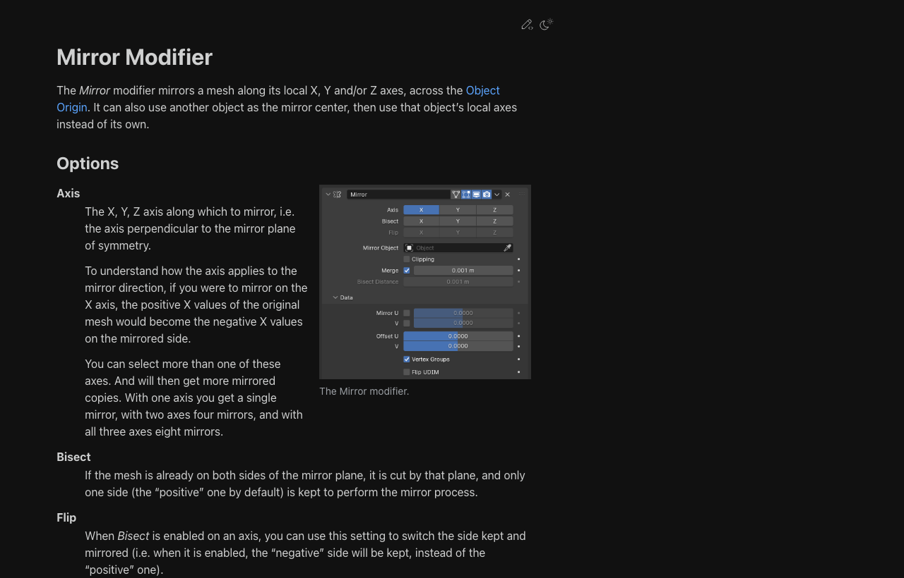
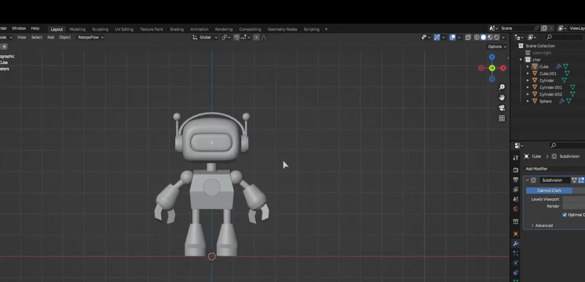
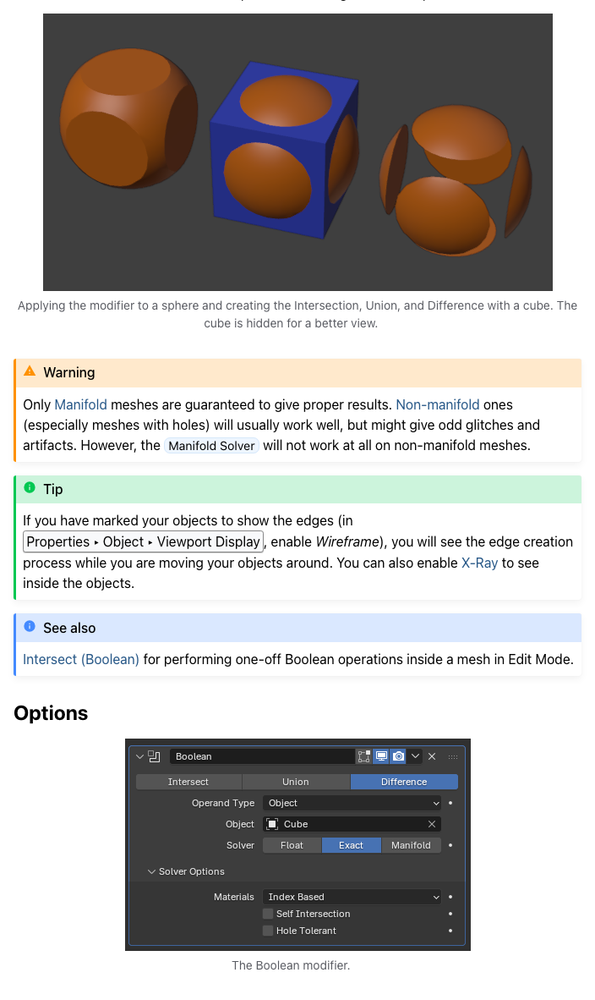
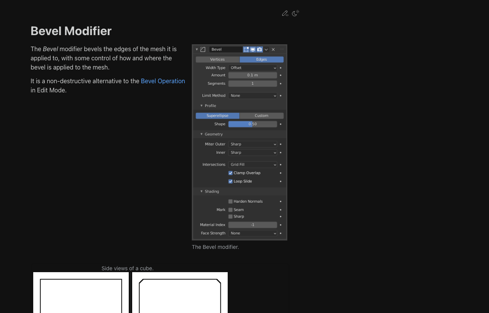

# Week 03: 기초 모델링 1 - Edit Mode + Modifier

## 학습 목표

- [ ] Edit Mode의 핵심 도구를 이해한다
- [ ] Modifier가 무엇인지 쉽게 설명할 수 있다
- [ ] Mirror, Subdivision Surface, Solidify, Array, Boolean을 사용할 수 있다
- [ ] Bevel Tool과 Bevel Modifier의 차이를 구분할 수 있다
- [ ] Weighted Normal, Join/Separate, Apply 타이밍을 작업 흐름 안에서 이해한다
- [ ] Edit Mode와 Modifier를 조합해 로봇 기본 형태를 만들 수 있다

## 🔗 이전 주차 복습

- Week 02에서 배운 **G / R / S**와 축 제한을 계속 사용한다
- 작업 전 **Ctrl + A > All Transforms**를 적용하는 습관이 중요하다
- **Numpad 1 / 3 / 7**로 정면, 측면, 상면을 자주 오가며 형태를 확인한다
- 파츠가 많아지면 **P (Separate)**, **Ctrl + J (Join)**로 정리할 수 있다

## 이론 (30분)

### 이번 주 흐름

- **Edit Mode:** 점, 선, 면을 직접 움직이며 기본형을 만든다
- **Modifier:** 원본을 바로 깎지 않고 효과를 얹어 더 빠르게 다듬는다
- **Join / Separate:** 파츠를 나누거나 묶어 작업을 정리한다
- **Apply 타이밍:** `Ctrl + A`는 중간에도 자주, `Modifier Apply`는 마지막에만
- 이번 주는 **손으로 형태를 만들고, Modifier로 정리하는 흐름**으로 이해하면 된다

> 💡 Edit Mode는 손으로 점토를 만지는 단계이고, Modifier는 거울 효과나 두께 효과 같은 필터를 얹는 단계라고 생각하면 쉽다.

### 꼭 기억할 Edit Mode 도구 4개

| 도구 | 쉽게 말하면 | 어디에 쓰는지 |
|------|-------------|----------------|
| **Extrude (E)** | 점토를 잡아당기기 | 팔, 다리, 안테나, 돌출 |
| **Loop Cut (Ctrl + R)** | 케이크에 칼집 넣기 | 분할선, 관절 위치 만들기 |
| **Inset (I)** | 면 안쪽에 작은 면 하나 더 만들기 | 눈, 패널, 버튼 영역 |
| **Bevel (Ctrl + B)** | 날카로운 모서리를 살짝 깎기 | 부드러운 모서리, 기계 디테일 |

### Modifier란?

- Modifier는 **필터처럼 얹는 기능**이라고 생각하면 쉽다
- 원본 메쉬를 바로 망가뜨리지 않고, 화면에 보이는 결과를 바꿔준다
- 숫자를 바꾸거나 끄거나 지우면서 실험하기 좋다
- 위치는 `Properties > Modifier Properties` (렌치 아이콘)

> 💡 **Non-destructive**는 되돌릴 수 있다는 뜻이다. Apply 하기 전까지는 원본을 살려둔 채 실험할 수 있다.

### 자주 쓰는 Modifier 한눈에 보기

| Modifier | 한 줄 비유 | 주로 하는 일 |
|----------|------------|---------------|
| **Mirror** | 거울처럼 반대편이 자동으로 생긴다 | 좌우 대칭 모델링 |
| **Subdivision Surface** | 스케치를 더 촘촘하게 다시 그린다 | 곡면을 부드럽게 만들기 |
| **Solidify** | 종이에 두께를 준다 | 외장 패널, 얇은 판 만들기 |
| **Array** | 도장을 여러 번 찍는다 | 반복 구조 만들기 |
| **Boolean** | 블록을 붙이거나 뺀다 | 구멍, 홈, 소켓 만들기 |

### 필수로 알아둘 추가 Modifier

| Modifier | 언제 쓰는지 | 같이 기억할 점 |
|----------|-------------|----------------|
| **Bevel Modifier** | 모서리를 비파괴로 둥글게 만들 때 | 하드서피스에서 자주 쓴다 |
| **Weighted Normal** | 음영이 이상할 때 정리할 때 | Bevel Modifier와 같이 쓰는 경우가 많다 |

### 선택으로 써볼 Modifier

| Modifier | 언제 쓰는지 | 같이 기억할 점 |
|----------|-------------|----------------|
| **Simple Deform** | 전체를 휘게, 비틀게, 가늘게 만들 때 | Bend, Twist, Taper를 빠르게 시험할 수 있다 |
| **Decimate** | 너무 무거운 메쉬를 가볍게 만들 때 | AI 생성 메쉬나 복잡한 모델에서 유용하다 |

### 영상에서 자주 보이는 실전 흐름

1. `G / R / S`로 큰 덩어리 위치를 먼저 맞춘다
2. `Ctrl + A > All Transforms`로 Scale과 Rotation을 정리한다
3. Edit Mode에서 `Extrude`, `Loop Cut`, `Inset`, `Bevel`로 기본형을 만든다
4. `Mirror`, `Subdivision Surface`로 실루엣을 빠르게 정리한다
5. `Boolean`이나 `Inset`으로 얼굴, 패널, 소켓 디테일을 추가한다
6. `Bevel Modifier`와 `Weighted Normal`로 표면 느낌과 음영을 정리한다
7. `Modifier Apply`는 정말 마지막에만 한다

### 헷갈리기 쉬운 차이

| 항목 | 언제 쓰는지 | 기억할 점 |
|------|-------------|-----------|
| **Edit Mode Bevel (`Ctrl + B`)** | 특정 모서리만 직접 다듬고 싶을 때 | 지금 선택한 부분만 바로 수정된다 |
| **Bevel Modifier** | 전체 모서리 느낌을 비파괴로 조절할 때 | 나중에도 값을 바꿀 수 있다 |
| **Apply Transform (`Ctrl + A`)** | Modifier 전, 비율과 회전을 정리할 때 | 작업 중간에도 자주 확인하는 편이 안전하다 |
| **Apply Modifier** | 형태를 최종 확정할 때 | 초반에 해버리면 수정 여지가 줄어든다 |

### ⚠️ 가장 많이 헷갈리는 두 가지 — 꼭 기억하기

#### 1. Modifier는 Object Mode에서만 추가할 수 있다

Modifier를 추가하려면 반드시 **Object Mode** 상태여야 한다. Edit Mode에서는 Modifier Properties(렌치 아이콘) 패널 자체가 비활성화되거나 Add Modifier 버튼이 보이지 않는다.

```plain text
[Modifier 추가 흐름]
Tab → Object Mode 확인 → Properties 패널 → 렌치 아이콘 → Add Modifier
                 ↑
         이 상태에서만 가능
```

> ⚠️ Edit Mode에서 렌치 아이콘을 클릭해도 Modifier가 추가되지 않는다. Add Modifier 버튼이 보이지 않으면 Tab을 눌러 Object Mode로 먼저 나와야 한다.

---

#### 2. Shift+A(오브젝트 추가)는 현재 모드에 따라 결과가 완전히 다르다

`Shift + A`는 같은 단축키지만 **어떤 모드에서 누르느냐**에 따라 전혀 다른 결과가 나온다. 이걸 모르면 나중에 Boolean이나 파츠 분리에서 예상 밖의 문제가 생긴다.

| | Object Mode에서 Shift+A | Edit Mode에서 Shift+A |
|---|---|---|
| **결과** | 새로운 독립 오브젝트 생성 | 현재 오브젝트의 메쉬 안에 추가됨 |
| **Outliner** | 새 항목이 생김 | 새 항목이 생기지 않음 |
| **Modifier** | 각자 따로 Modifier를 가짐 | 같은 Modifier를 공유함 |
| **선택/이동** | 오브젝트 단위로 분리 가능 | P(Separate)로 나눠야 분리됨 |
| **언제 쓰는지** | 독립된 파츠를 만들 때 | 기존 메쉬에 형태를 합쳐 편집할 때 |

```plain text
[예시 — Boolean 커터를 만들 때]
❌ 잘못된 방법:
  바디 오브젝트 Edit Mode 상태 → Shift+A → Cylinder 추가
  → 커터가 바디 메쉬 안에 합쳐짐 → Boolean이 작동하지 않음

✅ 올바른 방법:
  Tab → Object Mode 나오기 → Shift+A → Cylinder 추가
  → 커터가 독립 오브젝트로 생성 → Boolean에서 Object 지정 가능
```

> 💡 **확인 방법:** Shift+A로 추가한 뒤 Outliner(우측 상단 계층 패널)를 보자. 새 항목이 생겼으면 독립 오브젝트, 없으면 기존 메쉬에 합쳐진 것이다.

> 💡 **Edit Mode에서 실수로 합쳐진 경우:** Edit Mode에서 추가된 메쉬를 선택 → `P > Selection`으로 분리하면 독립 오브젝트로 만들 수 있다.

### Modifier Stack

- Modifier는 **위에서 아래로** 순서대로 계산된다
- 순서가 바뀌면 결과도 달라진다
- 처음에는 아래 순서를 기준으로 보면 덜 헷갈린다

```plain text
Mirror
↓
Boolean
↓
Subdivision Surface
```

> ⚠️ 같은 Modifier를 써도 순서가 달라지면 전혀 다른 결과가 나온다.

## 실습 (90분)

### Step 1: Edit Mode로 기본형 만들기 (20분)



> 기본 덩어리를 손으로 직접 잡는 단계입니다. 큰 실루엣을 먼저 만들고, 세부는 나중에 다듬는 흐름으로 보면 훨씬 편합니다.

1. Cube에서 시작
2. **Extrude (E)**로 머리, 팔, 다리 위치를 만든다
3. **Loop Cut (Ctrl + R)**로 관절과 분할선을 추가한다
4. **Inset (I)**으로 눈, 패널, 버튼 영역을 만든다
5. **Bevel (Ctrl + B)**로 너무 날카로운 모서리를 정리한다

> 💡 기본형은 Edit Mode로 먼저 만든다. Modifier는 그다음 속도를 올려주는 도구다.

> ⚠️ **Extrude(`E`) 후 `Esc`로 취소하면 중복 버텍스가 그 자리에 남는다.** 이상하다 싶으면 `Ctrl+Z`로 되돌리고, 이미 진행했다면 `M > Merge by Distance`로 정리한다.

> ⚠️ **Edit Mode에서 Shift+A를 누르면 새 오브젝트가 아니라 현재 메쉬에 추가된다.** 파츠를 독립 오브젝트로 만들고 싶다면 Tab으로 Object Mode로 나온 뒤 Shift+A를 눌러야 한다. → 자세한 내용은 이론 섹션 "가장 많이 헷갈리는 두 가지" 참고

### Step 2: Mirror Modifier - 대칭을 가장 빨리 만드는 방법 (15분)



> 위 스크린샷: 왼쪽에 편집 중인 반쪽 메쉬, 오른쪽에 Mirror가 자동으로 만들어준 대칭 결과. Modifier Properties 패널에서 Clipping이 켜진 것을 확인할 수 있다.

로봇처럼 좌우가 비슷한 형태를 만들 때 가장 먼저 떠올리면 좋다. 한쪽만 만들면 반대쪽이 자동으로 따라와서 작업 시간이 크게 줄어든다.

#### 어떻게 작동하는가

Mirror는 **원점(Origin)** 또는 **지정한 오브젝트**를 기준으로 한쪽을 복사해 반대쪽에 붙여준다. 실제 메쉬는 한쪽뿐이지만 화면에는 양쪽이 보인다. Apply 전까지는 원본이 한쪽에만 있다.

```plain text
[Edit Mode에서 편집 중인 버텍스]
   왼쪽 버텍스 ←→ Mirror가 오른쪽을 자동 생성
```

#### 핵심 파라미터

| 파라미터 | 의미 | 언제 쓰는지 |
|----------|------|-------------|
| **Axis: X / Y / Z** | 어떤 축을 기준으로 대칭할지 | 좌우 대칭은 X, 앞뒤 대칭은 Y |
| **Clipping** | 중심선 Vertex가 중앙을 넘지 않게 고정 | **항상 켜두기** |
| **Mirror Object** | 원점 대신 다른 오브젝트를 기준으로 삼을 때 | 복잡한 구조에서 기준점이 필요할 때 |
| **Merge** | 중심선 Vertex를 하나로 합치기 | 경계 없이 깔끔하게 만들 때 |
| **Bisect** | 기준선을 넘어가는 버텍스를 잘라냄 | 기존 오브젝트에 Mirror를 추가할 때 |

#### 실습 순서

1. Cube를 준비한다
2. Edit Mode(`Tab`)에서 중심 기준 오른쪽 절반의 버텍스를 선택 → `X > Vertices`로 삭제
3. `Add Modifier > Mirror`를 추가한다
4. X축 기준 대칭인지 확인하고 **Clipping을 켠다**
5. 남은 왼쪽 절반을 `Extrude`로 수정하면서 반대쪽이 같이 바뀌는지 확인한다

```plain text
[중심선 버텍스가 틀어졌을 때]
버텍스 선택 → S + X + 0 + Enter
→ X축 기준 0 위치로 강제 정렬
```

> ⚠️ **Clipping은 꼭 켜두기.** 꺼져 있으면 한쪽 버텍스를 중앙 쪽으로 당길 때 반대쪽과 벌어지거나 겹쳐서 나중에 Apply 시 구멍이 생긴다.

> 💡 **Mirror를 거는 시점:** Edit Mode로 기본형을 시작하기 전, 큐브 단계에서 바로 Mirror를 건다. 이미 어느 정도 형태가 잡힌 후에 Mirror를 추가하면 Bisect 처리가 필요해진다.

---

### Step 3: Subdivision Surface + Solidify (20분)

#### Subdivision Surface — 각진 박스를 부드러운 곡면으로


> 위 스크린샷: 왼쪽은 Subdivision Level 0(원본 박스), 가운데는 Level 2, 오른쪽은 Level 3. 폴리곤 수가 늘어날수록 표면이 둥글어지는 것을 확인할 수 있다.

각진 박스로 시작해도 둥글고 부드러운 몸체 느낌을 낼 수 있다. 단, Level을 높일수록 무거워지므로 작업 중에는 낮게 두고 렌더링 때만 높인다.

#### 핵심 파라미터

| 파라미터 | 의미 | 추천 값 |
|----------|------|---------|
| **Levels Viewport** | 작업 화면에서 보이는 분할 수 | `1` 또는 `2` |
| **Levels Render** | 최종 렌더링 시 분할 수 | `2` 또는 `3` |
| **Catmull-Clark** | 기본값. 부드러운 곡면으로 만들기 | 대부분 이걸 씀 |
| **Simple** | 분할만 하고 곡면은 만들지 않음 | 폴리곤 수를 늘릴 때만 |

```plain text
[단축키로 빠르게 레벨 변경]
Ctrl + 1  →  Viewport Level 1
Ctrl + 2  →  Viewport Level 2
Ctrl + 3  →  Viewport Level 3
```

#### Edge Crease — 날카로운 모서리 유지하기

Subdivision은 모든 모서리를 동등하게 둥글게 만든다. **날카롭게 남겨야 할 부분**이 있다면 Edge Crease를 줘서 고정해야 한다.

```plain text
Edit Mode → 날카롭게 유지할 Edge 선택 → Shift + E → 값 1.0 방향으로 드래그
→ 해당 Edge는 Subdivision이 적용돼도 날카롭게 유지됨
```

> 💡 Crease 대신 **Loop Cut을 여러 번 추가**해 가장자리를 촘촘하게 만드는 방식도 자주 쓴다. Loop Cut이 촘촘할수록 해당 부분의 곡률이 줄어든다.

> ⚠️ `Shade Smooth`를 함께 쓰지 않으면 표면 분할은 됐지만 조명이 각져 보인다. `Object Mode에서 우클릭 > Shade Smooth`를 같이 적용한다.

---

#### Solidify — 납작한 면에 두께 주기


> 📷 캡처 가이드: Plane에 Solidify 추가 → Offset `-1 / 0 / 1` 세 가지를 나란히 배치 → 두께 방향 차이가 보이는 사이드뷰. Modifier Properties에 Thickness와 Offset 값이 보이면 좋음

납작한 Plane이나 얇은 면에 두께를 부여한다. 로봇 외장 패널, 방어구, 날개, 얇은 쉘 형태를 만들 때 자주 쓴다.

#### 핵심 파라미터

| 파라미터 | 의미 | 처음 써볼 값 |
|----------|------|---------------|
| **Thickness** | 두께 값 | `0.02 ~ 0.1` |
| **Offset** | 원본 면 기준 두께가 자라는 방향 | `-1`(안쪽), `0`(중앙), `1`(바깥쪽) |
| **Even Thickness** | 곡면에서도 두께를 균일하게 유지 | 켜두기 |
| **Fill Rim** | 모서리에 면을 채워서 닫힌 형태로 만들기 | 켜두기 |

```plain text
Offset 비교:
  Offset -1  →  원본 면에서 안쪽 방향으로만 두께가 생김
  Offset  0  →  원본 면을 중심으로 양쪽으로 두께
  Offset  1  →  원본 면에서 바깥 방향으로만 두께가 생김
```

> 💡 외장 패널을 만들 때는 Offset `1`(바깥쪽)이 직관적이고, 속이 빈 케이스 형태를 만들 때는 Offset `-1`이 편리하다.

> ⚠️ **Thickness 값이 의도한 것보다 너무 크거나 작으면** Scale이 정리되지 않은 것이다. `Ctrl + A > All Transforms` 후 다시 값을 확인한다.

---

### Step 4: Array + Boolean (20분)



> 위 스크린샷: 왼쪽은 Array Count 5 + Relative Offset X 1.5 설정, 오른쪽은 Boolean Difference로 바디에 구멍을 낸 결과.

#### Array — 같은 형태를 규칙적으로 반복하기


> 📷 캡처 가이드: Object Mode에서 Cube에 Array Modifier 추가 → Count 5, Relative Offset X 1.5 설정 → Modifier Properties 패널이 보이는 뷰포트 스크린샷

손가락 마디, 척추, 볼트 패턴, 환기구 격자, 계단 구조처럼 **같은 파츠가 규칙적으로 반복되는 형태**에 쓴다.

#### 핵심 파라미터

| 파라미터 | 의미 | 처음 써볼 값 |
|----------|------|--------------|
| **Fit Type: Fixed Count** | 개수를 직접 지정 | Count `3 ~ 6` |
| **Fit Type: Fit Length** | 전체 길이를 지정하면 개수가 자동으로 맞춰짐 | 원하는 전체 길이 |
| **Relative Offset** | 오브젝트 크기 기준 간격 (`1.0` = 딱 붙음, `1.5` = 조금 떨어짐) | X: `1.1 ~ 1.5` |
| **Constant Offset** | Blender 단위 기준 고정 간격 | 정밀 작업에 유용 |

```plain text
[간격 계산 예시]
오브젝트 X 크기가 1m일 때
  Relative Offset X = 1.0  →  오브젝트 끝과 다음 오브젝트 시작이 딱 붙음
  Relative Offset X = 1.5  →  오브젝트 1개 간격(0.5m) 떨어짐
  Relative Offset X = 2.0  →  오브젝트 1개 크기만큼 떨어짐
```

**실습 흐름**

1. Cube에 Array를 추가한다
2. Count를 `5`로 바꾼다
3. Relative Offset X를 `1.5`로 바꾼다 (약간의 간격)
4. Y나 Z 방향으로도 바꿔서 가로·세로·높이 반복을 비교한다

> 💡 **Array를 2개 쌓으면?** Array(X축) + Array(Y축)을 같이 올리면 격자(Grid) 형태가 된다. 볼트 배열, 환기구 패턴에 자주 쓴다.

> ⚠️ **간격이 의도한 것과 다르게 나오면** Scale이 정리되지 않은 것이다. `Ctrl + A > All Transforms` 후 Offset 값을 다시 확인한다.

---

#### Boolean — 블록을 합치거나 잘라내기


> 📷 캡처 가이드: 바디 Cube + 커터 Cylinder 겹친 상태 → Boolean Difference 적용 후 → 커터를 H로 숨긴 뷰. 좌측에 Modifier Properties의 Object 필드에 커터 이름이 표시된 상태

두 오브젝트를 **합치거나**, **빼거나**, **겹치는 부분만 남기는** 세 가지 연산을 제공한다. 구멍, 소켓, 패널 홈처럼 직접 만들기 어려운 형태에 특히 유용하다.

#### 세 가지 연산 비교

| 연산 | 수식 | 결과 | 자주 쓰는 상황 |
|------|------|------|----------------|
| **Union** | A + B | 두 오브젝트를 합친 전체 형태 | 파츠를 하나의 덩어리로 합칠 때 |
| **Difference** | A − B | A에서 B 형태를 잘라낸 결과 | 구멍, 소켓, 홈, 눈 구멍 만들기 |
| **Intersect** | A ∩ B | 두 오브젝트가 겹치는 부분만 | 특정 교차 형태만 추출할 때 |

#### Boolean Difference 실습 흐름 (가장 자주 씀)

```plain text
1. 바디 오브젝트(A)를 선택
2. Modifier Properties → Add Modifier → Boolean
3. Operation: Difference 선택
4. Object: 커터 오브젝트(B) 지정
5. 커터 오브젝트는 뷰포트에서 숨기기 (눈 아이콘 또는 H키)
→ 바디에 커터 형태의 구멍이 생김
```

> ⚠️ **Boolean이 이상할 때 체크할 것:**
> - 커터가 실제로 바디 안쪽까지 충분히 겹쳐있는가? (표면만 닿으면 오작동)
> - 바디 오브젝트에 `Ctrl + A > All Transforms`가 적용됐는가?
> - 메쉬에 Non-Manifold(열린 면, 중복 버텍스)가 없는가? (`Mesh > Clean Up > Merge by Distance` 먼저 적용)

> 💡 커터 오브젝트는 Apply 전까지 숨겨만 두고 삭제하지 않는다. 나중에 구멍 위치나 크기를 수정하고 싶을 때 커터를 이동하면 된다.

---

### Step 5: 필수 추가 Modifier + 선택 심화 (15분)



> 위 스크린샷: 왼쪽은 Bevel/Weighted Normal 없이 날카롭고 얼룩진 음영, 오른쪽은 Bevel Modifier + Weighted Normal 적용 후 모서리가 부드럽고 음영이 깔끔해진 결과.

#### Bevel Modifier — 모서리를 비파괴로 둥글게


> 📷 캡처 가이드: Cube에 Bevel Modifier 추가 → Amount 0.01 / 0.05 / 0.1 세 단계 비교, Segments 1 vs 3 비교. 우측 Modifier Properties에 Amount·Segments·Limit Method 값이 보이도록

Edit Mode의 `Ctrl + B`는 선택한 Edge에만 직접 베벨을 넣는 방식이고, **Bevel Modifier는 전체 모서리에 비파괴로 적용**한다. 나중에 Amount 값을 바꾸거나 끄고 켤 수 있어서 하드서피스 모델링에서 자주 쓴다.

#### 핵심 파라미터

| 파라미터 | 의미 | 처음 써볼 값 |
|----------|------|--------------|
| **Amount** | 베벨 폭 (얼마나 깎을지) | `0.01 ~ 0.05` (얇게 시작) |
| **Segments** | 베벨을 몇 단계로 나눌지 (많을수록 둥글어짐) | `2` 또는 `3` |
| **Limit Method: Angle** | 특정 각도 이상 모서리에만 베벨 적용 | `30°` 전후로 조절 |
| **Limit Method: Weight** | Edit Mode에서 직접 지정한 Edge에만 적용 | 선택적으로 쓸 때 |

```plain text
[Bevel Modifier vs Edit Mode Bevel 선택 기준]
  전체 외장 모서리를 균일하게 정리  →  Bevel Modifier
  특정 Edge 몇 개만 직접 다듬기    →  Ctrl + B (Edit Mode)
```

> 💡 `Limit Method: Angle`을 `30~60°` 정도로 설정하면 넓은 평면 사이 미세한 각도는 그냥 두고, 실제로 선명한 모서리에만 베벨이 들어간다. 로봇 외장에 좋다.

---

#### Weighted Normal — 지저분한 음영 정리


> 📷 캡처 가이드: Bevel Modifier만 있는 상태(좌)와 Bevel + Weighted Normal 추가 후(우) 나란히 비교. Shade Smooth 적용 상태, 조명이 잘 보이는 각도로 캡처

형태를 바꾸지 않고 **빛이 닿는 방향(Normal)을 재계산**해서 음영을 깔끔하게 만든다. 특히 Bevel Modifier를 쓴 후 표면이 얼룩덜룩해 보일 때 이걸 추가하면 바로 정리된다.

```plain text
[적용 순서 - 이 순서를 지키면 가장 잘 된다]
1. Bevel Modifier
2. Weighted Normal
→ Modifier Stack에서 Bevel 아래에 Weighted Normal이 와야 함
```

#### Weighted Normal 설정법

1. Modifier Properties → Add Modifier → **Weighted Normal**
2. Weight: `50` (기본값으로 시작)
3. Face Influence: 켜기 (면 크기를 고려해서 Normal을 계산)
4. Object Properties → **Auto Smooth** 활성화 (Shade Smooth와 같이 켜야 효과 보임)

> ⚠️ Weighted Normal은 **Shade Smooth** 상태일 때만 차이가 보인다. Object Mode에서 우클릭 > Shade Smooth를 먼저 적용하고 확인한다.

---

#### Simple Deform (선택)

전체 오브젝트를 **휘거나**, **비틀거나**, **가늘게** 만드는 변형 Modifier.

| Mode | 효과 | 예시 |
|------|------|------|
| **Bend** | 오브젝트를 곡선으로 휨 | 안테나, 꼬리, 아치 |
| **Twist** | 오브젝트를 나선형으로 비틂 | 손잡이, 뿔 형태 |
| **Taper** | 한쪽 끝을 가늘게 만듦 | 뾰족한 돌기, 원뿔 형태 |
| **Stretch** | 오브젝트를 늘리거나 압축 | 탄성 있는 형태 표현 |

> 💡 Bend 모드를 쓸 때는 **Loop Cut을 미리 충분히 추가**해야 부드럽게 휜다. 세그먼트가 적으면 각져 보인다.

---

#### Decimate (선택)

너무 무거운 메쉬를 **폴리곤 수를 줄여 가볍게** 만든다. 지금 주차 필수는 아니지만, 나중에 AI 3D 생성 메쉬나 복잡한 임포트 모델을 다룰 때 특히 자주 쓰게 된다.

| 파라미터 | 의미 |
|----------|------|
| **Ratio** | 남길 폴리곤 비율. `0.5` = 반으로 줄이기 |
| **Un-Subdivide** | 균등하게 줄임. 원본 구조를 최대한 유지 |
| **Planar** | 평탄한 면을 먼저 합쳐서 줄임 |

---

#### Join / Separate — 파츠 정리

로봇 모델은 작업하다 보면 머리, 팔, 안테나, 손 파츠처럼 덩어리가 많아진다. 파츠 관리를 일찍 해두면 이후 리깅이나 애니메이션 작업이 훨씬 수월하다.

```plain text
[분리]  Edit Mode → 분리할 메쉬 선택 → P → Selection
[합치기]  Object Mode → 합칠 오브젝트 모두 선택 → Ctrl + J

용도 구분:
  함께 움직일 파츠     →  Ctrl + J (Join)
  따로 리깅할 파츠     →  P (Separate)
  Modifier를 따로 쓸 파츠  →  P (Separate)
```

---

#### Apply 타이밍 — 정리와 확정의 차이

| 명령 | 의미 | 타이밍 |
|------|------|--------|
| `Ctrl + A > All Transforms` | Scale, Rotation을 초기화해서 정리 | Modifier 추가 전, 작업 중간에 자주 |
| `Modifier Apply` | Modifier를 메쉬에 굽기(확정) | 형태 수정 가능성을 다 쓴 뒤 마지막에만 |

```plain text
왜 Scale 정리가 중요한가?
  Solidify Thickness가 의도한 크기보다 크거나 작게 나온다
  Boolean이 오작동한다
  Array 간격이 이상하게 들어간다
→ 이 세 증상이 나오면 Ctrl + A > All Transforms 먼저 해본다
```

> ⚠️ **Modifier를 너무 일찍 Apply하면 수정 여지가 크게 줄어든다.** Mirror를 Apply하면 좌우 대칭 편집이 사라지고, Subdivision을 Apply하면 폴리곤이 고정된다. 작업이 정말 끝날 때까지 Apply는 참는다.

### Step 6: 종합 실습 - 로봇 기본 형태 완성하기 (20분)

**1. Edit Mode로 기본형 만들기**

- `Extrude`, `Loop Cut`, `Inset`, `Bevel`로 몸통과 머리, 팔, 다리 위치를 잡는다

**2. Mirror로 좌우 대칭 맞추기**

- 절반만 남기고 Mirror를 건다
- Clipping을 켜고 한쪽만 수정한다

**3. Subdivision Surface로 큰 덩어리 다듬기**

- 몸통과 머리의 큰 곡면을 부드럽게 만든다
- 필요한 Edge는 `Shift + E`로 너무 둥글어지지 않게 잡는다

**4. Solidify, Array, Boolean으로 디테일 추가**

- 얇은 패널에는 Solidify
- 반복 파츠에는 Array
- 눈 구멍이나 환기구에는 Boolean

**5. 필수 추가 Modifier는 꼭 확인하기**

- Bevel Modifier 또는 Weighted Normal은 꼭 한 번 확인한다

**6. Join / Separate와 Apply 타이밍 같이 보기**

- 파츠를 나눌지 묶을지 한 번 정리해본다
- `Ctrl + A`와 `Modifier Apply`를 다르게 이해한다

**7. 선택 심화 Modifier는 여유 있으면 실험하기**

- Simple Deform, Decimate는 시간이 남으면 시도해본다

> 🔑 이번 주 핵심은 “전부 손으로 만들기”가 아니다. **직접 만들 부분은 Edit Mode로**, **대칭, 반복, 곡면, 두께는 Modifier로** 처리하는 감각을 익히는 것이 중요하다.

## ⚠️ 막혔을 때 빠른 참고

> 각 증상의 자세한 설명은 해당 Step 섹션 안의 ⚠️ 주의사항을 확인한다.

| 증상 | 해결법 |
|------|--------|
| Extrude 취소 후 메시 이상함 | `M > Merge by Distance` (Step 1) |
| Mirror 중심선이 벌어짐 | Clipping 켜기, `S + X + 0` (Step 2) |
| Subdivision이 너무 둥글어짐 | `Shift + E` Crease 또는 Loop Cut 추가 (Step 3) |
| Solidify 두께 / Array 간격이 이상함 | `Ctrl + A > All Transforms` (Step 3–4) |
| Boolean 결과가 비거나 이상함 | 커터 겹침 확인, `Merge by Distance` (Step 4) |
| Boolean 커터를 Object에 지정 못함 | Object Mode에서 `Shift+A`로 커터 생성 (이론 섹션) |
| Modifier 추가 버튼이 안 보임 | `Tab → Object Mode` 후 렌치 아이콘 (이론 섹션) |
| 음영이 지저분해 보임 | Weighted Normal + Auto Smooth (Step 5) |
| Modifier를 너무 일찍 Apply함 | Apply는 작업 마지막에만 (Step 5) |

## 과제

- **제출:** Discord `#week03-assignment` 채널
- **내용:** Edit Mode와 Modifier를 함께 사용한 로봇 또는 캐릭터 기본 형태 제작
- **형식:** 스크린샷 3장 + 사용한 Modifier 목록 + 한줄 코멘트
  - 1장: Edit Mode로 기본형을 잡는 과정 화면
  - 2장: Modifier Stack이 보이는 화면
  - 3장: 최종 형태 화면
- **기한:** 다음 수업 전까지

## 핵심 정리

| 개념 | 핵심 내용 |
|------|-----------|
| Edit Mode | 점, 선, 면을 직접 편집하며 기본형을 만든다 |
| Modifier | 원본을 보존한 채 결과를 바꾸는 비파괴 방식 |
| Mirror | 대칭 모델링의 기본. Clipping 꼭 켜기 |
| Subdivision Surface | 표면을 부드럽게 만든다. Ctrl+1/2/3으로 레벨 변경 |
| Solidify | 납작한 면에 두께를 준다 |
| Array | 같은 오브젝트를 규칙적으로 반복한다 |
| Boolean | 합치기, 빼기, 교차로 디테일을 만든다 |
| Bevel Modifier | 모서리를 비파괴로 둥글게 만든다 |
| Weighted Normal | 하드서피스 음영을 정리한다 |
| Join / Separate | 파츠를 묶거나 분리해 관리한다 |
| Apply Timing | `Ctrl + A`는 정리, `Modifier Apply`는 마지막 확정 |
| Simple Deform | 전체를 휘게, 비틀게, 가늘게 만든다 |
| Decimate | 무거운 메쉬를 가볍게 줄인다 |

## 📋 프로젝트 진행 체크리스트

- [ ] Edit Mode로 기본 몸체 형태를 만들었다
- [ ] Mirror Modifier로 좌우 대칭을 맞췄다
- [ ] Subdivision Surface로 큰 덩어리를 다듬었다
- [ ] Solidify, Array, Boolean 중 1개 이상 추가로 사용했다
- [ ] Bevel Modifier 또는 Weighted Normal을 확인했다
- [ ] Join 또는 Separate로 파츠를 정리해봤다
- [ ] (선택) Simple Deform 또는 Decimate를 시도했다
- [ ] Modifier Stack 순서를 정리했다
- [ ] `Ctrl + A`로 Transform을 정리했다
- [ ] 결과 스크린샷 3장을 저장했다

<!-- AUTO:CURRICULUM-SYNC:START -->
## 커리큘럼 연동 요약

> 이 섹션은 `course-site/data/curriculum.js` 기준으로 자동 갱신됩니다.

- 핵심 키워드: 기본형 · 대칭 · 곡면 · 반복
- 예상 시간: ~3시간

### 실습 단계

#### 1. 기본형 만들기

점토를 손으로 만지듯 기본형은 Edit Mode에서 직접 만들어요. 큰 덩어리를 먼저 잡고 세부는 나중에 다듬으면 돼요.



배울 것

- Edit Mode 도구 흐름을 안다
- 기본형을 직접 만든다

체크해볼 것

- Tab으로 Edit Mode 진입 (Object Mode ↔ Edit Mode 전환)
- Extrude로 팔이나 다리 위치 뽑기 (E로 면을 돌출)
- Loop Cut으로 관절 위치 나누기 (Ctrl+R로 분할선 추가)
- Inset과 Bevel로 패널과 모서리 다듬기 (I, Ctrl+B 사용)

#### 2. Mirror Modifier

거울처럼 한쪽만 편집하면 반대쪽이 자동으로 따라와요. 로봇처럼 좌우 대칭인 모델에 제일 먼저 떠올리면 좋아요.



배울 것

- Mirror 역할과 기본 설정을 이해한다

체크해볼 것

- 절반을 지우고 Mirror 추가하기 (Add Modifier → Mirror)
- Clipping 켜기 (중심선 버텍스가 넘어가지 않게 고정)
- 한쪽만 Extrude해서 자동 대칭 확인
- 중심선이 벌어지면 S + X + 0 써보기 (X축 0으로 다시 정렬)

#### 3. 곡면과 두께

각진 박스를 더 부드럽게 만들거나 납작한 면에 두께를 줄 수 있어요. 큰 실루엣을 빠르게 다듬을 때 많이 써요.



배울 것

- Subdivision과 Solidify를 구분해 쓴다
- 곡면과 두께를 조절한다

체크해볼 것

- Subdivision Surface 추가하기 (Ctrl+1/2/3으로 레벨 바꿔보기)
- Shift+E로 날카로운 모서리 남기기 (Edge Crease)
- Plane에 Solidify로 두께 주기 (Thickness와 Offset 비교)

#### 4. 반복과 구멍

도장을 찍듯 같은 부품을 반복하거나, 블록을 빼내듯 구멍을 만들 수 있어요. 디테일을 빠르게 늘릴 때 유용해요.



배울 것

- Array와 Boolean을 구분해 쓴다

체크해볼 것

- Array로 같은 부품 5개 반복하기 (Count와 Offset 바꿔보기)
- Boolean Difference로 홈 하나 만들기 (커터 오브젝트를 겹치게 두기)
- Solidify나 Array를 기존 형태에 추가해보기 (반복이나 패널 중 하나 더 실험)

#### 5. 필수 추가 Modifier

핵심 5개 다음으로 바로 써먹기 좋은 보조 Modifier예요. `Ctrl+B`는 부분 수정, Bevel Modifier는 전체 정리, Weighted Normal은 음영 정리라고 나눠 생각하면 이해가 쉬워요.



배울 것

- 필수 추가 Modifier를 안다

체크해볼 것

- Bevel Modifier로 모서리 둥글게 만들기 (전체적인 하드서피스 느낌 확인)
- Weighted Normal로 음영 정리하기 (Bevel과 같이 넣으면 차이가 잘 보임)
- Ctrl+B와 Bevel Modifier 차이 보기 (부분 수정과 전체 정리 흐름 비교)

### 핵심 단축키

- `E`: Extrude (면/선 돌출)
- `Ctrl + R`: Loop Cut (루프 분할)
- `I`: Inset (면 안쪽에 새 면)
- `Ctrl + B`: Bevel (모서리 둥글게)
- `Ctrl + 1/2/3`: Subdivision Level 빠른 설정
- `Shift + E`: Edge Crease (날카로운 모서리 유지)
- `Ctrl + A`: Apply All Transforms (Modifier 전에 필수)
- `S + X + 0`: Mirror 중심선 X축 0 정렬

### 과제 한눈에 보기

- 과제명: Edit + Modifier 로봇
- 설명: Edit Mode와 Modifier를 함께 써서 기본형과 디테일이 보이는 형태를 만드세요.
- 제출 체크:
  - Edit Mode 도구 3가지 이상 사용
  - Modifier 2가지 이상 사용
  - 필수 추가 Modifier 1개 확인
  - Join/Separate 또는 Apply 타이밍 확인
  - Modifier 스택이 보이는 스크린샷

### 자주 막히는 지점

- 중심선이 벌어짐 → Mirror의 Clipping 확인
- 너무 둥글어짐 → Subdivision Level 낮추고 Shift+E 써보기
- 두께나 간격이 이상함 → Ctrl+A로 Scale 먼저 정리
- Modifier를 너무 일찍 Apply함 → Apply는 마지막에만
- Boolean이 이상함 → 커터가 실제로 겹치는지 확인
- 음영이 지저분함 → Weighted Normal 추가해보기

### 공식 영상 튜토리얼

- [Blender Studio - Modeling Introduction](https://studio.blender.org/training/blender-2-8-fundamentals/modeling-introduction/)
- [Blender Studio - Object and Edit Mode](https://studio.blender.org/training/blender-2-8-fundamentals/object-and-edit-mode/)
- [Blender Studio - Mesh Selection Mode](https://studio.blender.org/training/blender-2-8-fundamentals/mesh-selection-mode/)
- [Blender Studio - Extrude](https://studio.blender.org/training/blender-2-8-fundamentals/extrude/)
- [Blender Studio - Loop Cut](https://studio.blender.org/training/blender-2-8-fundamentals/loop-cut/)
- [Blender Studio - Bevel Tool](https://studio.blender.org/training/blender-2-8-fundamentals/bevel-tool/)

### 공식 문서

- [Mirror Modifier](https://docs.blender.org/manual/en/latest/modeling/modifiers/generate/mirror.html)
- [Subdivision Surface](https://docs.blender.org/manual/en/latest/modeling/modifiers/generate/subdivision_surface.html)
- [Solidify](https://docs.blender.org/manual/en/latest/modeling/modifiers/generate/solidify.html)
- [Array](https://docs.blender.org/manual/en/latest/modeling/modifiers/generate/array.html)
- [Boolean](https://docs.blender.org/manual/en/latest/modeling/modifiers/generate/booleans.html)
- [Bevel Modifier](https://docs.blender.org/manual/en/latest/modeling/modifiers/generate/bevel.html)
- [Weighted Normal](https://docs.blender.org/manual/en/latest/modeling/modifiers/modify/weighted_normal.html)
- [Simple Deform](https://docs.blender.org/manual/en/latest/modeling/modifiers/deform/simple_deform.html)
- [Decimate](https://docs.blender.org/manual/en/latest/modeling/modifiers/generate/decimate.html)
<!-- AUTO:CURRICULUM-SYNC:END -->
