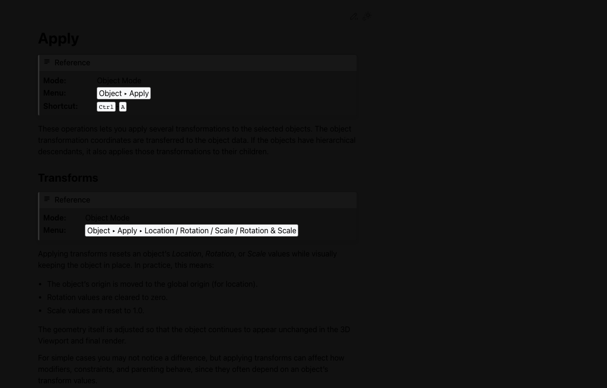
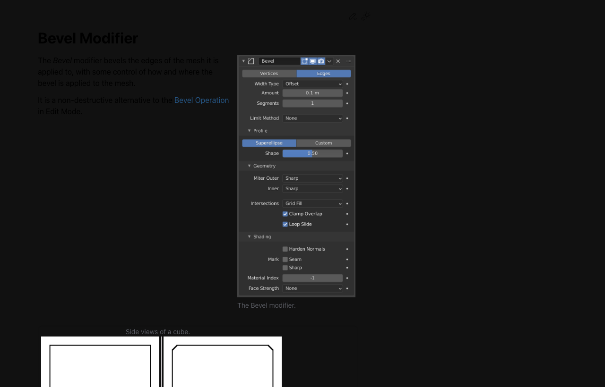
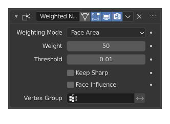
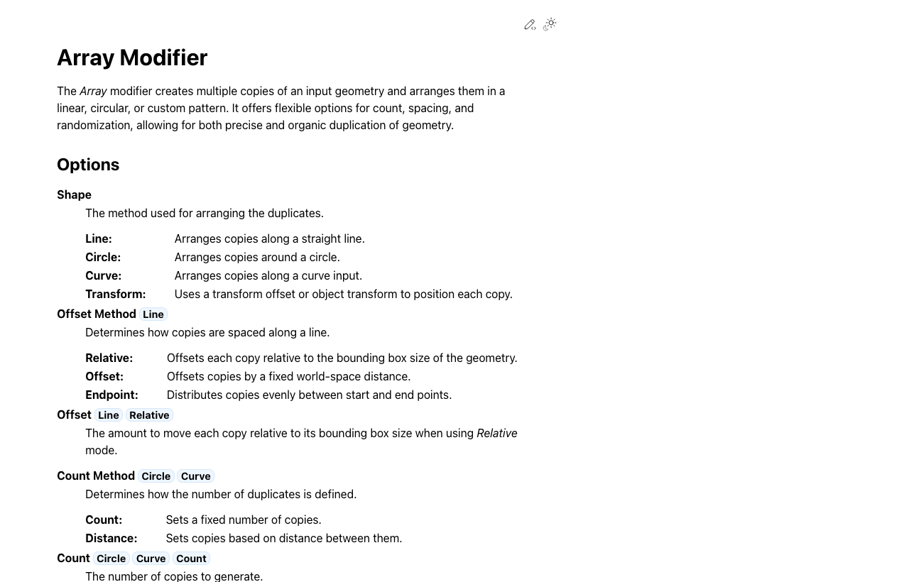

# Week 04: 기초 모델링 2 - 하드서피스 디테일 & 정리

## 학습 목표

- [ ] `Ctrl + B`와 `Bevel Modifier`의 차이를 설명할 수 있다
- [ ] `Weighted Normal`이 어떤 문제를 해결하는지 이해한다
- [ ] `Apply Transform`과 `Modifier Apply`의 시점을 구분할 수 있다
- [ ] 로봇 모델의 얼굴, 관절, 패널 디테일을 더 깔끔하게 정리할 수 있다

## 🔗 이전 주차 복습

- Week 03에서 **기본형 + Mirror + Subdivision + Bevel/Weighted Normal + Join/Separate + Apply 타이밍**까지 한 번 경험했다
- 이번 주는 큰 덩어리를 새로 만드는 시간보다, **이미 만든 형태를 더 좋아 보이게 정리하는 시간**이다
- 계속해서 **G / R / S**, 축 제한, `Ctrl + A`를 사용한다

## 이론 (30분)

### 이번 주 흐름

- 지난주에는 로봇의 **큰 덩어리**를 만들었다
- 이번 주에는 얼굴, 관절, 패널 같은 **디테일**을 더한다
- 그리고 마지막에 **음영 정리**와 **Apply 타이밍**을 구분한다

> 💡 실제 로봇 모델링 영상도 대부분 `기본형 → 디테일 추가 → 음영 정리 → 마지막에만 확정` 흐름으로 진행된다.

### 디테일에서 자주 쓰는 도구

| 도구 | 언제 쓰는지 | 기억할 점 |
|------|-------------|-----------|
| **Inset (I)** | 버튼, 눈, 패널 영역을 안쪽으로 한 번 더 잡을 때 | 디테일 시작점을 만들기 좋다 |
| **Boolean** | 구멍, 소켓, 홈을 빠르게 만들 때 | 커터가 실제로 겹쳐 있어야 한다 |
| **Bevel (`Ctrl + B`)** | 특정 모서리만 직접 깎을 때 | 손으로 직접 다듬는 느낌 |
| **Bevel Modifier** | 전체 외장 모서리 느낌을 비파괴로 정리할 때 | 나중에도 값을 조절할 수 있다 |
| **Weighted Normal** | 형태는 괜찮은데 음영이 울퉁불퉁해 보일 때 | Bevel Modifier와 함께 볼 때 차이가 잘 보인다 |

### 헷갈리기 쉬운 Apply 두 가지

| 항목 | 의미 | 언제 쓰는지 |
|------|------|-------------|
| **Apply Transform (`Ctrl + A`)** | 위치/회전/스케일 수치를 정리 | Modifier 전, 작업 중간중간 확인 |
| **Apply Modifier** | 현재 Modifier 결과를 실제 메쉬로 확정 | 정말 마지막 정리 단계 |

> ⚠️ `Ctrl + A`는 자주 써도 되지만, `Modifier Apply`는 너무 일찍 하면 수정 여지가 줄어든다.

## 실습 (90분)

### Step 1: Transform 정리 + 파츠 관리 (20분)

1. Week 03에서 만든 로봇 파일을 연다
2. `N` 패널에서 Scale이 `(1, 1, 1)`인지 확인한다
3. 이상하면 `Ctrl + A > All Transforms`를 적용한다
4. 따로 관리할 파츠는 `P > Selection`으로 분리한다
5. 하나로 묶어도 되는 파츠는 `Ctrl + J`로 합친다

> 💡 관절, 안테나, 헤드셋처럼 따로 움직일 수 있는 파츠는 미리 분리해두면 이후 작업이 편하다.

### Step 2: 얼굴 / 패널 / 관절 디테일 만들기 (20분)

1. 얼굴이나 가슴 패널처럼 눈에 잘 보이는 부위를 하나 고른다
2. `Inset (I)`으로 안쪽 영역을 만든다
3. 필요하면 `Extrude`로 살짝 들어가거나 나오게 만든다
4. 구멍이나 소켓이 필요하면 `Boolean Difference`를 사용한다
5. 디테일을 넣은 뒤 정면, 측면, 투시 뷰에서 다시 확인한다

### Step 3: Bevel 두 가지 비교하기 (20분)

#### `Ctrl + B`

- 특정 모서리를 직접 골라서 깎는다
- 얼굴 테두리, 손가락 끝, 패널 라인처럼 **부분 수정**에 좋다

#### Bevel Modifier

- 오브젝트 전체의 모서리 느낌을 한 번에 조절한다
- 외장 파츠 전체를 정리할 때 좋다

**실습 포인트**

1. 작은 파츠 하나는 `Ctrl + B`로 직접 다듬는다
2. 다른 파츠 하나는 `Bevel Modifier`를 넣어 비교한다
3. Width와 Segments를 바꾸며 차이를 확인한다

### Step 4: Weighted Normal로 음영 정리하기 (15분)

1. `Shade Smooth`를 먼저 적용한다
2. `Bevel Modifier` 아래에 `Weighted Normal`을 추가한다
3. 전후를 비교하며 표면이 얼마나 깔끔해졌는지 본다
4. 특히 평평한 면이 많은 가슴판, 팔 외장, 다리 파츠에서 확인한다

> 💡 `Weighted Normal`은 모양을 바꾸는 도구라기보다 **빛이 닿는 느낌을 정리하는 도구**라고 이해하면 쉽다.

### Step 5: 최종 점검과 Apply 시점 이해하기 (15분)

1. Modifier Stack 순서를 다시 확인한다
2. 수정할 가능성이 남아 있으면 Apply하지 않는다
3. 정말 확정할 파츠만 별도 저장 후 Apply를 시험해본다
4. 스크린샷은 `수정 가능한 상태`와 `최종 확인 화면`을 모두 남긴다

## ⚠️ 흔한 실수와 해결법

| 실수 | 원인 | 해결법 |
|------|------|--------|
| Bevel이 너무 두꺼워 보임 | Width가 과함 | 값을 아주 작게 시작하고 천천히 올린다 |
| Weighted Normal 차이가 잘 안 보임 | 비교 기준이 없음 | Bevel Modifier 전후, Shade Smooth 전후를 같이 본다 |
| Boolean이 지저분함 | 커터가 애매하게 겹침 | 커터를 더 명확히 겹치고 Scale도 정리한다 |
| Apply 후 수정이 어려워짐 | Modifier를 너무 일찍 확정함 | **Modifier Apply는 마지막에만** |
| 파츠 관리가 헷갈림 | 합쳐야 할 것과 분리할 것이 섞여 있음 | 움직일 파츠는 분리, 고정 파츠는 정리해서 묶는다 |

## 과제

- **제출:** Discord `#week04-assignment` 채널
- **내용:** Week 03 기본형에 디테일과 음영 정리를 더한 로봇/캐릭터 형태 제작
- **형식:** 스크린샷 3장 + 사용한 도구/Modifier 목록 + 한줄 코멘트
  - 1장: 디테일 작업 과정
  - 2장: Modifier Stack 또는 Transform 확인 화면
  - 3장: 최종 결과 화면
- **기한:** 다음 수업 전까지

## 핵심 정리

| 개념 | 핵심 내용 |
|------|-----------|
| `Ctrl + B` | 특정 모서리를 직접 깎는 수동 Bevel |
| Bevel Modifier | 전체 외장 모서리를 비파괴로 정리 |
| Weighted Normal | 하드서피스 음영을 깔끔하게 정리 |
| Apply Transform | Modifier 전 Scale/Rotation을 정리 |
| Modifier Apply | 최종 확정 단계에서만 사용 |
| Join / Separate | 파츠를 묶거나 분리해 관리 |

## 📋 프로젝트 진행 체크리스트

- [ ] 얼굴, 패널, 관절 중 한 곳 이상 디테일을 추가했다
- [ ] `Ctrl + B` 또는 `Bevel Modifier`를 사용했다
- [ ] `Weighted Normal`을 확인했다
- [ ] `Ctrl + A`로 Transform을 점검했다
- [ ] 파츠를 분리하거나 합쳐서 정리했다
- [ ] 결과 스크린샷 3장을 저장했다

<!-- AUTO:CURRICULUM-SYNC:START -->
## 커리큘럼 연동 요약

> 이 섹션은 `course-site/data/curriculum.js` 기준으로 자동 갱신됩니다.

- 핵심 키워드: Bevel · Weighted Normal · Apply
- 예상 시간: ~3시간

### 실습 단계

#### 1. Transform 정리와 파츠 관리

디테일을 넣기 전에 Scale과 파츠 구성을 먼저 정리해요. 수치가 꼬여 있거나 파츠가 뒤섞여 있으면 그다음 작업이 계속 불편해져요.

배울 것

- Transform을 정리한다
- 파츠를 분리하거나 합쳐 관리한다

체크해볼 것

- N 패널에서 Scale 값 확인 (1,1,1이 아니면 먼저 정리)
- Ctrl+A로 All Transforms 적용 (Modifier 전에 수치 정리)
- P로 움직일 파츠 분리하기 (안테나, 헤드셋, 손 파츠 등)
- Ctrl+J로 함께 갈 파츠 묶기 (고정 파츠끼리 정리)

#### 2. 얼굴과 패널 디테일

큰 덩어리가 잡힌 상태에서 눈, 패널, 관절 라인을 추가하는 단계예요. Inset과 Boolean을 같이 쓰면 디테일을 빠르게 만들 수 있어요.

배울 것

- Inset과 Boolean으로 디테일을 추가한다

체크해볼 것

- Inset으로 안쪽 영역 만들기 (눈, 버튼, 패널 라인 시작점)
- Extrude로 살짝 들어가거나 나오게 만들기 (작은 깊이 차이 주기)
- Boolean Difference로 홈 또는 소켓 만들기 (커터가 실제로 겹치는지 확인)

#### 3. Bevel 두 가지 비교

같은 '모서리 정리'라도 손으로 직접 깎는 방법과 Modifier로 전체를 정리하는 방법은 다르게 느껴져요. 둘 다 직접 비교해보는 게 가장 빠릅니다.

배울 것

- Ctrl+B와 Bevel Modifier를 구분해 쓴다

체크해볼 것

- 특정 모서리에 Ctrl+B 써보기 (부분 디테일 직접 다듬기)
- 다른 파츠에는 Bevel Modifier 넣기 (Width와 Segments 비교)
- 두 방식의 결과를 나란히 비교하기 (부분 수정 vs 전체 정리)

#### 4. Weighted Normal과 음영 정리

형태는 괜찮은데 표면이 울퉁불퉁해 보일 때가 있어요. 이럴 때 음영을 정리해주는 흐름을 익혀두면 결과물이 훨씬 단정해져요.

배울 것

- Weighted Normal의 역할을 이해한다

체크해볼 것

- Shade Smooth 적용하기 (음영 비교 준비)
- Bevel Modifier 아래에 Weighted Normal 추가 (순서 포함해서 확인)
- 전후 화면 비교하기 (가슴판, 팔 외장, 다리 파츠에서 확인)

#### 5. Apply 시점과 최종 점검

정리 단계에서 가장 많이 헷갈리는 건 '언제 확정하느냐'예요. 수정 가능성을 남길지, 지금 확정할지를 의식적으로 나눠보면 훨씬 안정적으로 작업할 수 있어요.

배울 것

- Apply Transform과 Modifier Apply를 구분한다

체크해볼 것

- Modifier Stack 순서 다시 보기 (수정 가능 상태 유지)
- 정말 확정할 파츠만 따로 저장 후 Apply 시험 (Apply 전후 수정 차이 느끼기)
- Transform 또는 Modifier 화면 포함해 스크린샷 저장 (작업 흐름 증거 남기기)

### 핵심 단축키

- `I`: Inset (면 안쪽에 디테일 시작점 만들기)
- `Ctrl + B`: Bevel (특정 모서리 직접 다듬기)
- `Ctrl + A`: Apply All Transforms (Modifier 전 수치 정리)
- `P`: Separate (선택 파츠 분리)
- `Ctrl + J`: Join (오브젝트 합치기)

### 과제 한눈에 보기

- 과제명: 로봇 디테일 정리
- 설명: Week 03 기본형에 디테일과 음영 정리를 더한 결과물을 제출하세요.
- 제출 체크:
  - 디테일 1곳 이상 추가
  - Bevel 계열 1회 이상 사용
  - Weighted Normal 확인
  - Modifier Stack 또는 Transform 확인 스크린샷

### 자주 막히는 지점

- Bevel이 너무 큼 → Width를 아주 작게 시작
- Weighted Normal 차이가 안 보임 → Bevel과 Shade Smooth 전후 비교
- Boolean이 지저분함 → 커터가 실제로 겹치는지 다시 확인
- Modifier를 너무 일찍 Apply함 → 마지막에만 확정
- 파츠 관리가 헷갈림 → 움직일 파츠는 분리, 고정 파츠는 정리해서 묶기

### 공식 문서

- [Bevel Tool](https://docs.blender.org/manual/en/latest/modeling/meshes/tools/bevel.html)
- [Bevel Modifier](https://docs.blender.org/manual/en/latest/modeling/modifiers/generate/bevel.html)
- [Weighted Normal](https://docs.blender.org/manual/en/latest/modeling/modifiers/modify/weighted_normal.html)
- [Boolean](https://docs.blender.org/manual/en/latest/modeling/modifiers/generate/booleans.html)
<!-- AUTO:CURRICULUM-SYNC:END -->

## 참고 자료

- [Blender 단축키 모음](../../resources/blender-shortcuts.md)
- [Blender Manual - Bevel Tool](https://docs.blender.org/manual/en/latest/modeling/meshes/tools/bevel.html)
- [Blender Manual - Bevel Modifier](https://docs.blender.org/manual/en/latest/modeling/modifiers/generate/bevel.html)
- [Blender Manual - Weighted Normal Modifier](https://docs.blender.org/manual/en/latest/modeling/modifiers/modify/weighted_normal.html)
- [Blender Manual - Boolean Modifier](https://docs.blender.org/manual/en/latest/modeling/modifiers/generate/booleans.html)
