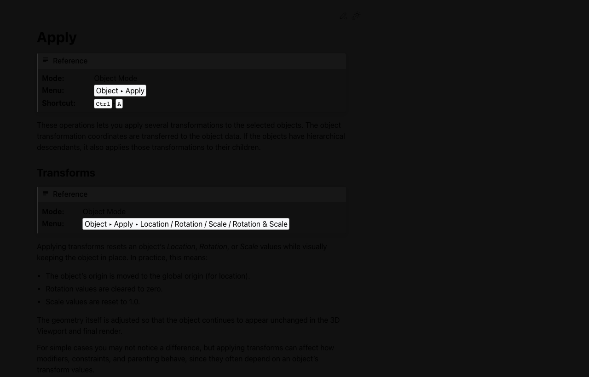
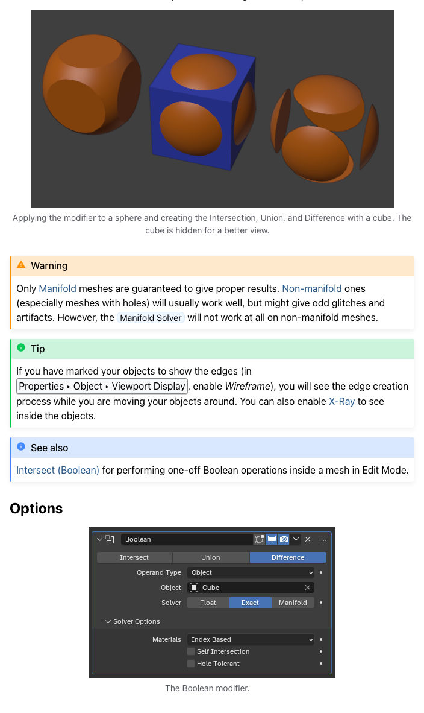
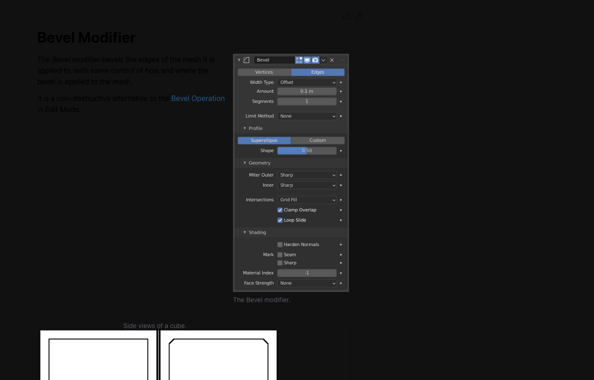
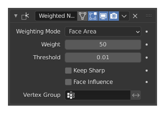
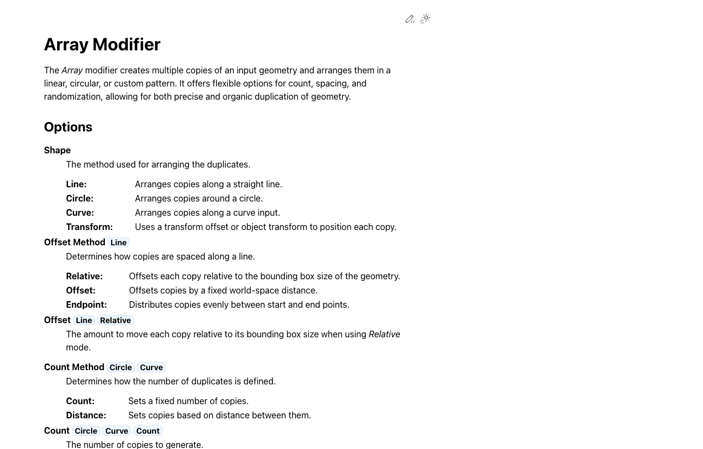

# Week 04: 기초 모델링 2 - 하드서피스 디테일 & 정리

## 학습 목표

- [ ] `Ctrl + B`와 `Bevel Modifier`의 차이를 설명할 수 있다
- [ ] `Weighted Normal`이 어떤 문제를 해결하는지 이해한다
- [ ] `Apply Transform`과 `Modifier Apply`의 시점을 구분할 수 있다
- [ ] 로봇 모델의 얼굴, 관절, 패널 디테일을 더 깔끔하게 정리할 수 있다

## 🔗 이전 주차 복습

- Week 03에서 **기본형 + Mirror + Subdivision + Bevel/Weighted Normal + Join/Separate + Apply 타이밍**까지 한 번 경험했다
- 이번 주는 큰 덩어리를 새로 만드는 시간보다, **이미 만든 형태를 더 좋아 보이게 정리하는 시간**이다
- 계속해서 **G / R / S**, 축 제한, `Ctrl + A`를 사용한다

## 이론 (30분)

### 이번 주 흐름

- 지난주에는 로봇의 **큰 덩어리**를 만들었다
- 이번 주에는 얼굴, 관절, 패널 같은 **디테일**을 더한다
- 그리고 마지막에 **음영 정리**와 **Apply 타이밍**을 구분한다

> 💡 실제 로봇 모델링 영상도 대부분 `기본형 → 디테일 추가 → 음영 정리 → 마지막에만 확정` 흐름으로 진행된다.

### 디테일에서 자주 쓰는 도구

| 도구 | 언제 쓰는지 | 기억할 점 |
|------|-------------|-----------|
| **Inset (I)** | 버튼, 눈, 패널 영역을 안쪽으로 한 번 더 잡을 때 | 디테일 시작점을 만들기 좋다 |
| **Boolean** | 구멍, 소켓, 홈을 빠르게 만들 때 | 커터가 실제로 겹쳐 있어야 한다 |
| **Bevel (`Ctrl + B`)** | 특정 모서리만 직접 깎을 때 | 손으로 직접 다듬는 느낌 |
| **Bevel Modifier** | 전체 외장 모서리 느낌을 비파괴로 정리할 때 | 나중에도 값을 조절할 수 있다 |
| **Weighted Normal** | 형태는 괜찮은데 음영이 울퉁불퉁해 보일 때 | Bevel Modifier와 함께 볼 때 차이가 잘 보인다 |

### 헷갈리기 쉬운 Apply 두 가지

| 항목 | 의미 | 언제 쓰는지 |
|------|------|-------------|
| **Apply Transform (`Ctrl + A`)** | 위치/회전/스케일 수치를 정리 | Modifier 전, 작업 중간중간 확인 |
| **Apply Modifier** | 현재 Modifier 결과를 실제 메쉬로 확정 | 정말 마지막 정리 단계 |

> ⚠️ `Ctrl + A`는 자주 써도 되지만, `Modifier Apply`는 너무 일찍 하면 수정 여지가 줄어든다.

## 실습 (90분)

### Step 1: Transform 정리 + 파츠 관리 (20분)

1. Week 03에서 만든 로봇 파일을 연다
2. `N` 패널에서 Scale이 `(1, 1, 1)`인지 확인한다
3. 이상하면 `Ctrl + A > All Transforms`를 적용한다
4. 따로 관리할 파츠는 `P > Selection`으로 분리한다
5. 하나로 묶어도 되는 파츠는 `Ctrl + J`로 합친다

> 💡 관절, 안테나, 헤드셋처럼 따로 움직일 수 있는 파츠는 미리 분리해두면 이후 작업이 편하다.

### Step 2: 얼굴 / 패널 / 관절 디테일 만들기 (20분)

1. 얼굴이나 가슴 패널처럼 눈에 잘 보이는 부위를 하나 고른다
2. `Inset (I)`으로 안쪽 영역을 만든다
3. 필요하면 `Extrude`로 살짝 들어가거나 나오게 만든다
4. 구멍이나 소켓이 필요하면 `Boolean Difference`를 사용한다
5. 디테일을 넣은 뒤 정면, 측면, 투시 뷰에서 다시 확인한다

### Step 3: Bevel 두 가지 비교하기 (20분)

#### `Ctrl + B`

- 특정 모서리를 직접 골라서 깎는다
- 얼굴 테두리, 손가락 끝, 패널 라인처럼 **부분 수정**에 좋다

#### Bevel Modifier

- 오브젝트 전체의 모서리 느낌을 한 번에 조절한다
- 외장 파츠 전체를 정리할 때 좋다

**실습 포인트**

1. 작은 파츠 하나는 `Ctrl + B`로 직접 다듬는다
2. 다른 파츠 하나는 `Bevel Modifier`를 넣어 비교한다
3. Width와 Segments를 바꾸며 차이를 확인한다

### Step 4: Weighted Normal로 음영 정리하기 (15분)

1. `Shade Smooth`를 먼저 적용한다
2. `Bevel Modifier` 아래에 `Weighted Normal`을 추가한다
3. 전후를 비교하며 표면이 얼마나 깔끔해졌는지 본다
4. 특히 평평한 면이 많은 가슴판, 팔 외장, 다리 파츠에서 확인한다

> 💡 `Weighted Normal`은 모양을 바꾸는 도구라기보다 **빛이 닿는 느낌을 정리하는 도구**라고 이해하면 쉽다.

### Step 5: 최종 점검과 Apply 시점 이해하기 (15분)

1. Modifier Stack 순서를 다시 확인한다
2. 수정할 가능성이 남아 있으면 Apply하지 않는다
3. 정말 확정할 파츠만 별도 저장 후 Apply를 시험해본다
4. 스크린샷은 `수정 가능한 상태`와 `최종 확인 화면`을 모두 남긴다

## ⚠️ 흔한 실수와 해결법

| 실수 | 원인 | 해결법 |
|------|------|--------|
| Bevel이 너무 두꺼워 보임 | Width가 과함 | 값을 아주 작게 시작하고 천천히 올린다 |
| Weighted Normal 차이가 잘 안 보임 | 비교 기준이 없음 | Bevel Modifier 전후, Shade Smooth 전후를 같이 본다 |
| Boolean이 지저분함 | 커터가 애매하게 겹침 | 커터를 더 명확히 겹치고 Scale도 정리한다 |
| Apply 후 수정이 어려워짐 | Modifier를 너무 일찍 확정함 | **Modifier Apply는 마지막에만** |
| 파츠 관리가 헷갈림 | 합쳐야 할 것과 분리할 것이 섞여 있음 | 움직일 파츠는 분리, 고정 파츠는 정리해서 묶는다 |

## 과제

- **제출:** 본인 학생 페이지
- **내용:** Week 03 기본형에 디테일과 음영 정리를 더한 로봇/캐릭터 형태 제작
- **형식:** 스크린샷 3장 + 사용한 도구/Modifier 목록 + 한줄 코멘트
  - 1장: 디테일 작업 과정
  - 2장: Modifier Stack 또는 Transform 확인 화면
  - 3장: 최종 결과 화면
- **기한:** 다음 수업 전까지

## 핵심 정리

| 개념 | 핵심 내용 |
|------|-----------|
| `Ctrl + B` | 특정 모서리를 직접 깎는 수동 Bevel |
| Bevel Modifier | 전체 외장 모서리를 비파괴로 정리 |
| Weighted Normal | 하드서피스 음영을 깔끔하게 정리 |
| Apply Transform | Modifier 전 Scale/Rotation을 정리 |
| Modifier Apply | 최종 확정 단계에서만 사용 |
| Join / Separate | 파츠를 묶거나 분리해 관리 |

## 📋 프로젝트 진행 체크리스트

- [ ] 얼굴, 패널, 관절 중 한 곳 이상 디테일을 추가했다
- [ ] `Ctrl + B` 또는 `Bevel Modifier`를 사용했다
- [ ] `Weighted Normal`을 확인했다
- [ ] `Ctrl + A`로 Transform을 점검했다
- [ ] 파츠를 분리하거나 합쳐서 정리했다
- [ ] 결과 스크린샷 3장을 저장했다

<!-- AUTO:CURRICULUM-SYNC:START -->
## 커리큘럼 연동 요약

> 이 섹션은 `course-site/data/curriculum.js` 기준으로 자동 갱신됩니다.

- 핵심 키워드: Bevel · Weighted Normal · Apply
- 예상 시간: ~3시간

### 실습 단계

#### 1. 몸통 만들기

3주차에 만든 머리 아래에 몸통을 붙여요. Cube에 Subdivision을 걸면 둥근 로봇 몸통이 되고, Inset으로 가슴판 영역을 구분하면 나중에 색을 나눌 때도 편해요.

몸통 기본 형태:

가슴판 영역 구분:

Subdivision Level은 2면 충분해요. 높이면 컴퓨터가 느려지고, 디테일 작업도 어려워집니다. 필요하면 나중에 올릴 수 있어요.

체크리스트:

체크해볼 것

- Shift + A → Mesh → Cube 추가
- S로 몸통 비율 잡기 (머리보다 살짝 작거나 비슷한 폭)
- Subdivision Surface Modifier 추가 (Level 2)
- G + Z로 머리 아래에 배치
- Tab → Edit Mode 진입
- 앞면 Face 선택
- I → Inset으로 안쪽 영역 생성
- E → Extrude로 살짝 돌출 (로봇 외장 느낌)
- Cube 추가 후 S로 몸통 비율 잡기 (머리보다 살짝 작거나 비슷한 폭)
- Subdivision Surface Modifier 추가 (Level 2로 둥근 형태 확인)
- Edit Mode에서 Inset으로 가슴판 영역 만들기 (앞면 선택 → I → 안쪽 면 생성)
- Extrude로 가슴판을 살짝 돌출시키기 (로봇 외장 느낌 추가)

#### 2. 3D Cursor로 위치 잡기

Blender에서 오브젝트를 정확한 위치에 만들려면 3D Cursor를 먼저 옮겨야 해요. 3D Cursor가 있는 곳에 새 오브젝트가 생기거든요. 관절을 붙이고 싶은 위치에 Cursor를 먼저 놓는 연습을 해봐요.

3D Cursor 이동 방법:

Cursor 위치에 오브젝트 생성:

3D Cursor는 주황색 십자가 표시예요. 뷰포트에서 위치를 확인하세요. 엉뚝한 곳에 가면 Shift+S → Cursor to World Origin으로 원점으로 되돌릴 수 있어요.

체크리스트:

체크해볼 것

- Shift + Right Click으로 어깨 위치에 Cursor 놓기
- Shift + A → Mesh → UV Sphere
- Cursor가 있는 어깨 위치에 바로 생성됨!
- Shift+Right Click으로 3D Cursor 이동 연습 (뷰포트에서 클릭한 곳으로 주황색 십자가 이동)
- Shift+S → Cursor to Selected로 정확한 위치로 (오브젝트나 Vertex를 선택한 후 실행)
- Shift+S → Cursor to World Origin으로 원점 복귀 (Cursor를 0,0,0으로 되돌리기)
- 3D Cursor 위치에 UV Sphere 추가해보기 (Shift+A → Mesh → UV Sphere)

#### 3. Origin 이동과 Snap 배치

Origin은 오브젝트의 기준점이에요. 회전하면 Origin을 중심으로 돌고, 좌표도 Origin 위치를 표시해요. Snap은 오브젝트를 다른 오브젝트의 꼭짓점·면·모서리에 정확히 붙이는 기능이에요.

Origin 이동:

Snap 배치:

Origin과 3D Cursor는 다른 것이에요!

둘 다 자유롭게 옮길 수 있지만, 역할이 다릅니다.

체크리스트:

배울 것

- 3D Cursor: 새 오브젝트가 생성될 위치 (주황색 십자가)
- Origin: 오브젝트의 기준점 (주황색 점)

체크해볼 것

- 상단 자석 아이콘 켜기
- Snap To: Vertex로 설정 (꼭짓점에 딱 붙음)
- G로 이동할 때 Ctrl 누르면 Snap 동작
- Right Click → Set Origin → Origin to 3D Cursor (미리 3D Cursor를 원하는 위치에 놓고 실행)
- Right Click → Set Origin → Origin to Geometry (Origin을 오브젝트 중심으로 되돌리기)
- 상단 Snap 자석 아이콘 켜고 Snap To: Vertex 설정 (꼭짓점에 딱 붙음)
- G로 이동할 때 Ctrl 눌러 Snap 이동 연습 (몸통 표면 꼭짓점에 관절이 딱 붙는 느낌 확인)

#### 4. 관절 구체 배치 실습

이제 배운 3D Cursor, Origin, Snap을 조합해서 로봇의 어깨·팔꿈치·무릎·발목에 관절 구체를 실제로 배치해요. 하나 만들고 복제해서 각 위치에 놓으면 돼요.

관절 배치 워크플로우:

관절 구체는 파츠와 살짝 파묻히는 정도가 자연스러워요. 완전히 떨어져 있으면 분리된 느낌이 나고, 너무 깊이 들어가면 안 보여요.

체크리스트:

체크해볼 것

- Shift + Right Click → 어깨 위치에 3D Cursor 놓기
- Shift + A → UV Sphere (Segments 16) → Cursor 위치에 생성
- S로 관절 크기 조절, R로 회전 조정
- Shift + D → 복제
- G + Ctrl → Snap으로 팔꿈치 위치에 배치
- 반복: 무릎, 발목도 같은 방식
- 어깨 위치에 3D Cursor 놓고 UV Sphere 생성 (Shift+Right Click → Shift+A → UV Sphere (Segments 16))
- S로 관절 크기 조절, R로 회전 조정 (관절이 파츠에 살짝 파묻히는 정도가 자연스러움)
- Shift+D로 복제 → 팔꿈치 위치에 Snap 배치 (복제 후 G → Ctrl 누른 채 이동하면 Snap)
- 같은 방식으로 무릎, 발목 관절도 배치 (총 6~8개 관절 구체 (좌우 대칭))

#### 5. 팔과 다리 제작

관절 사이를 채울 팔과 다리를 만들어요. Cube나 Cylinder를 늘려서 상완/하완, 허벅지/종아리를 만들고, Mirror Modifier로 반대편도 한 번에 처리해요.

팔 파츠 제작:

Mirror로 좌우 대칭:

Mirror가 이상한 방향으로 되면? Origin이 몸통 중심에 있는지 확인하세요. Origin이 파츠 자체에 있으면 그 자리에서 미러됩니다. Right-click → Set Origin → Origin to 3D Cursor (3D Cursor를 중심에 먼저 놓고)

체크리스트:

체크해볼 것

- Shift + A → Cube 추가
- S로 팔 하나 비율 잡기 (관절 구체 사이 길이)
- Tab → Edit Mode → Ctrl + R → Loop Cut으로 분절 추가
- G로 관절 사이에 배치
- 팔 파츠 선택
- Modifier → Mirror Modifier 추가
- Mirror Object: 몸통 (또는 Empty)
- Origin이 몸통 중심에 있는지 확인!
- Cube 추가 → S로 팔 하나 비율 잡기 (관절 구체 사이에 맞는 길이로)
- Edit Mode에서 Loop Cut으로 팔꿈치 분절 추가 (상완/하완 느낌을 구분)
- Mirror Modifier로 반대편 팔 생성 (Origin이 몸통 중심에 있는지 확인)
- 같은 방식으로 다리 파츠 제작 (허벅지/종아리를 관절 구체 사이에 배치)

#### 6. 손과 발 디테일

손가락은 작은 Cube를 복제해서 3~4개 나란히 배치하면 돼요. 발은 Cube를 Extrude해서 부츠 형태로 잡아요. 반복 파츠에는 Array Modifier를 써볼 수도 있어요.

손가락 만들기 (Loop Cut + Inset + Extrude):

발 만들기:

Array vs 수동 복제: Array Modifier는 간격이 균일해서 깔끔하지만, 수동 복제(Shift+D)는 각 손가락 크기를 다르게 할 수 있어요. 둘 다 시도해보세요!

체크리스트:

체크해볼 것

- Shift + A → Cube → S로 손바닥 형태 잡기
- Tab → Edit Mode 진입
- Ctrl + R → Loop Cut으로 손가락 갯수만큼 분할 (3~4줄)
- 나뉜 앞면(Face)에서 I → Inset으로 손가락 뽑을 위치 조정
- E → Extrude로 손가락 한 마디 뽑기
- R로 꺾어서 관절 느낌 주기
- 다시 E → Extrude로 다음 마디 뽑기
- 각 손가락마다 4~6번 반복
- Shift + A → Cube
- Tab → Edit Mode
- 앞쪽 Face 선택 → E → Extrude로 발끝 형태 잡기
- 밑면이 평평해야 바닥에 안정적으로 서요
- Cube를 손바닥 형태로 만들기 (S로 비율 잡은 뒤 Edit Mode 진입)
- Ctrl+R Loop Cut으로 손가락 갯수만큼 분할 (3~4줄로 나누기)
- Inset → Extrude → 꺾기를 반복해 손가락 제작 (마디마다 E로 뽑고 R로 꺾기)
- 발 파츠: Cube → Extrude로 부츠 형태 잡기 (밑면이 평평해야 바닥에 안정적으로 서요)

#### 7. Bevel로 모서리 마감

파츠를 다 만들었으면 모서리를 정리해서 완성도를 높여요. 얼굴 화면 테두리나 몸통 이음새에 Bevel을 넣으면 금속 느낌이 살아나요. 직접 깎는 Ctrl+B와 전체 적용 Modifier를 비교해보세요.

방법 1: Bevel Tool (부분 수정)

방법 2: Bevel Modifier (전체 정리)

체크리스트:

배울 것

- 특정 모서리만 선택적으로 다듬을 때 사용
- 적용 즉시 메쉬에 반영 (되돌리기: Ctrl+Z)
- 전체 오브젝트의 모서리를 균일하게 정리
- 비파괴적: 언제든 Width, Segments 조절 가능

체크해볼 것

- 얼굴 화면 테두리 모서리에 Ctrl+B (Scroll로 Segment 수 조절)
- 몸통 파츠에 Bevel Modifier 적용 (Width를 아주 작게 시작 (0.01~0.02))
- 두 방식의 결과를 나란히 비교하기 (부분 수정 vs 전체 정리, 어떤 게 편한지 느끼기)

#### 8. 파츠 정리 & Apply

모든 파츠가 만들어졌으면 구조를 정리해요. 움직여야 할 파츠(팔, 다리, 머리)는 따로 두고, 고정 파츠끼리는 Join으로 합쳐요. Transform을 Apply해서 수치를 깔끔하게 만들면 완성이에요.

파츠 이름 정리:

파츠 합치기/분리:

Transform 정리:

Mirror Modifier는 Apply 전에 확인! Mirror Modifier가 남아 있으면 Apply 순서를 잘 지켜야 해요. Mirror를 먼저 Apply하고, 그다음 다른 Modifier를 정리하세요.

체크리스트:

체크해볼 것

- Outliner에서 파츠 이름 정리하기 (Head, Body, Arm_L, Leg_R 등 알아보기 쉽게)
- 고정 파츠끼리 Ctrl+J로 합치기 (몸통+가슴판 등 항상 같이 움직일 것들)
- Ctrl+A → All Transforms 적용 (모든 파츠의 Scale을 1,1,1로 정리)
- 최종 형태 스크린샷 저장 (정면/측면 뷰로 완성 상태 기록)

### 핵심 단축키

- `Shift + A`: Add (Cube, UV Sphere 등)
- `Shift + D`: Duplicate (복제)
- `Shift + S`: Snap 메뉴 (Cursor to Selected 등)
- `Ctrl + G이동`: Snap 이동 (자석 켜진 상태)
- `Ctrl + B`: Bevel (모서리 직접 다듬기)
- `Ctrl + R`: Loop Cut (분절 추가)
- `P`: Separate (파츠 분리)
- `Ctrl + J`: Join (오브젝트 합치기)
- `Ctrl + A`: Apply All Transforms
- `N`: Properties 패널 (Scale 확인)
- `H`: 선택 오브젝트 숨기기
- `Alt + H`: 숨긴 오브젝트 복원
- `Ctrl + Z`: 되돌리기

### 과제 한눈에 보기

- 과제명: 로봇 디테일 정리
- 설명: Week 03 기본형에 디테일과 음영 정리를 더한 결과물을 제출하세요.
- 제출 체크:
  - 디테일 1곳 이상 추가
  - Bevel 계열 1회 이상 사용
  - Weighted Normal 확인
  - Modifier Stack 또는 Transform 확인 스크린샷

### 자주 막히는 지점

- Bevel이 너무 큼 → Width를 아주 작게 시작
- Weighted Normal 차이가 안 보임 → Bevel과 Shade Smooth 전후 비교
- Boolean이 지저분함 → 커터가 실제로 겹치는지 다시 확인
- Modifier를 너무 일찍 Apply함 → 마지막에만 확정
- 파츠 관리가 헷갈림 → 움직일 파츠는 분리, 고정 파츠는 정리해서 묶기

### 공식 영상 튜토리얼

- [Blender Studio - Modifiers](https://studio.blender.org/training/blender-fundamentals-45-lts/blender_4-5_lts_modifiers/)

### 공식 문서

- [Bevel Tool](https://docs.blender.org/manual/en/latest/modeling/meshes/tools/bevel.html)
- [Bevel Modifier](https://docs.blender.org/manual/en/latest/modeling/modifiers/generate/bevel.html)
- [Weighted Normal](https://docs.blender.org/manual/en/latest/modeling/modifiers/modify/weighted_normal.html)
- [Boolean](https://docs.blender.org/manual/en/latest/modeling/modifiers/generate/booleans.html)
<!-- AUTO:CURRICULUM-SYNC:END -->

## 참고 자료

- [Blender 단축키 모음](../../resources/blender-shortcuts.md)
- [Blender Manual - Bevel Tool](https://docs.blender.org/manual/en/latest/modeling/meshes/tools/bevel.html)
- [Blender Manual - Bevel Modifier](https://docs.blender.org/manual/en/latest/modeling/modifiers/generate/bevel.html)
- [Blender Manual - Weighted Normal Modifier](https://docs.blender.org/manual/en/latest/modeling/modifiers/modify/weighted_normal.html)
- [Blender Manual - Boolean Modifier](https://docs.blender.org/manual/en/latest/modeling/modifiers/generate/booleans.html)
