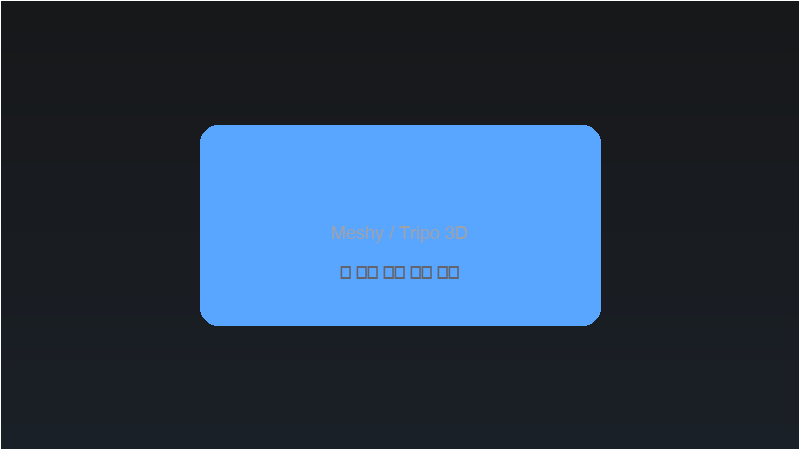

# Week 05: AI 3D 생성 + Sculpting + MCP 활용

## 🔗 이전 주차 복습

> **Week 03-04의 모델링 기법 복습**
>
> AI가 생성한 모델은 토폴로지가 불완전하므로, 직접 수정할 때 이전에 배운 모델링 기법이 필요합니다.
> - **Edit Mode 조작** (Week 03): Vertex, Edge, Face 선택 및 수정 — AI 모델의 불필요한 Face 정리 시 활용
> - **Modifier 활용** (Week 04): Subdivision Surface, Mirror 등 — AI 모델의 형태를 보완할 때 활용
> - **Transform 적용** (Ctrl+A): AI 모델 임포트 후 Scale/Rotation 적용은 필수

## 학습 목표

- [ ] AI 도구로 3D 모델을 생성하고 Blender에 임포트할 수 있다
- [ ] Sculpt Mode의 기본 브러시를 사용할 수 있다
- [ ] Blender MCP로 기본 씬을 자동 생성할 수 있다

## 이론 (20분)

### AI 3D 생성의 원리와 한계

- **텍스트 to 3D:** 텍스트 프롬프트를 입력하면 AI가 3D 모델을 생성
- **이미지 to 3D:** 2D 이미지를 업로드하면 3D 모델로 변환
- 한계점:
  - 토폴로지 품질이 불균일 (Ngon, 겹치는 Face 등)
  - 세밀한 디테일 부족
  - 의도와 다른 형태가 나올 수 있음
  - Blender에서 수정 작업이 반드시 필요

### AI 3D 도구 비교

| 도구 | 특징 | 무료 크레딧 |
|------|------|------------|
| Meshy AI | 가장 빠른 생성 속도, 안정적인 결과물 | 월 200 크레딧 |
| Tripo AI | 클린 토폴로지, 넉넉한 무료 크레딧 | 월 500 크레딧 |
| Luma Genie | 좋은 형태 이해도, 복잡한 형태에 강점 | 제한적 무료 |

## 실습 (100분)

### Meshy AI 3D 생성 (25분)

1. https://meshy.ai 접속 및 로그인 (Google 계정)
2. Text to 3D 선택
3. 프롬프트 입력: "cute mini robot character, round body, simple design"
   - 좋은 프롬프트 팁: 구체적인 형태, 스타일, 크기감을 명시
   - 예시: "small companion robot, spherical head, stubby arms, matte finish"
4. 스타일 선택 (Cartoon, Realistic 등) 및 생성 시작
5. 생성 완료 후 결과 확인 (여러 각도에서 미리보기)
6. GLB 또는 FBX 형식으로 다운로드
7. Blender에서 임포트
   - File > Import > glTF 2.0 (.glb/.gltf) 선택
   - 다운로드한 파일 선택 후 Import

> 💡 **프로 팁:** GLB 임포트 시 스케일이 100배 크거나 작게 들어오는 경우가 많습니다. Import 대화상자의 Scale 옵션을 확인하거나, 임포트 후 S 키로 조정하세요.

8. 임포트 후 조정
   - S 키로 스케일 조정 (너무 크거나 작을 수 있음)
   - Right-click > Set Origin > Origin to Geometry로 원점 설정
   - Ctrl+A > Apply All Transforms로 Transform 적용
9. 메쉬 상태 확인
   - Z 키 > Wireframe 모드로 전환
   - 토폴로지 품질 확인 (Face 분포, Ngon 유무)

### Tripo AI 테스트 (15분)

1. https://tripo3d.ai 접속 및 로그인
2. Image to 3D 선택
3. Week 01에서 만든 캐릭터 컨셉 이미지 업로드
   - 배경이 단순한 이미지가 좋은 결과를 생성
   - 정면 뷰 이미지 권장
4. 생성 완료 후 다운로드 (GLB 형식)
5. Blender에서 임포트 후 Meshy 결과와 비교
   - 토폴로지 품질 비교
   - 형태 정확도 비교
   - 텍스처 품질 비교

### Sculpt Mode 기초 (30분)

#### Sculpt Mode 진입

- Object Mode에서 오브젝트 선택 > Tab 키 또는 상단 모드 메뉴에서 Sculpt Mode 선택
- Sculpt Mode에서는 브러시로 메쉬 표면을 직접 조각

> 💡 **프로 팁:** Sculpt 전에 **Remesh**로 균일한 토폴로지를 확보하세요! Header > Remesh 버튼 또는 Ctrl+R로 Voxel Remesh를 실행하면, AI 모델의 불균일한 메쉬가 균등한 Quad 기반 메쉬로 변환됩니다. Voxel Size는 0.02~0.05 범위에서 시작하는 것이 좋습니다.

#### 브러시 기본 조작

- **브러시 크기:** F 키를 누른 상태에서 마우스 이동
- **브러시 강도:** Shift+F 키를 누른 상태에서 마우스 이동
- **더하기/빼기 전환:** Ctrl 키를 누르면 반대 효과

#### 핵심 브러시

1. **Draw**
   - 표면을 올리거나(+) 내림(-)
   - Ctrl로 더하기/빼기 전환
   - 가장 기본적인 조각 브러시

2. **Clay Strips**
   - 점토를 덧붙이듯 표면에 볼륨 추가
   - Draw보다 넓은 영역에 효과적
   - 큰 형태를 잡을 때 유용

3. **Smooth**
   - 표면을 부드럽게 정리
   - **Shift 키**를 누르면 어떤 브러시에서든 임시로 Smooth 브러시 전환
   - 다른 브러시 작업 후 정리용으로 자주 사용

> 💡 **프로 팁:** Smooth 브러시의 **Shift 키 단축키**는 Sculpting에서 가장 자주 쓰는 단축키입니다. Draw나 Clay Strips로 형태를 잡은 뒤, Shift를 눌러 즉시 표면을 정리하는 습관을 들이세요. 브러시를 전환하지 않아도 됩니다!

4. **Grab**
   - 표면을 잡아서 이동
   - 큰 형태를 변형할 때 사용
   - Proportional Editing과 유사한 효과

5. **Mask**
   - 특정 영역을 보호 (마스크된 부분은 브러시 영향 없음)
   - M 키로 마스크 해제 (Mask Clear)
   - Alt+M으로 마스크 반전
   - 부분적으로 수정할 때 필수

#### Dyntopo vs Multires

Sculpt에서 디테일을 추가할 때 두 가지 방식이 있습니다:

| 방식 | 특징 | 적합한 상황 |
|------|------|------------|
| **Dyntopo** (Dynamic Topology) | 브러시가 닿는 곳만 자동으로 메쉬 세분화 | 자유로운 형태 잡기, 컨셉 스컬프팅 |
| **Multires** (Multiresolution Modifier) | 전체 메쉬를 균일하게 세분화, 레벨 전환 가능 | 세밀한 디테일 추가, 단계별 작업 |

- AI 모델 수정에는 **Dyntopo**가 편리 (불균일한 토폴로지에서도 작동)
- Sculpt Mode 상단 Header에서 Dyntopo 체크박스로 활성화

### 🆕 Blender 5.0: SDF 기반 스컬프팅

Blender 5.0에서는 **SDF(Signed Distance Field)** 기반 스컬프팅이 도입되었습니다.

- **SDF란?** 공간의 각 지점에서 표면까지의 거리를 저장하는 데이터 구조
- **장점:**
  - 메쉬 간 자연스러운 **블렌딩(Blending)** 가능 — 두 형태가 녹아드는 효과
  - **카빙(Carving)** 연산이 안정적 — 한 메쉬로 다른 메쉬를 깎아내는 효과
  - 기존 Sculpt에서 발생하던 메쉬 관통 문제 감소
- **활용:** AI 모델의 파츠를 합치거나 형태를 대폭 수정할 때 유용
- Sculpt Mode > Brush Settings에서 SDF 관련 옵션 확인

#### AI 생성 모델 Sculpt 수정

1. AI 모델을 Sculpt Mode로 진입
2. Smooth 브러시로 거친 표면 정리
3. Grab 브러시로 형태 조정
4. Draw/Clay Strips로 디테일 추가
5. Mask로 수정하지 않을 영역 보호

### Blender MCP 씬 자동 생성 (15분)

1. Claude에 프롬프트 전송:
   - "Create a studio setup with a white floor plane, 3-point lighting, and a camera at 45 degrees"
   - MCP가 Blender에서 자동으로 씬 구성
2. AI 생성 로봇을 씬에 배치
   - 모델을 선택하고 MCP가 생성한 씬 중앙에 배치
3. MCP로 조명 조절:
   - "Make the key light warmer and brighter"
   - "Add a subtle rim light from the back"
4. 결과 확인 및 수동 미세 조정

### 작업물 정리 (15분)

1. AI 모델 + Sculpt 수정 결과 정리
   - 수정 전(AI 원본)과 수정 후(Sculpt 적용) 비교
2. 스크린샷 촬영
   - Before: AI 생성 직후 임포트 상태
   - After: Sculpt 수정 완료 상태
3. 파일 저장: File > Save As (.blend)

## ⚠️ 흔한 실수와 해결법

| # | 실수 | 원인 | 해결법 |
|---|------|------|--------|
| 1 | AI 생성 모델의 **Polygon 수가 너무 많아** Blender가 느려짐 | AI 도구가 고밀도 메쉬를 생성 | **Decimate Modifier** 적용 (Ratio 0.1~0.3으로 시작). Un-Subdivide 또는 Planar 모드도 시도 |
| 2 | **GLB Import 시 스케일이 이상함** (너무 크거나 작음) | AI 도구마다 단위 체계가 다름 | Import 대화상자에서 Scale 조정. 임포트 후 S키로 조정하고 반드시 **Ctrl+A > Apply Scale** |
| 3 | Sculpt에서 **Dyntopo vs Multires 선택** 혼란 | 두 방식의 차이를 모름 | 자유 형태 → Dyntopo, 세밀 디테일 → Multires. AI 모델은 Dyntopo 권장 |
| 4 | **Remesh 해상도**를 너무 높게 설정하여 PC가 멈춤 | Voxel Size를 너무 작게 설정 | Voxel Size **0.02~0.05**로 시작. Vertex 수가 10만 이하인지 확인 (하단 상태바) |
| 5 | Sculpt 수정 후 **Edit Mode로 돌아갔을 때** 토폴로지가 엉망 | Dyntopo가 삼각형 메쉬를 생성 | Sculpt 완료 후 **Remesh**로 정리하거나, 추후 Retopology 과정에서 해결 |

## 핵심 정리

| 주제 | 핵심 내용 |
|------|----------|
| AI 3D 생성 | Text/Image to 3D로 초기 모델 확보. Meshy AI, Tripo AI 등 활용 |
| AI 모델의 한계 | 불균일 토폴로지, 세밀함 부족, 의도와 다른 형태 → Blender에서 수정 필수 |
| Sculpt Mode | 브러시로 메쉬 표면을 직접 조각. Draw, Clay Strips, Smooth, Grab, Mask가 핵심 |
| Remesh | Sculpt 전 균일한 토폴로지 확보. Voxel Size 0.02~0.05 권장 |
| Dyntopo vs Multires | 자유 형태는 Dyntopo, 세밀 디테일은 Multires. AI 모델은 Dyntopo 추천 |
| Blender 5.0 SDF | SDF 기반 스컬프팅으로 메쉬 블렌딩/카빙이 가능 |
| Blender MCP | Claude와 연동하여 씬 셋업(조명, 카메라) 자동화 |

## 과제

- **제출:** Discord #week05-assignment 채널
- **내용:** AI 3D 생성 + Blender Sculpt 수정 작업
- **형식:**
  - 이미지 2장 (AI 원본 vs Sculpt 수정 후 Before/After 비교)
  - 사용한 AI 도구 이름 (Meshy 또는 Tripo)
  - 한줄 코멘트 (AI 모델의 한계점과 수정 과정)
- **기한:** 다음 수업 전까지

<!-- AUTO:CURRICULUM-SYNC:START -->
## 커리큘럼 연동 요약

> 이 섹션은 `course-site/data/curriculum.js` 기준으로 자동 갱신됩니다.

- 핵심 키워드: AI 툴 활용 · Sculpt Mode 기초
- 예상 시간: ~3시간

### 실습 단계

#### 1. AI 3D 생성 체험

텍스트 몇 글자 입력하면 3D 메쉬가 뚝딱 나와요. AI가 초안을 만들어주면 우리는 거기서 다듬기만 하면 돼요.

배울 것

- AI 생성 워크플로우를 이해한다

체크해볼 것

- Meshy 또는 Tripo에서 프롬프트 입력 후 생성
- .glb 파일 Blender에서 Import (File → Import → glTF)

#### 2. Sculpt Mode 기초

브러시로 메쉬를 직접 주무르는 모드예요. 마우스로 칠하듯이 형태를 만들어요. 점토 조각과 가장 비슷한 방식이에요.

배울 것

- 기본 Sculpt 브러시를 안다

체크해볼 것

- Ctrl+Tab으로 Sculpt Mode 전환
- F로 브러시 크기, Shift+F로 강도 조절
- Draw/Grab/Smooth 각각 사용해보기

### 핵심 단축키

- `Ctrl + Tab`: Sculpt Mode 전환
- `F`: 브러시 크기 조절
- `Shift + F`: 브러시 강도 조절
- `Ctrl (hold)`: 브러시 반전 (파내기)
- `Shift (hold)`: Smooth 임시 전환
- `Ctrl + Z`: 되돌리기

### 과제 한눈에 보기

- 과제명: AI + 수동 하이브리드 오브젝트
- 설명: AI 생성 메쉬를 Sculpt로 수정한 결과물을 제출합니다.
- 제출 체크:
  - AI 생성 → Sculpt 수정 흔적 있는 .blend
  - 완성 이미지 1장

### 자주 막히는 지점

- AI 메쉬 폴리곤이 너무 많음 → Decimate Modifier로 줄이기

### 공식 문서

- [Sculpt Mode](https://docs.blender.org/manual/en/latest/sculpt_paint/sculpting/introduction/index.html)
<!-- AUTO:CURRICULUM-SYNC:END -->

## 참고 자료

- [AI 도구 가이드](../../resources/ai-tools-guide.md)
- [Blender 단축키 모음](../../resources/blender-shortcuts.md)
- [Blender MCP 설치 가이드](../../resources/blender-mcp-setup.md)
- [Meshy AI](https://meshy.ai)
- [Tripo AI](https://tripo3d.ai)
## 📋 프로젝트 진행 체크리스트

- [ ] AI 도구(Meshy 또는 Tripo)로 3D 모델 생성 완료
- [ ] GLB/FBX 파일을 Blender에 임포트하고 스케일/원점 정리
- [ ] Decimate 또는 Remesh로 메쉬 최적화
- [ ] Sculpt Mode에서 형태 개선 (Smooth, Grab, Draw 등)
- [ ] Before(AI 원본) / After(Sculpt 수정) 스크린샷 비교 촬영
- [ ] MCP로 스튜디오 씬 셋업 (조명 + 카메라)
- [ ] .blend 파일 저장 완료
- [ ] Discord에 과제 제출
