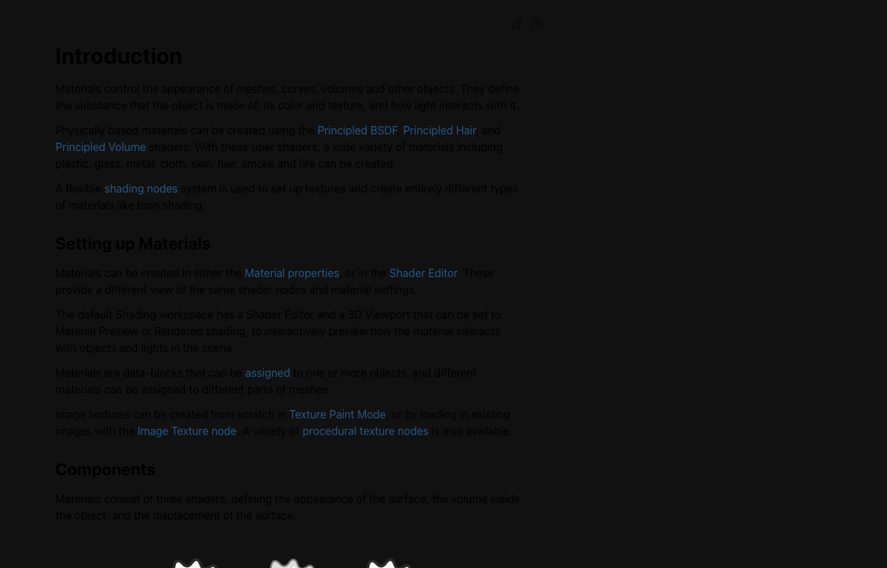
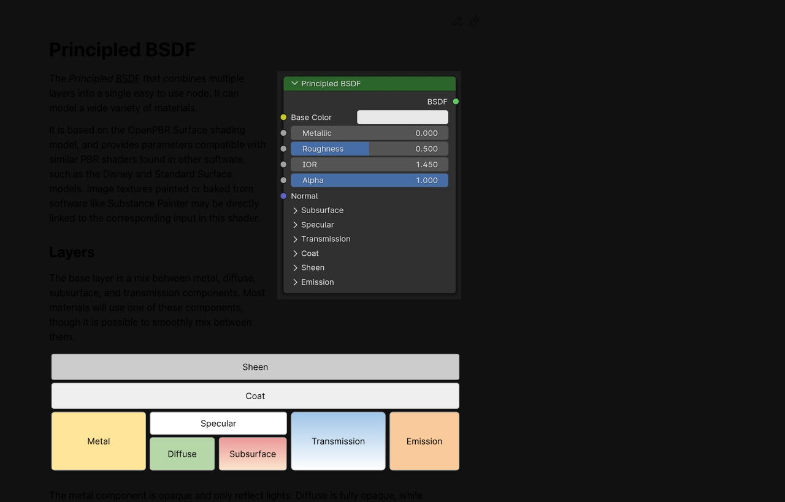
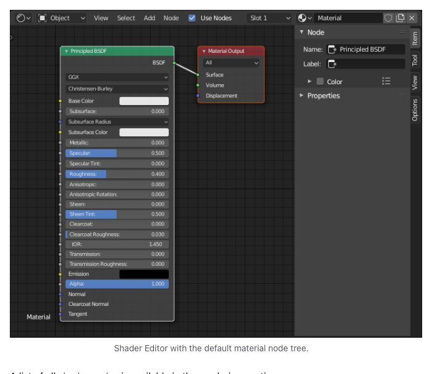

# Week 06: Material & Shader Node

## 🔗 이전 주차 복습

> **Week 05까지 완성된 로봇 모델에 재질을 입히는 단계**
>
> 이번 주는 모델링과 스컬프팅이 완료된 로봇에 Material을 적용하여 시각적 완성도를 높입니다.
> - **3D 모델 확보** (Week 05): AI 생성 + Sculpt 수정으로 로봇 형태 완성
> - **Mesh 정리** (Week 03-05): Material을 적용하려면 메쉬가 깨끗해야 함 — 겹치는 Face나 비정상 Normal이 있으면 재질이 올바르게 표시되지 않음
> - 아직 모델이 완성되지 않았다면, 이번 주 실습은 기본 Primitive(Cube, Sphere)로 진행한 뒤 다음 주까지 모델을 완성하세요

## 학습 목표

- [ ] Material을 생성하고 오브젝트에 할당할 수 있다
- [ ] Principled BSDF의 주요 파라미터를 이해한다
- [ ] Shader Node Editor를 사용할 수 있다
- [ ] Blender 5.0 Thin Film Iridescence를 활용할 수 있다

## 이론 (30분)

### Material이란?

- 오브젝트의 표면 속성을 정의하는 데이터 블록
- 색상, 반사, 투명도, 거칠기 등 시각적 특성을 결정
- 하나의 오브젝트에 여러 Material을 부위별로 할당 가능

### Material 생성 및 관리

- **생성:** Properties > Material Properties > New 버튼 클릭
- **이름 변경:** Material 이름을 클릭하여 직관적인 이름으로 변경
- **여러 Material 할당:**
  1. Edit Mode 진입
  2. 할당할 Face 선택
  3. Material 슬롯에서 원하는 Material 선택
  4. Assign 버튼 클릭
- **삭제:** Material 슬롯에서 - 버튼 클릭
- **Fake User:** Material 이름 옆 방패 아이콘(F). 사용하지 않아도 파일에 유지

### Principled BSDF 파라미터

Blender의 기본 셰이더. 현실적인 재질 대부분을 하나의 노드로 표현 가능

| 파라미터 | 설명 | 범위 |
|---------|------|------|
| Base Color | 기본 색상. Color Picker, Hex 값, 텍스처 연결 가능 | Color |
| Metallic | 금속성. 비금속과 금속 재질을 구분 | 0=비금속, 1=금속 |
| Roughness | 거칠기. 표면의 매끄러운 정도를 결정 | 0=매끄러움/반사, 1=거침/무광 |
| Specular | 정반사 강도. 비금속 표면의 반사량 조절 | 0~1 |
| IOR | 굴절률. 유리 등 투명 재질에서 빛이 꺾이는 정도 | 유리 1.5, 물 1.33 등 |
| Alpha | 투명도. Blend Mode 설정 필요 (Alpha Blend/Alpha Hashed) | 0=투명, 1=불투명 |
| Emission | 자체 발광. Color와 Strength로 제어 | Color + Strength |

### 🆕 Blender 5.0 신기능: Thin Film Iridescence

- Principled BSDF > Thin Film 섹션에서 활성화
- 비눗방울이나 기름막처럼 빛의 간섭으로 생기는 무지개빛 효과
- **Film Thickness:** 막의 두께(nm 단위). 값에 따라 무지개색 패턴이 달라짐
  - 200~400nm: 파란색/보라색 계열이 강조됨
  - 400~600nm: 녹색/노란색 계열이 강조됨
  - 600~800nm: 주황색/빨간색 계열이 강조됨
- **Film IOR:** 막의 굴절률. 색상 변화의 강도에 영향
  - 1.0~1.3: 미묘한 색상 변화
  - 1.3~1.8: 뚜렷한 무지개빛 효과
  - 1.8~2.5: 강렬한 색상 변화
- 로봇의 금속 표면에 적용하면 미래적인 느낌을 줄 수 있음
- **Blender 5.0 업데이트:** 이제 금속(Metallic BSDF)에도 Thin Film Iridescence가 적용 가능. 이전 버전에서는 비금속(Dielectric)에만 작동했으나, 5.0부터 Metallic=1인 재질에서도 사용 가능
- Metallic 재질과 함께 사용하면 효과가 두드러짐 — 로봇의 크롬 파츠, 티타늄 외장 등에 활용

## 실습 (90분)

### 기본 Material 만들기 (15분)

1. 기본 Cube 선택
2. Properties > Material Properties > New 클릭
3. Material 이름을 "Red_Plastic"으로 변경
4. Base Color를 빨간색으로 설정 (Hex: FF0000 또는 Color Picker 사용)
5. Viewport Shading > Material Preview (Z > Material Preview)로 결과 확인
6. Roughness 값을 0.3, 0.5, 0.8로 바꿔보며 차이 관찰

> 💡 **프로 팁:** Material을 다른 오브젝트에 복사하려면, 소스 오브젝트를 먼저 선택하고 타겟 오브젝트를 Shift+클릭으로 추가 선택한 뒤 **Ctrl+L > Link Materials**를 사용하세요. 여러 파츠에 동일한 재질을 빠르게 적용할 수 있습니다.

### 다양한 재질 실험 (20분)

> 💡 **프로 팁:** 실제 재질의 레퍼런스 사진을 참고하며 파라미터를 조정하세요. Google에서 "chrome metal reference", "matte plastic material" 등을 검색하면 도움이 됩니다. 눈으로 보고 비교하는 것이 가장 빠른 학습법입니다.

#### 반짝이는 금속

- Base Color: 밝은 회색 또는 금색
- Metallic: 1
- Roughness: 0.3
- 로봇 몸체에 적합

#### 매트 플라스틱

- Base Color: 원하는 색상
- Metallic: 0
- Roughness: 0.8
- 로봇 관절부나 커버에 적합

#### 투명 유리

- Transmission: 1
- IOR: 1.5
- Roughness: 0 (깨끗한 유리) 또는 0.1 (살짝 불투명)
- 로봇 바이저, 카메라 렌즈 등에 활용

#### 자체 발광

- Emission Color: 원하는 색상 설정
- Emission Strength: 1~10 범위에서 조절
- 로봇의 눈, LED 표시등, 에너지 코어 등에 활용

> 💡 **프로 팁:** Eevee에서 Emission이 주변 오브젝트를 밝히지 않는다면, **Render Properties > Bloom** 설정을 활성화하세요. 또한 Eevee Next(Blender 5.0)에서는 Screen Space Global Illumination이 개선되어 Emission 빛이 주변에 미치는 영향이 더 자연스럽습니다.

### Shader Node Editor (20분)

1. Editor Type 드롭다운에서 Shader Editor 선택 (또는 상단 Workspace에서 Shading 탭)
2. 기본 노드 구성 확인: Principled BSDF -> Material Output
3. 노드 연결 원리: 출력 소켓(오른쪽) -> 입력 소켓(왼쪽)을 드래그로 연결
4. Add > Texture > Image Texture 노드 추가
5. Image Texture의 Color 출력 -> Principled BSDF의 Base Color 입력에 연결
6. Add > Converter > Color Ramp 노드를 중간에 추가하여 색상 매핑 조절
7. Add > Converter > Math 노드로 값 연산 (Roughness 제어 등)

### Poly Haven 텍스처 활용 (15분)

1. https://polyhaven.com 접속
2. Textures 카테고리에서 PBR 텍스처 다운로드 (예: 금속, 나무, 돌)
3. 다운로드 파일 구성 확인: Diffuse, Roughness, Normal, Displacement 맵
4. Shader Editor에서 각 맵 연결:
   - Diffuse Map -> Base Color
   - Roughness Map -> Roughness (Color Space: Non-Color)
   - Normal Map -> Normal Map 노드 -> Normal 입력
5. Normal Map 노드 사용법:
   - Add > Vector > Normal Map
   - Image Texture의 Color -> Normal Map의 Color 입력
   - Normal Map의 Normal 출력 -> Principled BSDF의 Normal 입력
   - Strength 값으로 효과 강도 조절

### Thin Film Iridescence (10분)

1. 금속 Material이 적용된 오브젝트 선택
2. Principled BSDF > Thin Film 섹션 찾기
3. Thin Film 체크박스 활성화
4. Film Thickness 값을 200~800nm 범위에서 조절하며 색상 변화 관찰
5. Film IOR 값을 1.3~2.0 범위에서 조절
6. 로봇의 금속 파츠 (헬멧, 어깨, 가슴판 등)에 적용
7. Material Preview에서 결과 확인

### 로봇에 Material 적용 (10분)

1. 로봇 모델 선택 > Edit Mode 진입
2. Material 슬롯에 여러 Material 추가:
   - 몸체: 금속 Material (Metallic=1, Roughness=0.3)
   - 눈: 발광 Material (Emission Color + Strength)
   - 관절: 매트 플라스틱 Material (Roughness=0.8)
3. 각 부위의 Face를 선택하고 해당 Material을 Assign
4. Material Preview에서 전체 결과 확인
5. 필요시 색상이나 파라미터 미세 조정

## ⚠️ 흔한 실수와 해결법

| # | 실수 | 원인 | 해결법 |
|---|------|------|--------|
| 1 | **Material Preview에서 보이는 것과 Render 결과가 다름** | Material Preview는 기본 HDRI를 사용하고, Render는 씬의 실제 조명을 사용 | Render Properties에서 동일한 HDRI를 설정하거나, 씬에 적절한 조명을 배치. **Z > Rendered** 모드로 실시간 확인 |
| 2 | **Metallic을 0.5 같은 중간값으로 설정** | 현실에서는 금속/비금속이 이분법적 | Metallic은 **0(비금속) 또는 1(금속)**만 사용. 중간값은 비현실적인 결과를 만듦 |
| 3 | **Alpha(투명도) 설정 후 투명해지지 않음** | Blend Mode를 변경하지 않음 | Material Properties > **Settings > Surface > Alpha Blend** (또는 Alpha Hashed)로 변경. Eevee에서만 필요, Cycles는 자동 |
| 4 | **Emission이 주변을 밝히지 않음** | Eevee에서 Bloom 설정이 꺼져 있음 | Render Properties > **Bloom 활성화**. 실제 조명 효과를 원하면 Emission 오브젝트 근처에 Point Light 추가 |
| 5 | **여러 Material을 Assign 했는데 전체가 같은 색** | Face를 선택하지 않고 Assign 클릭 | Edit Mode에서 **Face 선택 모드(3키)**로 원하는 Face를 먼저 선택한 후 Assign |

## 핵심 정리

| 주제 | 핵심 내용 |
|------|----------|
| Material | 오브젝트의 표면 속성(색상, 반사, 투명도 등)을 정의하는 데이터 블록 |
| Principled BSDF | Blender의 기본 셰이더. Base Color, Metallic, Roughness가 핵심 파라미터 |
| Metallic | 0(비금속) 또는 1(금속)만 사용. 중간값은 비현실적 |
| Roughness | 0(매끄러움/반사) ~ 1(거침/무광). 재질의 질감을 결정 |
| Shader Node Editor | 노드를 연결하여 복잡한 재질을 시각적으로 구성 |
| PBR 텍스처 | Diffuse, Roughness, Normal, Displacement 맵으로 사실적 재질 표현 |
| Thin Film (5.0) | 금속에도 적용 가능한 무지개빛 효과. Thickness(nm)와 Film IOR로 제어 |
| Emission | 자체 발광. Eevee에서 Bloom 설정 필요. 로봇 눈/LED에 활용 |

## 과제

- **제출:** Discord #week06-assignment 채널
- **내용:** 렌더 이미지 1~2장 + 사용한 재질 종류 설명 + 한줄 코멘트
- **기한:** 다음 수업 전까지

<!-- AUTO:CURRICULUM-SYNC:START -->
## 커리큘럼 연동 요약

> 이 섹션은 `course-site/data/curriculum.js` 기준으로 자동 갱신됩니다.

- 핵심 키워드: 재질 시스템 · Principled BSDF · 노드 편집
- 예상 시간: ~3시간

### 실습 단계

#### 1. Material 할당

옷을 입히듯 오브젝트에 재질을 입혀요. 같은 로봇이라도 재질 하나로 장난감이 될 수도, 군용 장비가 될 수도 있어요.

배울 것

- Material 슬롯의 구조를 안다
- 하나의 오브젝트에 여러 Material을 쓸 수 있다

체크해볼 것

- Material Properties에서 + New 클릭 (기본 Principled BSDF가 자동 생성돼요)
- Base Color 바꿔서 색 변경 확인 (Z → Material Preview로 확인)
- Edit Mode에서 면 선택 → 두 번째 Material Assign (눈이나 가슴판에 다른 색 입히기)

#### 2. Principled BSDF 탐색

숫자 하나로 금속/유리/플라스틱이 바뀌어요. Metallic을 1로 올리면 금속, Transmission을 1로 올리면 유리처럼 보여요. 옷감을 고르듯 슬라이더를 움직여보세요.

배울 것

- 핵심 파라미터 4가지를 구분한다
- 원하는 재질을 슬라이더로 만든다

체크해볼 것

- Metallic 1.0으로 금속 재질 만들기 (Roughness도 같이 바꿔서 광택 비교)
- Transmission 1.0으로 유리 재질 만들기 (IOR 1.45 정도면 유리 느낌)
- Roughness 0 vs 0.5 vs 1 비교 (반짝 → 은은 → 무광 변화 확인)
- Emission으로 발광 재질 만들기 (로봇 눈이나 표시등에 활용)

#### 3. Shader Node Editor

노드는 레고 블록처럼 연결해서 재질을 만들어요. 색을 그라데이션으로 바꾸거나 질감을 섞을 수 있어요. 선을 연결하는 것만으로 복잡한 재질이 가능해져요.

배울 것

- 노드 기반 재질 편집 방식을 이해한다
- Color Ramp 노드를 연결한다

체크해볼 것

- Shader Editor 열기 (상단 에디터 타입 메뉴 또는 워크스페이스 Shading 탭)
- Shift+A → Color → Color Ramp 추가
- Color Ramp 출력 → Base Color 입력 연결 (드래그로 소켓 연결)
- Color Ramp 색상 두 개 바꿔서 그라데이션 만들기 (색 포인트 클릭 후 변경)

#### 4. Texture 노드로 질감 추가

Noise Texture를 연결하면 표면에 얼룩이나 먼지 같은 질감이 생겨요. 실제 물건은 완전히 깨끗한 법이 없으니까, 이 한 단계가 리얼함을 크게 올려줘요.

배울 것

- Noise/Musgrave 등 텍스처 노드를 연결한다

체크해볼 것

- Shift+A → Texture → Noise Texture 추가
- Noise → Color Ramp → Base Color 연결 (Scale을 바꿔서 패턴 크기 조절)
- Noise의 Roughness 출력을 Principled BSDF Roughness에 연결 (표면 광택에 변화를 줘요)

#### 5. Viewport Shading 비교

Z 키 하나로 와이어프레임/솔리드/미리보기/렌더를 오가요. 작업 중에는 Material Preview로, 최종 확인은 Rendered로 보는 습관을 들이면 편해요.

배울 것

- 4가지 Shading 모드를 구분한다

체크해볼 것

- Z 파이 메뉴로 4가지 모드 각각 전환 (Wireframe/Solid/Material/Rendered)
- Material Preview에서 작업 후 Rendered에서 최종 확인 (빛 반사가 다르게 보여요)

### 핵심 단축키

- `Z`: Shading 모드 전환 파이 메뉴
- `Shift + A`: Shader Editor 노드 추가
- `Ctrl + Shift + Click`: Viewer Node 연결
- `Ctrl + T`: Texture Mapping 자동 연결
- `M`: Frame 그룹 만들기
- `H`: 노드 숨기기/접기
- `Ctrl + Right Click`: 노드 연결선 끊기

### 과제 한눈에 보기

- 과제명: 재질 스타일 샘플러
- 설명: 5가지 다른 재질로 구 5개를 만들어 나란히 배치하고 렌더해요. 금속/유리/플라스틱/발광/질감 각 1개씩.
- 제출 체크:
  - 5가지 재질 구 렌더 이미지
  - 각 재질의 핵심 파라미터 값 메모
  - Shader Editor 노드 연결 스크린샷 1장
  - .blend 파일

### 자주 막히는 지점

- 재질이 화면에서 안 보임 → Viewport Shading을 Material Preview 또는 Rendered로 변경
- 노드 연결이 안 됨 → 소켓 색이 같은 것끼리 연결 (노란색끼리, 보라색끼리)
- Emission이 안 빛남 → Rendered 모드에서만 보여요. Material Preview에선 약하게 보임
- 유리가 검게 보임 → 주변에 반사할 환경이 없으면 유리가 어두워요. HDRI 추가하면 해결
- 여러 Material 할당이 안 됨 → Edit Mode에서 면을 선택한 뒤 Assign 버튼

### 공식 영상 튜토리얼

- [Blender Studio - Materials and Shading](https://studio.blender.org/training/blender-2-8-fundamentals/materials-and-shading/)

### 공식 문서

- [Materials](https://docs.blender.org/manual/en/latest/render/materials/introduction.html)
- [Principled BSDF](https://docs.blender.org/manual/en/latest/render/shader_nodes/shader/principled.html)
- [Shader Editor](https://docs.blender.org/manual/en/latest/editors/shader_editor.html)
- [Texture Nodes](https://docs.blender.org/manual/en/latest/render/shader_nodes/textures/index.html)
- [Color Ramp](https://docs.blender.org/manual/en/latest/render/shader_nodes/converter/color_ramp.html)
<!-- AUTO:CURRICULUM-SYNC:END -->

## 참고 자료

- [Poly Haven](https://polyhaven.com) - 무료 PBR 텍스처 라이브러리
- [Blender Manual: Materials](https://docs.blender.org/manual/en/latest/render/materials/index.html)
- [Blender Manual: Shader Nodes](https://docs.blender.org/manual/en/latest/render/shader_nodes/index.html)
## 📋 프로젝트 진행 체크리스트

- [ ] 3종류 이상의 Material 생성 및 적용 (예: 금속, 플라스틱, 발광)
- [ ] 발광(Emission) Material 적용 (로봇 눈, LED 등)
- [ ] Edit Mode에서 부위별 Material Assign 완료
- [ ] Material Preview (Z > Material Preview)로 결과 확인
- [ ] Thin Film Iridescence 효과 실험 (선택사항)
- [ ] PBR 텍스처 연결 실습 (Poly Haven 활용)
- [ ] 렌더 이미지 촬영 및 과제 제출
- [ ] .blend 파일 저장 완료
