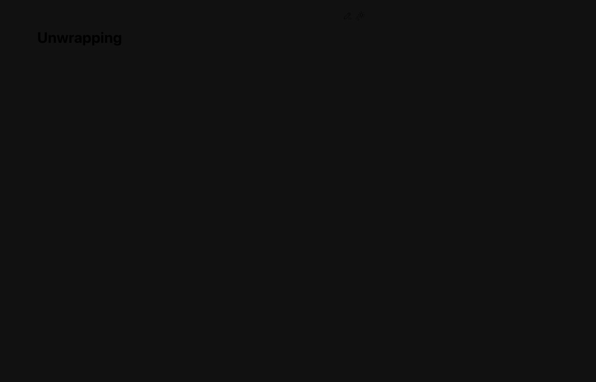
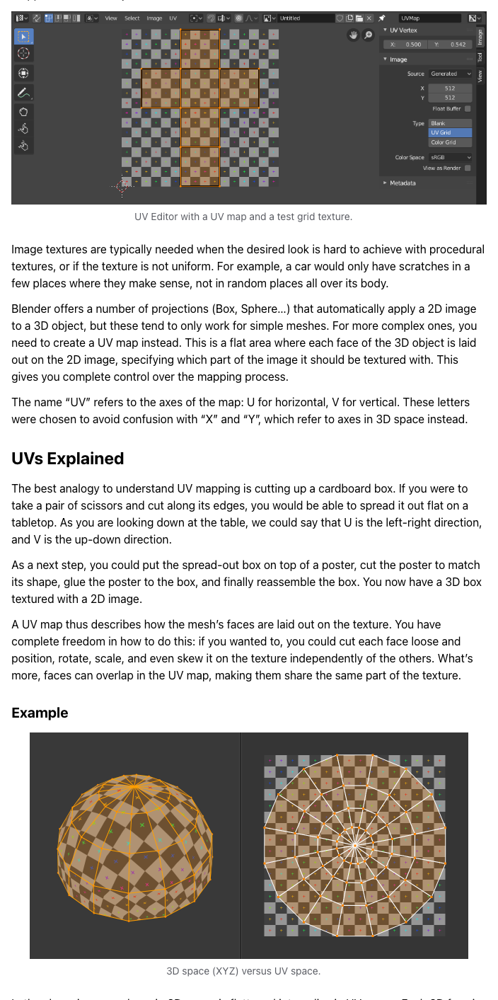
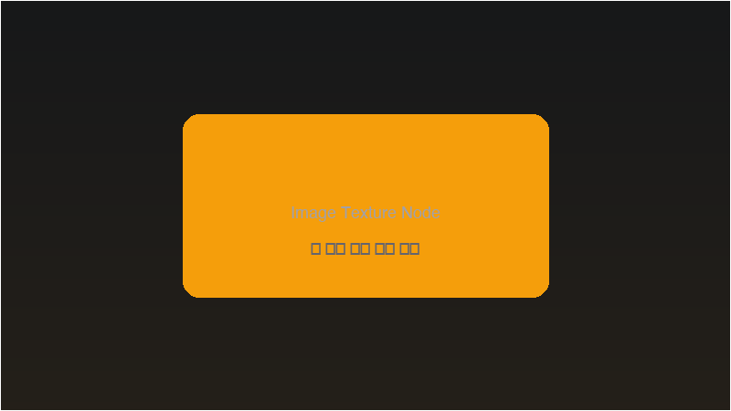

# Week 07: UV Unwrapping + AI Texture

## 🔗 이전 주차 복습

> **Week 06의 Material 개념 복습 — 텍스처는 Material의 Base Color에 연결**
>
> 이번 주에 배울 텍스처(Texture)는 지난 주에 만든 Material과 직접 연결됩니다.
> - **Material** (Week 06): Principled BSDF의 Base Color에 단색 대신 **이미지 텍스처**를 연결하면 사실적인 표면 표현 가능
> - **Shader Node Editor** (Week 06): Image Texture 노드를 추가하고 Base Color에 연결하는 방법을 복습하세요
> - **PBR 워크플로우** (Week 06): Diffuse, Roughness, Normal Map — 이번 주에 UV를 통해 이 맵들이 실제로 매핑되는 원리를 이해합니다
> - UV가 없으면 텍스처가 올바르게 표시되지 않으므로, 이번 주는 Material 파이프라인의 핵심 단계입니다

## 학습 목표

- [ ] UV 개념을 이해하고 Seam을 설정할 수 있다
- [ ] 다양한 Unwrap 방법을 사용할 수 있다
- [ ] AI 도구로 텍스처를 생성하고 적용할 수 있다
- [ ] Texture Painting을 보조 디테일 작업으로 활용할 수 있다

## 이론 (30분)

### UV란?

- 3D 표면을 2D 평면으로 펼치는 것
- 선물 포장지 비유: 3D 상자를 감싼 포장지를 펼치면 2D 종이가 되는 것과 같은 원리
- U, V는 2D 좌표축 이름 (X, Y가 이미 3D 공간에서 사용되므로 구분하기 위해 U, V 사용)

### UV가 필요한 이유

- 2D 이미지(텍스처)를 3D 표면에 정확히 매핑하기 위해 필요
- UV 없이 텍스처를 적용하면 이미지가 늘어나거나 왜곡됨
- 기본 오브젝트에도 UV는 있지만, 형태를 많이 바꾸면 다시 Unwrap해야 하는 경우가 많음
- 게임, 영화, 제품 디자인 등 모든 3D 파이프라인에서 필수 과정

### Seam이란?

- 3D 모델을 2D로 펼칠 때 **잘라야 할 선**
- 종이 상자를 접착 면에서 잘라 펼치는 것과 같은 원리
- **Mark Seam:** Edge 선택 후 Ctrl+E > Mark Seam (빨간색 선으로 표시)
- **Clear Seam:** Ctrl+E > Clear Seam (Seam 제거)

### 좋은 Seam 전략

- 눈에 잘 보이지 않는 곳에 Seam 배치 (뒷면, 안쪽, 접히는 부분)
- 자연스러운 경계선을 따라 배치 (파츠 사이, 색상이 바뀌는 곳)
- Seam이 너무 적으면 UV가 심하게 왜곡됨
- Seam이 너무 많으면 UV Island가 지나치게 분리됨

### UV Editor 인터페이스

- Editor Type > UV Editor로 전환
- 왼쪽: UV 맵 편집 영역 (2D)
- UV Island: Seam을 기준으로 분리된 UV 조각
- G, R, S로 UV Island를 이동, 회전, 스케일 조절 가능
- UV가 0~1 범위의 정사각형 안에 들어가야 텍스처가 올바르게 매핑됨

### 🆕 Blender 5.0: UV 편집 개선사항

- **UV Sync Selection 기본 활성화:** 3D Viewport에서 Face를 선택하면 UV Editor에서도 자동으로 해당 UV가 선택됩니다. Face 단위 선택과 Island 선택이 더 직관적으로 연동됩니다.
- **Pack Islands 개선:** 커스텀 영역(사각형이 아닌 특정 구역)에 UV Island를 패킹할 수 있습니다. UDIM 타일 활용 시 특히 유용합니다.
- **Pin & Live Unwrap 개선:** 핀 고정된 UV를 기준으로 실시간 언래핑 결과를 미리 볼 수 있어 Seam 조정이 더 효율적입니다.

## 실습 (90분)

### 간단한 UV Unwrap (20분)

#### 기본 Unwrap

1. Cube 선택 > Tab으로 Edit Mode 진입
2. Edge 선택 모드 (숫자 2 키)
3. Seam을 배치할 Edge 선택 (상자를 펼치듯이)
4. Ctrl+E > Mark Seam (빨간색 선 확인)
5. A로 전체 Face 선택
6. U > Unwrap
7. UV Editor에서 결과 확인: Cube가 십자 모양으로 펼쳐짐

#### Smart UV Project

1. Edit Mode에서 전체 Face 선택 (A)
2. U > Smart UV Project
3. Island Margin 값 설정 (0.01~0.05 권장)
4. 결과 확인: 자동으로 Seam이 생성되고 Unwrap됨
5. Unwrap과 비교: Smart UV Project는 간편하지만 수동 Unwrap보다 덜 정교함

> 💡 **프로 팁:** 빠르게 UV를 잡아야 할 때는 **Smart UV Project**가 최적입니다. 특히 AI 생성 모델처럼 복잡한 토폴로지에서는 수동 Seam을 일일이 설정하기 어려우므로, Smart UV Project로 시작한 뒤 문제가 있는 부분만 수동으로 수정하는 하이브리드 방식을 추천합니다.

### 로봇 UV 작업 (25분)

1. 로봇 모델 선택 > Edit Mode 진입
2. Seam 전략 수립:
   - 관절 부분: 자연스러운 경계선
   - 뒷면: 눈에 보이지 않는 곳
   - 파츠 경계: 서로 다른 Material이 만나는 곳
3. Edge 선택 모드에서 Seam Edge 선택
4. Ctrl+E > Mark Seam으로 Seam 설정
5. 전체 Face 선택 후 U > Unwrap 실행
6. UV Editor에서 결과 확인 및 Island 정리
7. 투영 방식 활용:
   - U > Cube Projection: 육면체 형태에 적합
   - U > Cylinder Projection: 원기둥 형태에 적합
   - U > Sphere Projection: 구형 형태에 적합

### Texture Painting (15분)

1. Shader Editor에서 Image Texture 노드 추가 > New Image 생성
2. 이미지 크기 설정 (1024x1024 또는 2048x2048)
3. Workspace를 Texture Paint로 전환 (또는 3D Viewport에서 Texture Paint 모드)
4. 브러시 설정: 색상, 크기, 강도 조절
5. 3D 모델 위에 직접 페인팅
6. 색상, 패턴, 디테일 그리기
7. 텍스처를 자주 저장 (Image > Save)

> 💡 **프로 팁:** Texture Paint의 **Clone 브러시**를 활용하면 레퍼런스 이미지의 일부분을 3D 모델 표면에 직접 복사할 수 있습니다. 브러시 목록에서 Clone을 선택한 후, Image > Open에서 참조 이미지를 불러오세요. 로봇 표면에 로고나 마킹을 넣을 때 유용합니다.

### AI 텍스처 생성 (20분)

#### Meshy AI 활용

1. https://www.meshy.ai 접속
2. 텍스처 생성 기능 활용
3. 3D 모델을 업로드하거나 프롬프트로 텍스처 생성
4. 생성된 텍스처 다운로드

#### 나노바나나로 텍스처 패턴 생성

1. https://nanobananas.ai 접속 또는 Gemini 앱 사용
2. 프롬프트 예시:
   - "seamless robot skin texture, metallic blue, subtle circuit patterns"
   - "seamless matte plastic texture, soft gray, minimal surface detail"
   - "glowing energy pattern, neon blue lines on dark background, seamless tile"
3. 생성된 이미지 다운로드
4. 필요시 Seamless 여부 확인 (타일링 시 이음새가 보이지 않는지)

#### Blender에서 AI 텍스처 적용

1. Shader Editor에서 Image Texture 노드 추가
2. Open으로 다운로드한 AI 텍스처 이미지 로드
3. Color 출력 -> Principled BSDF의 Base Color에 연결
4. UV가 올바르게 설정되어 있으면 텍스처가 3D 모델 표면에 매핑됨
5. UV Editor에서 UV Island 위치를 조절하여 텍스처 배치 수정

### 텍스처 저장 및 관리 (10분)

#### 텍스처 저장

- Blender 내부에서 생성한 텍스처: Image > Save As로 외부 파일 저장
- 저장하지 않으면 Blender 파일을 닫을 때 텍스처가 사라질 수 있음
- 파일 포맷: PNG (투명도 필요 시) 또는 JPG (용량 절약)

#### Pack Resources

- File > External Data > Pack Resources: 외부 이미지를 Blender 파일에 포함
- 장점: 파일 하나로 모든 텍스처를 관리, 파일 이동 시에도 텍스처가 깨지지 않음
- 단점: Blender 파일 용량이 커짐
- File > External Data > Unpack Resources: 다시 외부 파일로 분리

## ⚠️ 흔한 실수와 해결법

| # | 실수 | 원인 | 해결법 |
|---|------|------|--------|
| 1 | **UV Island가 겹침** — 텍스처가 이상하게 보임 | Unwrap 후 Island가 겹쳐져 배치됨 | UV Editor에서 **UV > Pack Islands** 실행. Island Margin을 0.01~0.03으로 설정하면 자동 정리 |
| 2 | **Texture 해상도가 부족** — 가까이서 보면 픽셀이 보임 | 텍스처 이미지 크기가 너무 작음 (512x512 등) | 최소 **2K(2048x2048)** 이상 권장. 4K는 고품질이지만 메모리 사용량 증가 |
| 3 | **UV Seam이 눈에 잘 보이는 곳에 있음** | Seam 위치를 고려하지 않고 배치 | Seam을 모델의 **뒷면, 안쪽, 관절 접히는 부분**에 배치. 색상이 바뀌는 경계선도 좋은 위치 |
| 4 | **Normal/Roughness Map 적용 시 색상이 이상함** | Image Texture의 Color Space가 sRGB로 되어 있음 | Normal Map, Roughness Map 등 데이터 맵은 반드시 **Color Space를 Non-Color**로 설정 |
| 5 | **텍스처를 저장하지 않아 다음 실행 시 사라짐** | Blender 내부 생성 텍스처는 자동 저장되지 않음 | 텍스처 생성/수정 후 반드시 **Image > Save As**로 외부 파일 저장. 또는 File > External Data > Pack Resources |

## 핵심 정리

| 주제 | 핵심 내용 |
|------|----------|
| UV | 3D 표면을 2D 평면으로 펼치는 것. 텍스처 매핑의 기초 |
| Seam | UV를 펼칠 때 잘라야 할 선. 눈에 보이지 않는 곳에 배치 |
| Unwrap 방식 | 수동 Unwrap, Smart UV Project, Cube/Cylinder/Sphere Projection |
| UV Editor | UV Island를 G/R/S로 편집. 0~1 범위 안에 배치해야 함 |
| Pack Islands | 겹치는 UV Island를 자동 정리. Island Margin으로 간격 설정 |
| Texture Paint | 3D 모델 표면에 직접 페인팅. Clone 브러시로 참조 이미지 활용 |
| AI 텍스처 | Meshy AI, 나노바나나 등으로 Seamless 텍스처 생성 |
| Non-Color | Normal, Roughness 등 데이터 맵은 Color Space를 Non-Color로 설정 |
| Blender 5.0 UV | UV Sync Selection 기본 활성화, Pack Islands 커스텀 영역 패킹 |

## 과제

- **제출:** 본인 학생 페이지에 업로드
- **내용:** 렌더 이미지 2장 (서로 다른 각도) + UV 전개도 스크린샷 1장 + 한줄 코멘트
- **기한:** 다음 수업 전까지
- **중요:** 다음 주 중간고사 대비! 모델링 + 텍스처 완성본을 준비할 것

<!-- AUTO:CURRICULUM-SYNC:START -->
## 커리큘럼 연동 요약

> 이 섹션은 `course-site/data/curriculum.js` 기준으로 자동 갱신됩니다.

- 핵심 키워드: UV 펼치기 · 텍스처 매핑 · AI 이미지 활용
- 예상 시간: ~3시간

### 실습 단계

#### 1. UV 개념 이해

UV는 3D 표면을 2D 좌표로 펼쳐서 이미지가 어디에 붙을지 정하는 작업이에요. 기본 오브젝트에도 UV는 있지만, 모델링으로 형태를 바꾸면 다시 Unwrap해야 하는 경우가 많아요. Seam은 그때 자르는 선이에요.

배울 것

- UV가 왜 필요한지 이해한다
- Seam의 역할을 안다

체크해볼 것

- Edit Mode → Edge Select 모드(2) 전환
- 큐브의 모서리를 선택해서 Ctrl+E → Mark Seam (빨간 선이 보이면 성공)
- 잘못 표시한 Seam을 Ctrl+E → Clear Seam으로 지우기

#### 2. Unwrap & UV Editor

Seam을 그은 경계선대로 메쉬가 펼쳐져서 UV Editor에 2D로 나와요. 종이 상자를 펼친 것처럼 생겼어요. 여기 보이는 모양대로 이미지가 입혀져요.

배울 것

- UV가 어떻게 펼쳐지는지 이해한다
- UV Editor에서 섬을 조작한다

체크해볼 것

- 전체 선택(A) 후 U → Unwrap 실행
- UV Editor 열어서 펼쳐진 결과 확인 (화면 분할 또는 워크스페이스 UV Editing)
- L로 UV Island 개별 선택 후 G/S/R로 이동/크기/회전
- 겹치는 UV 섬이 없는지 확인 (겹치면 텍스처가 이상하게 보여요)

#### 3. Smart UV Project로 빠른 펼침

Seam을 하나하나 지정하기 어려운 메쉬에서는 Smart UV Project로 빠르게 초안을 만들 수 있어요. 자동으로 잘라서 펼쳐주기 때문에 시작은 빠르지만, 중요한 부분은 나중에 수동으로 다듬는 게 좋아요.

배울 것

- 수동 Unwrap과 자동 Unwrap을 비교한다

체크해볼 것

- 전체 선택 후 U → Smart UV Project 실행 (Angle Limit 66° 정도가 기본값)
- 수동 Unwrap 결과와 나란히 비교해보기 (어떤 게 더 깔끔한지 확인)

#### 4. AI Texture 생성 및 적용

AI가 만든 이미지를 바로 붙이려면 먼저 UV가 안정적으로 펼쳐져 있어야 해요. 텍스처가 어색하게 늘어나면 이미지보다 UV 배치부터 먼저 확인하는 습관이 중요해요.

배울 것

- Image Texture 노드 사용법을 안다
- AI 생성 이미지를 재질에 연결한다

체크해볼 것

- AI 텍스처 이미지 파일 저장 (Meshy AI, 나노바나나 등)
- Shader Editor → Shift+A → Image Texture 노드 추가
- Open으로 이미지 불러와서 Base Color에 연결
- Material Preview에서 결과 확인 (텍스처가 늘어나면 UV를 다시 조정)

#### 5. Texture Painting 맛보기

Texture Paint는 UV를 만든 뒤 표면 디테일을 얹는 단계예요. 큰 패턴은 이미지 텍스처로 잡고, 로고나 스크래치 같은 작은 요소를 나중에 덧칠하면 더 수월해요.

배울 것

- Texture Paint 모드의 존재를 안다

체크해볼 것

- Image Editor에서 New → 빈 이미지 생성 (1024×1024) (Base Color 노드에 연결)
- Texture Paint 모드로 전환해서 표면에 직접 색 칠하기 (브러시 색과 크기 바꿔가며 실험)

### 핵심 단축키

- `U`: UV Unwrap 메뉴
- `Ctrl + E → Mark Seam`: UV Seam 지정
- `Ctrl + E → Clear Seam`: UV Seam 제거
- `L`: UV Editor에서 Island 선택
- `P`: UV Pin 고정
- `A`: UV 전체 선택
- `S + X/Y + 0`: UV Island 정렬

### 과제 한눈에 보기

- 과제명: 텍스처 적용 로봇 렌더
- 설명: 자신의 로봇 또는 캐릭터 모델에 Seam → Unwrap → Texture 적용을 수행하고, 렌더 이미지 2장과 UV 전개도 스크린샷 1장을 정리해 제출해요.
- 제출 체크:
  - 렌더 이미지 2장 이상
  - UV Editor 스크린샷 1장
  - 한줄 코멘트
  - 필요하면 AI 텍스처 이미지 또는 Texture Paint 결과 함께 정리

### 자주 막히는 지점

- 텍스처가 늘어남 → Seam 위치를 조정하거나 UV 섬 크기를 맞추기
- 텍스처가 뒤집혀 보임 → UV Editor에서 해당 섬 선택 후 S → Y → -1
- UV가 겹침 → UV Editor에서 섬이 서로 겹치지 않게 배치
- 이미지가 흐림 → 텍스처 해상도가 너무 낮으면 1024×1024 이상으로
- 텍스처가 안 보임 → Image Texture 노드가 Base Color에 연결됐는지, 활성 UV 맵이 맞는지 확인

### 공식 영상 튜토리얼

- [Blender Studio - UV Unwrapping](https://studio.blender.org/training/blender-2-8-fundamentals/uv-unwrapping/)

### 공식 문서

- [UV Unwrapping](https://docs.blender.org/manual/en/latest/modeling/meshes/uv/unwrapping/index.html)
- [UV Editor](https://docs.blender.org/manual/en/latest/editors/uv/introduction.html)
- [Image Texture Node](https://docs.blender.org/manual/en/latest/render/shader_nodes/textures/image.html)
- [Texture Painting](https://docs.blender.org/manual/en/latest/sculpt_paint/texture_paint/index.html)
<!-- AUTO:CURRICULUM-SYNC:END -->

## 참고 자료

- [Blender Manual: UV Editing](https://docs.blender.org/manual/en/latest/editors/uv/index.html)
- [Poly Haven](https://polyhaven.com) - 무료 PBR 텍스처 라이브러리
- [Meshy AI](https://www.meshy.ai) - AI 3D 텍스처 생성
## 📋 프로젝트 진행 체크리스트

- [ ] 로봇 모델의 UV Unwrapping 완료 (Seam 설정 + Unwrap)
- [ ] UV Island 겹침 없이 Pack Islands 정리 완료
- [ ] AI 텍스처 생성 (Meshy AI 또는 나노바나나)
- [ ] 생성된 텍스처를 Shader Editor에서 Base Color에 연결
- [ ] Normal/Roughness Map 적용 시 Non-Color 설정 확인
- [ ] Texture Paint로 추가 디테일 작업 (선택사항)
- [ ] 텍스처 파일 외부 저장 또는 Pack Resources 완료
- [ ] 렌더 이미지 2장 + UV 전개도 스크린샷 촬영
- [ ] Discord에 과제 제출
- [ ] **중간고사 준비 시작** — 모델링 + Material + 텍스처 완성본 준비
