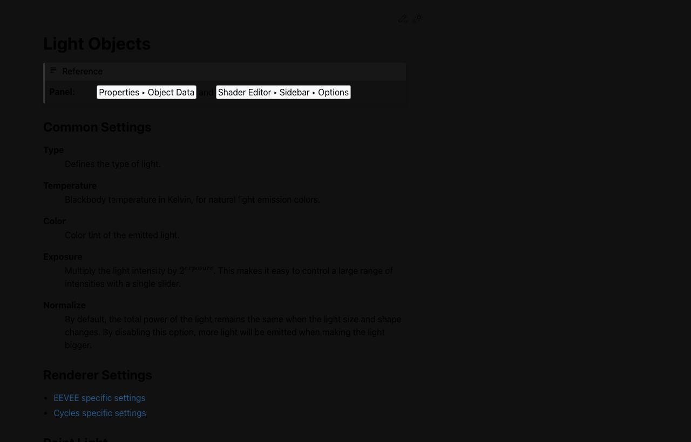
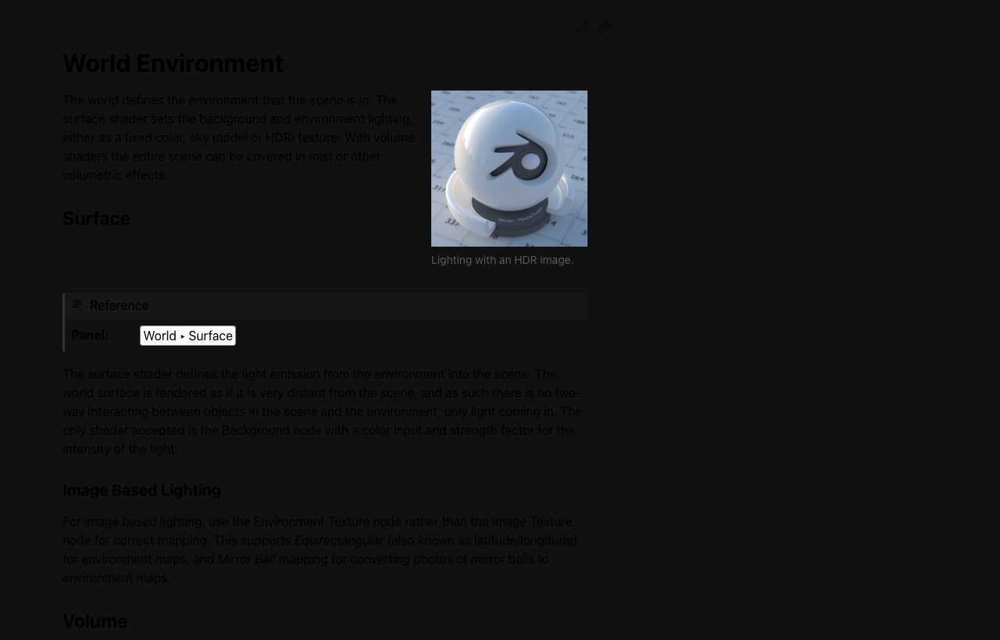

# Week 09: Lighting 기초 + MCP 조명 연출

## 🔗 이전 주차 복습

> **Week 08 중간고사 피드백을 반영하세요!**
>
> 중간고사에서 받은 피드백(모델링 Topology, Material 구성, UV 품질 등)을 이번 주부터 개선해 나가세요. 후반부(Week 09~15)는 **조명, 애니메이션, 리깅, 렌더링**에 집중합니다. 중간고사에서 완성한 로봇 모델을 계속 사용하므로, 피드백 반영 후 모델을 업데이트해 두면 이후 작업이 수월합니다.
>
> - [Week 08: 중간고사 - 중간 프로젝트 발표](../week08-midterm/lecture-note.md)

## 학습 목표

- [ ] Blender의 조명 종류와 각각의 특성을 이해할 수 있다
- [ ] 3-Point Lighting 시스템을 구성할 수 있다
- [ ] HDRI 환경 조명을 설정하고 활용할 수 있다
- [ ] Claude MCP를 활용하여 다양한 조명 분위기를 자동으로 연출할 수 있다

## 이론 (30분)

### 조명의 역할

- 조명은 3D 장면의 **분위기를 80% 이상 결정**하는 핵심 요소
- 같은 모델이라도 조명에 따라 완전히 다른 느낌을 전달할 수 있음
- 조명의 3가지 핵심 역할:
  - **분위기 (Mood):** 따뜻한 조명 vs 차가운 조명으로 감정 전달
  - **깊이감 (Depth):** 그림자를 통해 3D 형태를 강조하고 공간감 부여
  - **시각적 무게 (Visual Weight):** 밝은 부분에 시선이 집중되는 원리 활용

### Blender 조명 종류

Blender 5.0에서 제공하는 4가지 기본 Light 타입:

#### Point Light (점광원)

- 한 점에서 **모든 방향으로** 빛을 발산
- 전구, 촛불 등을 표현할 때 적합
- Properties: Color, Power (Watts), Radius (광원 크기, 클수록 부드러운 그림자)
- 단점: 방향을 제어할 수 없어 정밀한 조명 연출에는 부적합

#### Sun Light (태양광)

- **무한히 먼 거리**에서 평행하게 들어오는 빛
- 태양이나 달빛을 표현할 때 사용
- Properties: Color, Power (Watts), Angle (빛의 퍼짐 각도)
- 위치는 상관없고 **방향(Rotation)만** 영향을 줌
- 야외 장면에서 가장 자주 사용

#### Spot Light (스포트라이트)

- **원뿔 모양**으로 특정 방향에 빛을 집중
- 무대 조명, 가로등, 플래시라이트 표현에 적합
- Properties: Color, Power (Watts), Spot Size (원뿔 각도), Blend (가장자리 부드러움)
- 특정 오브젝트를 강조하거나 드라마틱한 연출에 유용

#### Area Light (면광원)

- **직사각형 또는 원형 면**에서 빛을 발산
- 모니터, 창문, 소프트박스 등을 표현
- Properties: Color, Power (Watts), Shape (Rectangle/Square/Disk/Ellipse), Size
- 면적이 넓을수록 부드럽고 자연스러운 그림자 생성
- 제품 사진 촬영에서 가장 많이 사용하는 조명 타입

### 조명의 주요 Properties

| Property | 설명 | 조절 효과 |
|----------|------|-----------|
| Color | 조명의 색상 | 따뜻한/차가운 분위기 결정 |
| Power (Watts) | 조명의 밝기 | 노출(밝기) 조절 |
| Size / Radius | 광원의 크기 | 클수록 그림자가 부드러움 |
| Shadow | 그림자 설정 | Soft Shadow, Contact Shadow 등 |

### 3-Point Lighting 시스템

영화, 사진, 3D에서 가장 기본이 되는 조명 구성법:

#### Key Light (주조명)

- **가장 밝은 메인 조명**
- 오브젝트의 45도 앞/위에 배치하는 것이 일반적
- Area Light 추천 (부드러운 그림자)
- 장면의 전체적인 밝기와 방향을 결정

#### Fill Light (보조조명)

- Key Light의 **반대편**에서 그림자를 채워주는 역할
- Key Light 밝기의 **30~50% 수준**으로 설정
- 그림자가 너무 어두워지지 않도록 보완
- Area Light를 Key Light보다 작은 Power로 설정

#### Back Light (역광/윤곽광)

- 오브젝트 **뒤쪽**에서 비추어 **윤곽선(rim)** 을 만들어줌
- 오브젝트를 배경에서 분리시키는 효과
- Spot Light 추천 (집중적인 빛)
- 은은하게 설정하여 자연스러운 분리감 부여

### World Lighting: HDRI

#### HDRI란?

- **High Dynamic Range Imaging:** 매우 넓은 밝기 범위를 담은 360도 파노라마 이미지
- 일반 사진 (LDR): 0~255 범위
- HDRI: 0~수만 이상의 밝기 값을 포함하여 실제 환경의 빛 정보를 정확히 담음
- 하나의 HDRI 이미지만으로 **사실적인 환경 조명 + 반사** 동시 구현 가능

#### Environment Texture 설정

1. Properties Panel > **World Properties** (지구 아이콘)
2. Surface > **Background** 확인
3. Color 옆의 노란 점 클릭 > **Environment Texture** 선택
4. Open 버튼으로 HDRI 파일 (.hdr 또는 .exr) 로드
5. Strength 값으로 환경 조명 밝기 조절 (기본값 1.0)
6. Viewport Shading을 Material Preview 이상으로 설정하면 HDRI 배경 확인 가능

#### Poly Haven에서 무료 HDRI 다운로드

- https://polyhaven.com/hdris 접속
- 카테고리: Indoor, Outdoor, Studio 등 다양한 환경
- 해상도: 1K (빠른 테스트), 2K (일반), 4K (고품질 렌더)
- 포맷: HDR 또는 EXR 다운로드
- 라이선스: CC0 (무료, 상업적 사용 가능)

#### Blockade Labs Skybox: AI 360 HDRI 생성

- https://skybox.blockadelabs.com 접속
- 텍스트 프롬프트를 입력하면 AI가 360도 HDRI 이미지를 생성
- 프롬프트 예시:
  - "modern photography studio with soft white lighting"
  - "futuristic neon-lit city at night with rain reflections"
  - "warm sunset over calm ocean with soft clouds"
- 생성된 이미지를 다운로드하여 Blender World에 적용
- 원하는 환경을 텍스트로 직접 만들 수 있어 창의적 활용에 유리

### Blender 5.0 색상 관리 (Color Management)

#### View Transform 비교

| View Transform | 특징 | 적합한 용도 |
|---------------|------|------------|
| **AgX** (기본) | 자연스러운 하이라이트 롤오프, 채도 보존 | 대부분의 작업 (Blender 5.0 기본값) |
| **Filmic** | 넓은 다이나믹 레인지, 약간 desaturated | 사실적인 장면, 이전 버전 호환 |
| **ACES** | 영화 산업 표준 색공간 | 전문 VFX/영화 파이프라인 |
| **Standard** | 색 보정 없음, 물리적으로 부정확 | 비추천 (번아웃 발생) |

#### AgX의 장점

- Blender 5.0에서 기본 View Transform으로 채택
- 밝은 빛이 자연스럽게 흰색으로 수렴 (highlight rolloff)
- 강한 조명에서도 색상이 과도하게 빠지지 않음 (채도 보존)
- 컬러풀한 로봇이나 제품 렌더에 특히 적합
- 설정: Render Properties > Color Management > View Transform > AgX

## 실습 (90분)

### 로봇 모델 불러오기 + 기본 조명 추가 (10분)

1. Blender 실행, 이전에 만든 로봇 모델 파일 열기 (File > Open)
   - 로봇 모델이 없으면 기본 Suzanne (monkey head)으로 대체 가능
2. 기본 Scene의 Light 삭제 (선택 후 X)
3. Shift+A > Light > **Area Light** 추가
4. Area Light 선택 후 Properties Panel에서 설정:
   - Power: 100W
   - Color: 흰색 (기본값)
   - Size: 2m
5. G 키로 이동하여 로봇 앞/위쪽에 배치 (45도 각도)
6. 렌더 미리보기: Viewport Shading을 **Rendered** (Z > 8번)로 전환하여 확인
7. 각 조명 타입을 하나씩 추가해보며 차이점 직접 확인:
   - Shift+A > Light > Point Light: 사방으로 퍼지는 빛
   - Shift+A > Light > Sun Light: 평행한 빛 (Rotation으로 방향 제어)
   - Shift+A > Light > Spot Light: 원뿔형 집중 빛

> **💡 프로 팁:** 조명은 하나로 시작해서 점차 추가하는 것이 좋습니다. 처음부터 여러 조명을 동시에 넣으면 각 조명의 역할을 파악하기 어렵습니다. Key Light 하나만 켜고 Rendered 모드에서 확인한 뒤, Fill → Back 순서로 추가하세요.

> **💡 프로 팁:** Outliner에서 조명 옆의 눈 아이콘(👁)을 클릭하면 개별 조명을 끄고 켤 수 있습니다. 각 조명의 효과를 비교할 때 매우 유용합니다.

### 3-Point Lighting 세팅 (20분)

#### Key Light 설정

1. Shift+A > Light > **Area Light** 추가
2. 이름 변경: "Key_Light" (Properties > Object Properties)
3. 위치: 로봇 기준 왼쪽 앞 45도, 약간 위 (예: X=-3, Y=-3, Z=3)
4. 로봇을 향하도록 회전 (오브젝트 선택 후 Ctrl+T > Track To Constraint 또는 수동 회전)
5. 설정:
   - Power: **200W**
   - Size: 2m (부드러운 그림자)
   - Color: 약간 따뜻한 흰색 (Hex: #FFF5E6)

#### Fill Light 설정

1. Shift+A > Light > **Area Light** 추가
2. 이름 변경: "Fill_Light"
3. 위치: Key Light의 **반대편** (예: X=3, Y=-2, Z=2)
4. 설정:
   - Power: **60~80W** (Key Light의 30~40%)
   - Size: 3m (Key보다 넓게, 더 부드러운 빛)
   - Color: 약간 차가운 흰색 (Hex: #E6F0FF)

#### Back Light 설정

1. Shift+A > Light > **Spot Light** 추가
2. 이름 변경: "Back_Light"
3. 위치: 로봇 **뒤쪽 위** (예: X=0, Y=3, Z=4)
4. 로봇 뒤통수를 향하도록 회전
5. 설정:
   - Power: **100W**
   - Spot Size: 60도
   - Blend: 0.5 (가장자리 부드럽게)
   - Color: 흰색

#### 확인

1. Viewport Shading을 Rendered로 전환
2. 카메라 앵글을 조절하며 3-Point Lighting 효과 확인
3. 각 조명을 하나씩 끄고 켜보며(Outliner에서 눈 아이콘) 역할 비교

### Poly Haven HDRI 적용 (15분)

1. 웹 브라우저에서 https://polyhaven.com/hdris 접속
2. "Studio" 카테고리에서 마음에 드는 HDRI 선택
   - 추천: "studio_small_09", "photo_studio_loft_hall", "kloppenheim_06"
3. 2K 해상도의 HDR 파일 다운로드
4. Blender로 돌아와서:
   - Properties Panel > **World Properties** (지구 아이콘) 클릭
   - Surface > Background > Color 옆 **노란 점** 클릭
   - **Environment Texture** 선택
   - **Open** 버튼 클릭 > 다운로드한 HDR 파일 선택
5. Strength 조절: 0.5~2.0 사이에서 원하는 밝기 설정
6. HDRI 회전: Shader Editor > World 모드에서 Mapping 노드 추가하여 Z Rotation 조절
7. Viewport를 Material Preview 또는 Rendered로 전환하여 결과 확인
8. 3-Point Lighting과 HDRI를 **함께** 사용하면 더욱 사실적인 결과

### Blockade Labs Skybox로 AI HDRI 생성 (15분)

1. 웹 브라우저에서 https://skybox.blockadelabs.com 접속
2. 무료 계정으로 로그인
3. 프롬프트 입력하여 360 Skybox 생성:
   - 예시 1: "clean white photography studio with softbox lights"
   - 예시 2: "futuristic robot workshop with blue neon lights and metal walls"
   - 예시 3: "warm golden sunset over mountain landscape"
4. 생성 완료 후 이미지 다운로드 (Equirectangular 형식)
5. Blender에서 World Properties > Environment Texture에 적용 (Step 3과 동일 방법)
6. 두 HDRI (Poly Haven vs AI 생성)의 결과를 비교
7. AI HDRI는 원하는 환경을 자유롭게 만들 수 있는 장점이 있지만, Poly Haven HDRI보다 빛 정보의 정확도가 떨어질 수 있음

### Claude MCP로 다양한 조명 분위기 자동 연출 (20분)

Blender MCP를 통해 Claude에게 조명 설정을 자동으로 요청할 수 있다.

#### 따뜻한 스튜디오 조명

```
프롬프트: "Create a warm sunset studio lighting setup for my robot model.
Use an area light as key light with warm orange color, a soft fill light,
and a subtle back light. Set the world background to dark gray."
```

- Claude가 3-Point Lighting을 자동으로 구성
- Color, Power, Position 등을 한 번에 설정

#### 드라마틱 단일 조명 (Noir Style)

```
프롬프트: "Set up dramatic single-light noir style lighting.
Use one strong spot light from the upper left with hard shadows.
Make the background completely black. Remove all other lights."
```

- 강한 명암 대비의 드라마틱한 분위기
- 하드 섀도우를 활용한 Film Noir 스타일

#### 밝은 제품 사진 조명

```
프롬프트: "Create bright product photography lighting.
Use two large area lights on each side and one from above.
Set the background to pure white. Make shadows very soft."
```

- 제품 카탈로그 스타일의 밝고 깨끗한 조명
- 부드러운 그림자로 형태를 보여주는 데 집중

#### 실습 방법

1. 각 프롬프트를 Claude MCP에 입력
2. 생성된 조명 설정을 Viewport Rendered 모드에서 확인
3. 마음에 들지 않는 부분은 직접 수정하거나 추가 프롬프트로 조절
4. 예: "Make the key light warmer" / "Increase the back light power"

### 3가지 조명 환경 렌더 비교 (10분)

1. **환경 1: 밝은 스튜디오** - 3-Point Lighting + 밝은 HDRI
2. **환경 2: 무드 있는 환경** - 단일 조명 또는 컬러 조명 + 어두운 배경
3. **환경 3: AI HDRI** - Blockade Labs Skybox로 생성한 환경

각 환경에서 렌더 실행:
1. 카메라 위치 설정 (Ctrl+Alt+Numpad 0 으로 현재 뷰를 카메라로)
2. Render Properties에서 해상도 설정 (1920x1080 권장)
3. Color Management > View Transform > **AgX** 확인
4. F12로 렌더 실행
5. Image > Save As로 이미지 저장
6. 3장의 렌더 이미지를 나란히 놓고 조명의 역할을 비교 분석

## 핵심 정리

| 개념 | 핵심 내용 |
|------|-----------|
| 조명의 역할 | 분위기, 깊이감, 시각적 무게를 결정하는 장면의 핵심 요소 |
| 4가지 Light 타입 | Point (전방향), Sun (무한/평행), Spot (원뿔), Area (면광원) |
| 3-Point Lighting | Key (메인) + Fill (보조) + Back (윤곽) |
| HDRI | 360도 파노라마 이미지 하나로 사실적 환경 조명 + 반사 |
| AI HDRI | Blockade Labs Skybox로 원하는 환경을 텍스트로 생성 |
| AgX | Blender 5.0 기본 View Transform, 자연스러운 색상 렌더 |
| MCP 자동화 | Claude MCP로 다양한 조명 분위기를 프롬프트 한 줄로 연출 |

> 조명 = 분위기의 80%. HDRI 하나만 잘 설정해도 렌더 퀄리티가 크게 올라간다.

## ⚠️ 흔한 실수와 해결법

### 1. HDRI 파일이 너무 커서 Blender가 느려짐

- **문제:** 8K, 16K 해상도의 HDRI를 사용하면 Viewport가 매우 느려지고 메모리 부족 발생
- **해결:** 작업 중에는 **2K 해상도**로 충분합니다. 최종 렌더 시에만 4K를 사용하세요
- **팁:** Poly Haven에서 다운로드할 때 해상도를 선택할 수 있으므로, 2K HDR을 먼저 다운로드

### 2. 조명 Power 값이 너무 높아 화면이 하얗게 날아감

- **문제:** Area Light Power를 1000W 이상으로 설정하면 화면 전체가 하얗게 번아웃(Burn Out)됨
- **해결:** Area Light는 **100~300W** 범위에서 시작하고, 조금씩 올리면서 확인
- **팁:** Render Properties > Color Management > **Exposure** 값을 조절하면 전체 밝기를 미세하게 보정할 수 있음

### 3. Area Light 방향이 틀어져 있음

- **문제:** Area Light를 추가했는데 엉뚱한 방향을 비추고 있어 효과가 없음
- **해결:** Area Light 선택 > Object Constraint Properties > **Track To** Constraint 추가 > Target을 로봇으로 설정하면 자동으로 로봇을 향해 비춤
- **팁:** 또는 Area Light 선택 후 로봇을 Shift+클릭 > Ctrl+T > Track To Constraint로 빠르게 설정

### 4. AgX vs Filmic 차이를 모르고 사용

- **문제:** Blender 5.0의 기본값인 AgX와 이전 버전의 Filmic을 혼동하여 색감이 의도와 다르게 나옴
- **해결:**
  - **AgX (권장):** 채도가 잘 보존되고 하이라이트가 자연스럽게 수렴. 컬러풀한 로봇 렌더에 적합
  - **Filmic:** 약간 desaturated된 톤, 사실적인 장면에 적합하지만 색이 빠져 보일 수 있음
- **확인:** Render Properties > Color Management > View Transform에서 설정 확인

### 5. HDRI 배경이 렌더에 그대로 보임

- **문제:** 환경 조명으로만 사용하고 싶은데, HDRI 이미지가 배경에 그대로 나타남
- **해결:** Render Properties > Film > **Transparent** 체크하면 배경이 투명해지고 HDRI 조명 효과만 남음
- **팁:** 또는 World Properties > Surface > Settings > **Ray Visibility > Camera** 체크 해제

## 📋 프로젝트 진행 체크리스트

이번 주 실습 완료 후 아래 항목을 확인하세요.

### 조명 기초
- [ ] 4가지 Light 타입(Point, Sun, Spot, Area) 차이를 이해했는가
- [ ] 3-Point Lighting 세팅 완료 (Key + Fill + Back)
- [ ] 각 조명의 이름을 지정했는가 ("Key_Light", "Fill_Light", "Back_Light")

### HDRI 환경
- [ ] Poly Haven에서 HDRI 다운로드 및 적용 완료
- [ ] Blockade Labs Skybox로 AI HDRI 생성 및 적용 완료
- [ ] HDRI Strength 값을 적절히 조절했는가

### 렌더 비교
- [ ] 3가지 서로 다른 조명 분위기에서 렌더 이미지 생성
- [ ] Color Management > View Transform > AgX 설정 확인
- [ ] 렌더 이미지를 비교하여 조명의 역할을 분석했는가

### Claude MCP 활용
- [ ] MCP 프롬프트로 최소 1가지 조명 설정을 자동 생성해 보았는가
- [ ] 자동 생성된 조명을 직접 수정하여 원하는 분위기로 조절해 보았는가

## 다음 주 예고

**Week 10: Animation 기초**

- Keyframe과 Timeline의 개념
- 로봇에 간단한 움직임 부여
- Graph Editor로 자연스러운 이징 조절
- 로봇이 움직이는 3~5초 애니메이션 제작

<!-- AUTO:CURRICULUM-SYNC:START -->
## 커리큘럼 연동 요약

> 이 섹션은 `course-site/data/curriculum.js` 기준으로 자동 갱신됩니다.

- 핵심 키워드: 빛의 종류 · HDRI · 조명 연출
- 예상 시간: ~3시간

### 실습 단계

#### 1. Light 종류 탐색

요리사 스튜디오에서 조명을 세팅하듯, 어떤 조명을 쓰냐에 따라 분위기가 완전히 달라져요. 동일한 오브젝트라도 조명만 바꾸면 다른 작품처럼 보여요.



배울 것

- 각 Light 타입의 특성을 안다

체크해볼 것

- Shift+A → Light → 4종류 각각 추가해보기
- Energy/Color 값 조절해보기

#### 2. HDRI 환경 조명

360도 파노라마 사진이 전구 역할을 해요. 텍스처 하나로 자연스러운 환경 조명을 만들 수 있어요.



배울 것

- HDRI의 역할과 장점을 안다

체크해볼 것

- World Properties → Environment Texture 추가
- HDRI 이미지 파일 연결 (Poly Haven 등)

#### 3. 3점 조명 세팅

사진 체울린 사진처럼 Key(주), Fill(보조), Rim(윤곽) 세 개만 잘 놓으면 어떤 오브젝트도 입체감 있게 보여요.


배울 것

- 3점 조명의 원리를 이해한다

체크해볼 것

- Key Light (주 광원) 배치 (오브젝트 앞 45도 위치)
- Fill Light (보조 광원) 배치 (반대편 낮게)
- Rim Light (윤곽 광원) 배치 (뒤쪽에서 윤곽 강조)

### 핵심 단축키

- `Shift + A → Light`: 조명 추가
- `Z → Rendered`: 렌더 미리보기
- `Shift + Z`: Rendered/Solid 토글
- `Ctrl + Numpad 0`: 현재 시점 → 카메라
- `Numpad 0`: 카메라 뷰 전환

### 과제 한눈에 보기

- 과제명: 조명 포트폴리오
- 설명: 동일한 오브젝트에 3가지 다른 조명 분위기 렌더 이미지를 제출합니다.
- 제출 체크:
  - 낮/저녁/밤 또는 다른 3가지 분위기 렌더
  - .blend 파일

### 자주 막히는 지점

- 빛이 너무 강함 → Energy 값 줄이기
- 그림자 없음 → Shadow 설정 확인

### 공식 문서

- [Lighting](https://docs.blender.org/manual/en/latest/render/lights/light_object.html)
<!-- AUTO:CURRICULUM-SYNC:END -->

## 참고 자료

- [Blender Manual: Lighting](https://docs.blender.org/manual/en/latest/render/lights/index.html)
- [Poly Haven HDRI Library](https://polyhaven.com/hdris) - 무료 CC0 HDRI
- [Blockade Labs Skybox](https://skybox.blockadelabs.com) - AI 360 HDRI 생성
- [Blender Guru: Lighting for Beginners](https://www.youtube.com/watch?v=5UCc3Z_-ibs) - 조명 기초 튜토리얼
- [3-Point Lighting Explained](https://www.youtube.com/results?search_query=3+point+lighting+blender) - 3점 조명 해설
