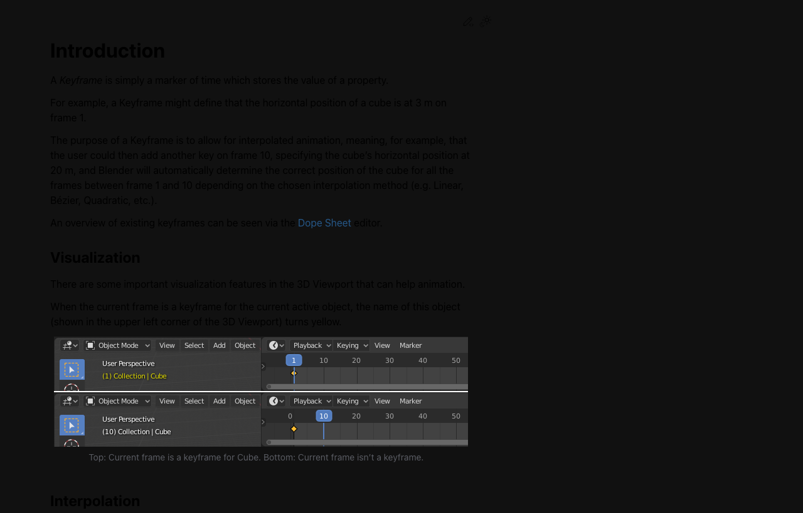
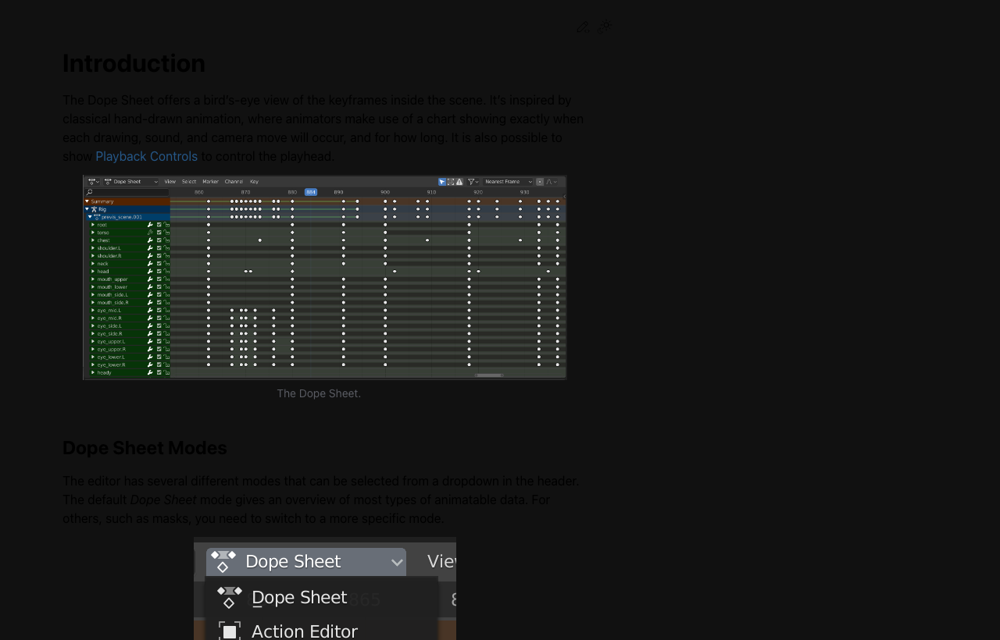

# Week 10: Animation 기초

## 🔗 이전 주차 복습

> **Week 09에서 설정한 조명과 카메라를 유지한 채 애니메이션을 추가합니다.**
>
> 이번 주에는 지난 주에 완성한 3-Point Lighting과 HDRI 환경을 그대로 활용합니다. 조명이 잘 설정된 상태에서 애니메이션을 추가하면 결과물의 완성도가 훨씬 높아집니다. Week 09 파일을 열어서 바로 작업을 시작하세요.
>
> - [Week 09: Lighting 기초 + MCP 조명 연출](../week09-lighting/lecture-note.md)

## 학습 목표

- [ ] Timeline과 Keyframe의 개념을 이해할 수 있다
- [ ] 오브젝트에 Keyframe을 삽입하여 움직임을 만들 수 있다
- [ ] Graph Editor를 활용하여 이징(easing)을 조절할 수 있다
- [ ] 로봇/캐릭터에 3~5초 분량의 간단한 애니메이션을 만들 수 있다

## 이론 (30분)

### 애니메이션의 원리

애니메이션은 **연속된 정지 이미지(프레임)를 빠르게 재생**하여 움직임을 만드는 것이다. Disney의 전설적인 애니메이터들이 정리한 **12 Principles of Animation** 중 가장 핵심적인 4가지를 먼저 익힌다.

#### 1. Squash & Stretch (압축과 늘림)

- 오브젝트가 움직일 때 **힘에 의해 형태가 변형**되는 원리
- 공이 바닥에 닿으면 납작해지고(squash), 올라갈 때 길쭉해짐(stretch)
- 볼륨(부피)은 유지하면서 형태만 변형
- 무게감과 탄성을 표현하는 데 필수

#### 2. Anticipation (예비 동작)

- 주 동작 전에 **반대 방향으로 작은 동작**을 하는 것
- 점프하기 전에 무릎을 굽히는 동작 (웅크림 → 점프)
- 주먹을 뻗기 전에 팔을 뒤로 빼는 동작
- 관객에게 "다음에 무슨 일이 일어날지" 예상하게 하여 자연스러운 느낌

#### 3. Ease In / Ease Out (가감속)

- 현실에서 물체는 **즉시 최고 속도**로 움직이지 않음
- **Ease In (Slow In):** 시작이 느리고 점점 빨라짐 (가속)
- **Ease Out (Slow Out):** 점점 느려지다 멈춤 (감속)
- 선형(Linear) 움직임은 기계적이고 부자연스러움
- 대부분의 자연스러운 동작은 Ease In/Out이 적용되어 있음

#### 4. Timing (타이밍)

- **같은 동작이라도 프레임 수에 따라 느낌이 완전히 달라짐**
- 프레임이 적으면: 빠르고 가벼운 느낌
- 프레임이 많으면: 느리고 무거운 느낌
- 캐릭터의 성격과 무게감을 타이밍으로 표현
- 예: 가벼운 로봇은 빠르게, 무거운 로봇은 천천히

### Timeline 기초

Timeline은 Blender 하단에 기본으로 표시되는 **시간 제어 패널**이다.

#### Timeline 구성 요소

- **프레임 (Frame):** 시간의 최소 단위, 각 프레임이 하나의 정지 이미지
- **Playhead (파란 세로선):** 현재 프레임 위치를 표시
- **Keyframe 마커 (노란 다이아몬드):** 속성값이 기록된 프레임 위치
- **Start/End Frame:** 애니메이션의 시작과 끝 프레임 범위

#### FPS 설정

- **FPS (Frames Per Second):** 초당 재생되는 프레임 수
- 설정 위치: **Output Properties > Frame Rate**
- 24fps: 영화 표준, 부드럽고 시네마틱한 느낌
- 30fps: 게임/웹 표준, 더 매끄러운 재생
- 이 수업에서는 **24fps** 권장

#### 프레임 범위 설정

- Output Properties > Frame Range에서 Start Frame, End Frame 설정
- 3초 애니메이션 (24fps 기준): Start=1, End=72
- 5초 애니메이션 (24fps 기준): Start=1, End=120

### Keyframe 개념

#### Keyframe이란?

- **특정 프레임에 오브젝트의 속성값을 기록**하는 것
- 위치(Location), 회전(Rotation), 크기(Scale) 등을 기록할 수 있음
- 두 Keyframe 사이의 값은 Blender가 **자동으로 보간(Interpolation)** 해줌
- 예: 프레임 1에서 X=0, 프레임 24에서 X=5이면, 중간 프레임은 자동 계산

#### Keyframe 삽입 방법

**방법 1: 단축키 I**
1. 오브젝트 선택
2. 원하는 프레임으로 이동
3. **I** 키 누르기
4. 삽입할 속성 선택:
   - **Location:** 위치
   - **Rotation:** 회전
   - **Scale:** 크기
   - **LocRotScale:** 위치+회전+크기 동시 기록
   - **Available:** 이미 Keyframe이 있는 채널만

**방법 2: Properties Panel에서 직접**
1. 속성값 옆의 입력 필드에 마우스를 올리고 **I** 키
2. 또는 속성값 필드를 **우클릭 > Insert Keyframe**
3. Keyframe이 삽입되면 필드가 **노란색**으로 변함

#### Keyframe 삭제

- 오브젝트 선택 후 **Alt+I** > Keyframe 삭제
- Timeline에서 Keyframe 마커 선택 후 **X** 또는 Delete

#### Auto Keying (자동 키프레임)

- Timeline 헤더의 **빨간 원(Record)** 버튼을 활성화
- 오브젝트를 이동/회전/스케일하면 **자동으로 Keyframe 삽입**
- 편리하지만, 의도하지 않은 Keyframe이 생길 수 있으므로 주의
- 작업 후 반드시 비활성화하는 습관을 들일 것

### Graph Editor

#### Graph Editor란?

- Keyframe 사이의 **보간 커브(Interpolation Curve)** 를 시각적으로 편집하는 도구
- Timeline이 "언제" Keyframe이 있는지 보여준다면, Graph Editor는 "어떻게" 보간되는지 보여줌
- 전환: Editor Type 드롭다운 > **Graph Editor**

#### 이징 커브 종류

| 보간 모드 | 특징 | 사용 예시 |
|-----------|------|-----------|
| **Bezier** (기본) | 부드러운 S커브, 핸들로 세밀한 조절 가능 | 대부분의 자연스러운 움직임 |
| **Linear** | 일정한 속도, 직선 | 기계적 움직임, 시계 초침 |
| **Constant** | 다음 Keyframe까지 값 변화 없음, 갑자기 전환 | On/Off 스위치, 깜빡임 |

#### 이징 프리셋 적용

1. Graph Editor에서 Keyframe 선택
2. **T** 키 (또는 Key > Interpolation Mode)로 보간 모드 변경
3. 유용한 프리셋:
   - **Ease In:** 느리게 시작 → 빠르게 끝
   - **Ease Out:** 빠르게 시작 → 느리게 끝
   - **Bounce:** 공이 튀는 듯한 효과
   - **Elastic:** 고무줄처럼 늘어났다 돌아오는 효과
   - **Back:** 목표를 약간 넘었다 돌아오는 효과

#### Graph Editor 핸들 조절

- Keyframe 선택 후 핸들(작은 점) 드래그로 커브 조절
- **V** 키: 핸들 타입 변경 (Auto, Vector, Aligned, Free 등)
- 핸들을 위로 올리면 가속, 아래로 내리면 감속

### Dope Sheet 기초

- **Dope Sheet:** 모든 Keyframe을 한눈에 볼 수 있는 편집 도구
- Timeline보다 상세한 Keyframe 편집이 가능
- 여러 오브젝트/채널의 Keyframe을 동시에 관리
- Keyframe 선택 후 G로 이동, S로 타이밍 스케일 조절
- 전환: Editor Type > **Dope Sheet**

### 재생 관련 단축키

| 단축키 | 동작 |
|--------|------|
| **Space** | 재생/일시정지 |
| **Left/Right Arrow** | 1프레임 이동 |
| **Up/Down Arrow** | 10프레임 이동 |
| **Shift+Left** | 시작 프레임으로 이동 |
| **Shift+Right** | 끝 프레임으로 이동 |
| **Ctrl+Shift+Left/Right** | Start/End Frame을 현재 프레임으로 설정 |

## 실습 (90분)

### 공 바운스 애니메이션 - Squash & Stretch (25분)

애니메이션의 가장 기본이 되는 공 바운스 실습으로 핵심 원리를 체득한다.

#### 씬 준비

1. 새 파일 시작 (File > New > General)
2. 기본 Cube 삭제 (X)
3. Shift+A > Mesh > **UV Sphere** 추가 (공 역할)
4. Shift+A > Mesh > **Plane** 추가, S > 5로 크기 키우기 (바닥 역할)
5. Plane의 Z 위치를 0으로, Sphere의 Z 위치를 5로 설정

#### FPS 및 프레임 범위 설정

1. Output Properties > Frame Rate > **24fps**
2. Frame Range: Start=1, End=72 (3초)

#### Keyframe 삽입 - 낙하

1. Sphere 선택
2. 프레임 1로 이동 (Shift+Left)
3. Sphere 위치: Z=5 (높이)
4. **I** > **Location** (위치 Keyframe 삽입)
5. 프레임 12로 이동 (Timeline에서 클릭 또는 입력)
6. Sphere 위치: Z=0.5 (바닥 근처)
7. **I** > **Location** (위치 Keyframe 삽입)

#### Keyframe 삽입 - 바운스

1. 프레임 24로 이동
2. Sphere 위치: Z=3 (첫 번째 바운스 높이, 원래보다 낮음)
3. **I** > **Location**
4. 프레임 36으로 이동
5. Sphere 위치: Z=0.5 (다시 바닥)
6. **I** > **Location**
7. 프레임 48로 이동
8. Sphere 위치: Z=1.5 (두 번째 바운스, 더 낮아짐)
9. **I** > **Location**
10. 프레임 56으로 이동
11. Sphere 위치: Z=0.5 (다시 바닥)
12. **I** > **Location**

> **💡 프로 팁:** Auto Keying(Timeline 하단의 빨간 원 버튼)을 활성화하면 오브젝트를 이동/회전할 때 자동으로 Keyframe이 삽입됩니다. 많은 Keyframe을 빠르게 찍을 때 편리하지만, 작업이 끝나면 **반드시 비활성화**하세요. 안 그러면 의도하지 않은 Keyframe이 계속 생깁니다.

#### Squash & Stretch 추가

바닥에 닿는 프레임(12, 36, 56)에서 공을 납작하게:
1. 프레임 12로 이동
2. Sphere 크기: S > Z > 0.6 (납작하게), S > Shift+Z > 1.3 (옆으로 퍼지게)
3. **I** > **Scale**
4. 프레임 10과 14에서는 원래 크기(1, 1, 1)로 Scale Keyframe

같은 방법으로 프레임 36, 56에서도 Squash 적용 (점점 효과 줄이기)

#### Graph Editor에서 이징 조절

1. Editor Type을 **Graph Editor**로 전환
2. 낙하 구간의 Keyframe 선택 (프레임 1→12 구간)
3. **T** > **Ease In** (점점 빨라지게 = 중력 가속)
4. 바운스 올라가는 구간: **Ease Out** (점점 느려지게 = 감속)
5. Space로 재생하여 자연스러운지 확인

### 로봇 머리 회전 - 좌우 둘러보기 (20분)

#### 로봇 모델 준비

1. 이전에 만든 로봇 모델 열기 (File > Open)
   - 로봇이 없으면 Suzanne(monkey head)으로 대체
2. 로봇의 머리 파트가 별도 오브젝트인지 확인
   - 별도 오브젝트가 아니면 Edit Mode에서 머리 부분 선택 > P > Selection으로 분리

#### FPS 및 프레임 범위 설정

1. Output Properties > Frame Rate > **24fps**
2. Frame Range: Start=1, End=120 (5초)

#### 둘러보기 동작 Keyframe

1. 머리 오브젝트 선택
2. **프레임 1:** 정면 (Rotation Z=0) → I > Rotation
3. **프레임 24:** 왼쪽 45도 (Rotation Z=45) → I > Rotation
4. **프레임 48:** 다시 정면 (Rotation Z=0) → I > Rotation
5. **프레임 72:** 오른쪽 45도 (Rotation Z=-45) → I > Rotation
6. **프레임 96:** 다시 정면 (Rotation Z=0) → I > Rotation
7. **프레임 120:** 정면 유지 (Rotation Z=0) → I > Rotation

#### 이징 적용

1. Graph Editor로 전환
2. 모든 Rotation Keyframe 선택 (A)
3. **T** > **Bezier** (부드러운 커브)
4. 방향 전환 지점(프레임 24, 72)에서 약간의 멈춤(hold)을 주면 더 자연스러움
   - Keyframe 복제로 hold 프레임 추가 (예: 프레임 22~26 동일 값)

### 로봇 팔 올리기/내리기 (20분)

#### 팔 오브젝트 준비

1. 로봇의 팔 파트가 별도 오브젝트인지 확인
2. 팔의 **Origin Point(원점)** 을 어깨 관절 위치로 설정:
   - 팔 오브젝트 선택
   - Edit Mode에서 어깨 부분 vertex 선택
   - Shift+S > Cursor to Selected
   - Object Mode로 전환
   - 우클릭 > **Set Origin > Origin to 3D Cursor**
3. 이제 팔이 어깨를 중심으로 회전하게 됨

#### 팔 동작 Keyframe

1. 팔 오브젝트 선택
2. **프레임 1:** 팔 내린 상태 (Rotation X=0) → I > Rotation
3. **프레임 12:** Anticipation! 팔 살짝 뒤로 (Rotation X=10) → I > Rotation
4. **프레임 36:** 팔 올린 상태 (Rotation X=-90) → I > Rotation
5. **프레임 48:** 잠시 hold (Rotation X=-90) → I > Rotation
6. **프레임 72:** 팔 내린 상태 (Rotation X=0) → I > Rotation

#### 이징 적용

1. Graph Editor에서 Rotation 커브 확인
2. 올리는 동작(12→36): **Ease Out** (빠르게 시작, 천천히 도착)
3. 내리는 동작(48→72): **Ease In** (천천히 시작, 빠르게 낙하 = 중력)
4. Anticipation 구간(1→12): 자연스러운 Bezier

### Graph Editor에서 이징 세밀 조정 (15분)

#### 이징 비교 실습

1. 공 바운스 파일 또는 로봇 파일에서 Graph Editor 열기
2. 같은 동작에 다른 이징을 적용하며 비교:

**Linear (직선):**
- Keyframe 선택 > T > Linear
- 결과: 기계적이고 딱딱한 움직임
- 적합한 경우: 로봇 관절의 정밀한 기계적 움직임

**Bezier (S커브):**
- Keyframe 선택 > T > Bezier
- 결과: 부드럽고 자연스러운 움직임
- 적합한 경우: 대부분의 캐릭터 애니메이션

**Back:**
- Keyframe 선택 > T > Back
- 결과: 목표를 약간 지나쳤다가 돌아오는 느낌
- 적합한 경우: 과장된 만화적 표현

**Bounce:**
- Keyframe 선택 > T > Bounce
- 결과: 공이 튀는 것 같은 반복 감속
- 적합한 경우: 착지, 물체 떨어짐

> **💡 프로 팁:** Graph Editor에서 Bezier 핸들을 직접 조절하면 프리셋보다 훨씬 세밀한 이징을 만들 수 있습니다. 핸들을 수평에 가깝게 만들면 해당 구간에서 움직임이 느려지고, 수직에 가깝게 만들면 빨라집니다.

#### 핸들 직접 조절

1. Bezier 모드에서 Keyframe 선택
2. 핸들 포인트를 드래그하여 커브 형태를 직접 조절
3. **V** 키로 핸들 타입 변경:
   - **Auto:** 자동 부드러운 핸들
   - **Vector:** 직선 핸들 (날카로운 전환)
   - **Aligned:** 양쪽 핸들이 일직선
   - **Free:** 각 핸들을 독립적으로 조절

### 완성된 3~5초 동작 만들기 (10분)

#### 동작 조합

1. Step 2의 머리 회전 + Step 3의 팔 동작을 **같은 Timeline**에 배치
2. 머리가 돌아가는 동안 팔이 올라가는 등 **동작을 겹쳐** 자연스럽게 연결
3. 각 동작의 시작 타이밍을 **약간 어긋나게 (offset)** 하면 더 자연스러움
   - 예: 머리 회전이 프레임 1에서 시작, 팔 동작은 프레임 6에서 시작

#### 최종 확인 및 렌더 준비

1. Space로 전체 재생하며 전반적인 느낌 확인
2. 부자연스러운 부분은 Graph Editor에서 커브 조절
3. 카메라 앵글 설정 (동작이 잘 보이는 각도)
4. Output Properties에서 출력 설정:
   - 포맷: FFmpeg Video (MP4) 또는 PNG Sequence
   - 해상도: 1280x720 이상
5. 렌더: **Ctrl+F12** (Animation Render)
   - 또는 Render > Render Animation
6. GIF로 변환하고 싶으면: 온라인 MP4→GIF 변환 도구 활용

## 핵심 정리

| 개념 | 핵심 내용 |
|------|-----------|
| 12 Principles 핵심 4 | Squash & Stretch, Anticipation, Ease In/Out, Timing |
| Timeline | 프레임 단위 시간 제어, FPS 설정으로 재생 속도 결정 |
| Keyframe | 특정 프레임에 속성값(위치/회전/크기) 기록, I로 삽입 |
| Graph Editor | Keyframe 사이의 보간 커브를 편집, 이징 조절 |
| Bezier vs Linear | Bezier=자연스러운 S커브, Linear=기계적 직선 |
| Auto Keying | 자동 Keyframe 삽입, 편리하지만 주의 필요 |
| 동작 겹침 | 여러 동작의 시작 시점을 offset하면 더 자연스러움 |

> 자연스러운 움직임 = **적절한 이징 + 타이밍**. 같은 동작도 이징에 따라 전혀 다른 느낌이 된다.

## ⚠️ 흔한 실수와 해결법

### 1. Keyframe이 의도하지 않은 채널에 삽입됨

- **문제:** I 키를 누른 후 "LocRotScale"을 선택하면 Location, Rotation, Scale 모든 채널에 Keyframe이 들어감. 위치만 바꿨는데 Rotation/Scale에도 Keyframe이 생겨 나중에 의도하지 않은 고정이 발생
- **해결:** I 키 메뉴에서 **정확한 채널만** 선택하세요
  - 위치만 바꿨으면: **Location**
  - 회전만 바꿨으면: **Rotation**
  - 크기만 바꿨으면: **Scale**
- **팁:** 이미 잘못 삽입된 Keyframe은 Graph Editor에서 해당 채널을 선택 > X로 삭제

### 2. Timeline과 Keyframe 위치 혼동

- **문제:** Playhead(파란 세로선)의 위치를 확인하지 않고 Keyframe을 삽입하여 엉뚱한 프레임에 Keyframe이 들어감
- **해결:** Keyframe 삽입 전 항상 **Timeline 하단의 현재 프레임 번호**를 확인하세요
- **팁:** Timeline의 프레임 입력 필드에 직접 숫자를 타이핑하면 정확한 프레임으로 이동 가능

### 3. 24fps vs 30fps 설정 확인

- **문제:** FPS 설정을 확인하지 않아 예상보다 빠르거나 느린 애니메이션이 만들어짐
- **해결:** 작업 시작 전 **Output Properties > Frame Rate**에서 반드시 확인. 이 수업에서는 **24fps** 권장
- **팁:** 3초 = 72프레임(24fps), 5초 = 120프레임(24fps). FPS를 변경하면 기존 Keyframe의 타이밍이 달라지므로 **작업 시작 전에** 설정

### 4. Animation 재생이 실시간이 아님

- **문제:** Space로 재생했는데 애니메이션이 뚝뚝 끊기거나 느리게 재생됨
- **해결:** Viewport Shading을 **Solid 모드**로 전환하면 실시간에 가깝게 재생됨. Rendered 모드에서는 렌더링 부하 때문에 실시간 재생이 어려움
- **팁:** Timeline 헤더 > Playback > **Sync** 옵션을 확인하세요
  - **Frame Dropping:** 실시간 속도에 맞추기 위해 프레임을 건너뜀 (속도 정확, 프레임 누락 가능)
  - **No Sync:** 모든 프레임을 다 보여줌 (속도 부정확, 프레임 누락 없음)

### 5. 애니메이션이 루프되지 않음

- **문제:** 마지막 프레임에서 첫 프레임으로 돌아올 때 움직임이 갑자기 끊김
- **해결:** 마지막 Keyframe의 값을 첫 Keyframe과 동일하게 설정. 또는 Graph Editor에서 Channel > Extrapolation Mode > **Make Cyclic**으로 자동 루프 설정

## 📋 프로젝트 진행 체크리스트

이번 주 실습 완료 후 아래 항목을 확인하세요.

### 기본 설정
- [ ] FPS를 24fps로 설정했는가
- [ ] Frame Range를 적절히 설정했는가 (3초=72프레임, 5초=120프레임)

### 애니메이션 제작
- [ ] 3~5초 분량의 애니메이션 완성
- [ ] Keyframe 최소 4개 이상 삽입
- [ ] 이징(Easing) 적용 (Linear가 아닌 Bezier 또는 프리셋 사용)
- [ ] Squash & Stretch 또는 Anticipation 원리를 1가지 이상 적용

### Graph Editor
- [ ] Graph Editor에서 커브를 확인하고 조절해 보았는가
- [ ] 최소 2가지 이상의 이징 프리셋을 비교해 보았는가

### 렌더 준비
- [ ] 카메라 앵글이 동작을 잘 보여주는 위치에 설정되었는가
- [ ] Animation Render(Ctrl+F12)로 영상 출력을 테스트해 보았는가

## 🔥 MCP 활용 심화 — Blender 5.1 + Claude Code 공식 Connector

> **2026-05 업데이트.** 지난 주 Claude Code가 Blender 공식 connector를 정식 출시하면서, 이제 **원클릭**으로 MCP 환경을 구성할 수 있게 되었습니다. 이전까지 사용하던 `ahujasid/blender-mcp` (커뮤니티)를 대체하는 공식 경로입니다. 이번 보충 섹션은 **MCP를 활용해 애니메이션 작업을 자동화/가속화**하는 워크플로를 다룹니다.

### 📰 배경 — 무슨 일이 있었나

공식 MCP가 출시되기까지 한 달간 Blender 커뮤니티에서 큰 사건이 있었습니다. 단순한 기능 출시가 아니라, **오픈소스 프로젝트가 AI 회사의 후원을 어떻게 받아야 하는가**라는 정책적 논쟁이 결합된 사례입니다.

#### 1세대 — 비공식 MCP (커뮤니티, 2025-03~)

- 인도 개발자 **Siddharth Ahuja (ahujasid)** 가 2025년 3월 개인 프로젝트로 [`ahujasid/blender-mcp`](https://github.com/ahujasid/blender-mcp) 공개
- GitHub 21.4k stars로 폭발적 인기 — 사실상 Blender + Claude 연동의 표준
- 단점: Blender Foundation과 무관한 커뮤니티 프로젝트 → 호환성 깨지면 개인이 패치, 설치 과정 번거로움 (Python addon 수동 설치)

#### 2세대 — Anthropic의 Corporate Patron 시도 (2026-04-29)

- Anthropic이 **Blender Development Fund에 연 €240,000 (약 3.5억 원) Corporate Patron으로 가입** 발표
- 동시에 Claude의 Blender 공식 connector + Blender 공식 MCP 서버 출시
- 발표 직후 커뮤니티 격렬한 반발 — 특히 핵심 컨트리뷰터들과 생성형 AI에 비판적인 아티스트 그룹
  - "Blender가 AI 회사에 종속된다"
  - "기부를 끊겠다"
  - **결정 전에 컨트리뷰터들과 충분한 논의가 없었다**는 절차적 비판이 결정적
- Hacker News, BlenderArtists 포럼, X(트위터) 전반에서 며칠간 논쟁

#### 3세대 — 롤백 + 정책 정비 (2026-05)

- Blender Foundation이 공식 입장 발표 — **Anthropic의 후원을 Corporate Patron 자격 박탈 후 "일회성 단일 기부(one-off single donation)"로 다운그레이드**
- Foundation CEO Ton Roosendaal: "컨트리뷰터들과 더 충분히 대화했어야 했다" 인정
- 향후 후원 수락 프로세스 강화 + **AI Policies 논의 착수**
- **중요 포인트**: 후원 형태는 다운그레이드되었지만, 그 과정에서 출시된 **Claude 공식 connector와 Blender 공식 MCP 서버는 그대로 유지** — 우리가 지금 쓸 수 있는 이유

> 💡 **이 사건이 시사하는 것**: 오픈소스에서 AI 기업 후원은 단순한 자금 문제가 아니라 **거버넌스 문제**입니다. Blender Foundation은 결정을 되돌리고 절차를 보강하는 방식으로 신뢰를 회복했습니다. 우리가 도구를 쓸 때도 **누가 만들었고, 어떤 권한 구조 위에 있는지**를 인식하는 습관이 필요합니다.

### 🎓 알면 재밌는 — "Corporate Patron"이란 정확히 뭔데?

뉴스에서 "Anthropic이 Patron이 됐다 → 박탈됐다"는 말이 반복됐는데, 이 단어가 그냥 "후원자"가 아니라 **공식 등급명**이에요. 알고 보면 오픈소스 정치학의 고전적 이슈가 깔려 있습니다.

#### Blender Development Fund 후원 등급 구조

Blender Foundation은 후원자를 **연간 금액에 따라 등급**으로 나눠 운영합니다:

| 등급 | 금액(연) | 주요 혜택 |
|------|---------|----------|
| **Corporate Patron** | €120,000+ | 공식 사이트 최상단 로고, 분기별 미팅, 우선 협의권, 보도자료 협업 |
| **Corporate Gold** | €30,000+ | Gold 섹션 로고, 정기 업데이트 |
| **Corporate Silver** | €12,000+ | Silver 섹션 로고 |
| **Corporate Bronze** | €6,000+ | 작은 로고 |
| **Individual** | €5~ | 개인 후원, 이름 등재 |

Anthropic이 약속한 금액은 **€240,000/년** — Patron 최저선의 **2배**, 사실상 "메가 Patron" 급이었습니다.

#### Patron이 "단순 기부"와 다른 점

1. **공식 파트너 지위** — Foundation 홈페이지에 "이 회사가 Blender 개발에 기여한다"고 명시
2. **반복 후원 약정** — 1회성이 아니라 매년 갱신되는 **멤버십**
3. **소통 채널** — 핵심 운영진과 정기 미팅 + 로드맵 협의 기회
4. **양방향 PR** — 회사는 "오픈소스 후원" 이미지, Foundation은 안정적 자금줄

> 🔑 **커뮤니티가 폭발한 진짜 이유**: "그냥 돈만 받는 거면 괜찮은데, **AI 회사가 Blender의 의사결정 구조에 가까워지는 자리**를 차지하는 게 문제"라는 비판이었습니다. 돈 자체보다 **거버넌스 접근권**이 핵심.

#### "Downgrade"가 의미하는 것

Foundation이 한 일을 분해하면:

- **Patron 자격 박탈** → 회사 로고가 공식 파트너 목록에서 제거
- **돈은 받되 "일회성 기부(one-off donation)"로 처리** → 정기 멤버 아님, 일회성 기부자
- **공식 파트너 지위 없음** → 소통 채널, 로드맵 협의권 모두 회수

→ **돈은 €240,000 그대로 받았지만, 거버넌스 접근권은 모두 회수**한 셈. Anthropic은 이 결정에 "지지한다(supports this decision)"는 성명을 냈고요.

#### 역대 Corporate Patron들 (참고)

Blender의 역사적 Patron 명단:

- **Epic Games** (Unreal 개발사) — MegaGrant 일환
- **AMD, NVIDIA, Intel** — GPU 렌더링 협업
- **Meta, Microsoft, Apple, Google** — 시기별로 참여
- **Adobe** — Substance 통합 시기

→ 이들은 모두 **3D/그래픽 인프라 회사**로, Blender와 기술적 접점이 명확했어요. 반면 Anthropic은 **LLM/AI 어시스턴트** 회사라 "Blender 본체 개발과 직접 관련이 없는데 왜 의사결정 가까이 오는가?"라는 질문이 자연스럽게 나온 거죠.

#### 한국 맥락에 비유하면

비슷한 구도를 한국 IT에서 찾으면:

- 카카오가 우분투 한국 커뮤니티에 **연 3억 정기 후원 + 공식 파트너 로고** 권리를 받는 셈
- 커뮤니티: "카카오가 이제 우분투에 영향력을 행사하는 거 아닌가?"
- 해결: "돈은 받되 공식 파트너 지위는 빼자, 그냥 일회성 기부로 처리하자"

이런 **거버넌스 vs 자금 분리**가 오픈소스 정치학의 고전적 이슈입니다. 리눅스 재단, Apache 재단, Mozilla 재단 모두 비슷한 사건을 겪었어요. AI 시대에는 이게 더 자주, 더 격렬하게 나올 가능성이 높습니다.

### 🛠 설치 — 원클릭 공식 경로

#### Step 1. Blender 5.1 준비

- **Blender 5.1 이상** 필요. 이전 버전(5.0 포함)은 공식 MCP add-on을 지원하지 않음
- 다운로드: [blender.org/download](https://www.blender.org/download/)

#### Step 2. Blender MCP Add-on 설치 (Drag & Drop)

1. [Blender MCP Server 페이지](https://www.blender.org/lab/mcp-server/)에서 add-on `.zip` 다운로드
2. Blender 5.1을 실행한 상태에서 **다운로드한 zip 파일을 Blender 창에 드래그 & 드롭**
3. 자동 설치 완료 → Edit > Preferences > Add-ons에서 `MCP Server`가 활성화되었는지 확인
4. Auto-start 기본 켜짐 — Blender 켜면 매번 자동 실행

#### Step 3. Claude Code에서 Connector 설치

1. Claude Code 우측 상단 **+** 버튼 → **Connectors** → **Manage Connectors** (또는 **Add Connector**)
2. 검색창에 **`Blender`** 입력 → 결과에서 공식 Blender connector 선택
3. **Install** 클릭 — 끝
4. **Claude Code 완전 재시작** (필수)

#### Step 4. 연결 테스트

Blender를 켠 상태에서 Claude에게 다음 프롬프트:

```
내 Blender 씬을 정리해줘. 모든 오브젝트를 삭제해.
```

Claude가 Blender MCP를 호출해 실제로 씬을 정리하면 성공. (정리 전에 다른 작업 파일은 저장해 두세요.)

### 🌐 FAL.ai MCP — 모든 AI 생성 모델을 한 곳에

Blender MCP만으로도 Claude가 Blender를 조작할 수 있지만, **실제 3D/이미지 자산을 AI로 생성해서 바로 임포트**하려면 모델 API가 필요합니다. 모델마다 따로 가입/결제하면 관리가 번거롭기 때문에, **FAL.ai**를 통해 한 번에 해결하는 방식을 권장합니다.

#### FAL.ai란?

- AI 모델 API **어그리게이터(aggregator)**. 한 계정/한 API key로 거의 모든 프런티어 모델 호출 가능
- 지원 모델 (2026-05 기준 일부):
  - **이미지/PBR**: FLUX, FAL Patina (PBR 머티리얼 자동 생성), Imagen
  - **3D 생성**: Hunyuan 3D, Trellis 2, Tripo P1, Rodin
  - 신규 모델은 **출시 당일 또는 며칠 안에** API로 추가됨
- 사이트보다 API가 메인 — Claude/Cursor 같은 AI 도구와 궁합이 좋음

> ⚠️ **유료 API 주의**: FAL.ai는 사용량 과금입니다. 학생용 실습 시 **하루 cap을 미리 걸어두세요** (FAL.ai 대시보드 > Billing > Daily limit). 모델별 단가는 [fal.ai/pricing](https://fal.ai/pricing) 참조.

#### FAL.ai MCP 설치 (Claude Code)

1. [fal.ai](https://fal.ai/) 가입 → Dashboard > **API Keys**에서 키 발급
2. Claude Code 터미널에서 한 줄로 설치:
   ```bash
   claude mcp add fal-ai -- npx -y @fal-ai/mcp-server --api-key YOUR_FAL_KEY
   ```
3. (또는 Claude Desktop 사용 시) `~/Library/Application Support/Claude/claude_desktop_config.json` 의 `mcpServers`에 다음 추가:
   ```json
   {
     "mcpServers": {
       "fal-ai": {
         "command": "npx",
         "args": ["-y", "@fal-ai/mcp-server"],
         "env": { "FAL_KEY": "YOUR_FAL_KEY" }
       }
     }
   }
   ```
4. Claude 재시작 → **+ Connectors**에 `fal-ai`가 떠 있으면 성공

### 🎬 MCP × 애니메이션 활용 사례

이번 주 핵심: **MCP는 Keyframe 노가다를 줄이고 창의적 의사결정에 시간을 쓰게 한다**. 단순히 "AI가 만들어줌"이 아니라, **반복 작업 자동화 + 셋업 가속화**가 본질입니다.

#### 사례 1. 절차적 분포 애니메이션 (Geometry Nodes 자동 생성)

씬에 식물 4종과 지형이 있을 때:

```
지형 위에 4종 식물을 Geometry Nodes로 분포시켜줘.
density 파라미터로 조절 가능하게 만들고,
서로 겹치지 않게 distribute해.
```

Claude가 Geometry Nodes 트리를 직접 작성 → 결과 modifier에 **density 슬라이더**가 노출되어 즉시 조절 가능. 수동으로 노드 30~50개 연결할 작업을 1분 안에.

#### 사례 2. 키 분리 + Wave Drop 애니메이션

키보드 메쉬(키캡 66개가 하나로 합쳐진 상태)에서:

```
이 키보드의 각 키를 별도 오브젝트로 분리한 후,
위에서 떨어지면서 wave 형태로 도착하는 애니메이션을 만들어줘.
도착 시 약간의 bounce를 줘.
```

Claude의 작업:
1. Edit Mode 진입 → Loose geometry로 키 66개 분리 (`P > By Loose Parts`)
2. 각 키에 Location keyframe 자동 삽입 (Z축 낙하 + offset)
3. Bounce easing 적용 (Graph Editor에서 Bounce interpolation)

수업에서 배운 Keyframe/Graph Editor 개념이 그대로 Claude의 출력에 매핑됩니다. **결과물을 검토하고 미세조정하는 것이 우리의 역할**.

#### 사례 3. 베이크 자동화 (Normal/AO Map)

캐릭터의 High-poly와 Low-poly가 준비된 상태에서:

```
이 두 메쉬로 Normal Map과 Ambient Occlusion Map을 베이크해서
Low-poly의 shader에 자동 연결해줘.
```

이전엔 Bake settings, Selected to Active, Image Texture 노드 연결 등 단계별 클릭이 많았던 작업이 1프롬프트로 완료됩니다. 동일 패턴을 **여러 오브젝트에 일괄 적용**할 수도 있어 게임 에셋 파이프라인에 강력.

#### 사례 4. LOD 일괄 생성 + 텍스처 리사이즈

```
이 오브젝트의 LOD0(원본), LOD1(1K 텍스처), LOD2(512 텍스처)를 만들어줘.
mesh도 각각 decimate해.
```

→ 메쉬 데시메이트 + 이미지 텍스처 리사이즈를 한 번에. 게임/웹 배포용 최적화 단계가 자동화.

#### 사례 5. 절차적 셰이더 (Toon, Pearl Chameleon 등)

```
이 자동차 바디에 펄 카멜레온 페인트 셰이더를 만들어줘.
viewing angle에 따라 보라→청록으로 변하는 느낌.
```

Color Ramp + Layer Weight + Mix Shader 조합을 Claude가 자동으로 노드 트리로 생성. 셰이더 노드 학습 중인 학생에게 **"어떻게 만들었는지 설명해줘"** 라고 물어보면 학습 보조 도구로도 활용 가능.

### 🧠 학습 관점에서의 활용 원칙

MCP는 강력하지만 **이번 주 핵심 학습목표(Keyframe, Timeline, Graph Editor 이징)를 직접 손으로 익히는 것을 대체하지 않습니다.** 다음 원칙을 권장합니다:

1. **첫 실습(공 바운스 + 로봇)은 반드시 수동으로** — MCP 사용 금지. 단축키와 개념을 손에 새기는 단계
2. **응용 단계에서 MCP 보조 사용 OK** — 위 사례 1~5 중 1개 이상을 시도하고 과제에 포함
3. **AI 출력은 반드시 Graph Editor에서 검토** — Claude가 만든 키프레임/이징을 그래프로 열어보고 어떻게 작동하는지 이해할 것. 블랙박스로 두지 말 것
4. **프롬프트도 학습 대상** — 잘 안 되면 Claude에게 "어떻게 프롬프트를 개선하면 좋을지" 직접 물어보세요

### 📚 참고 링크

- [Blender 공식 MCP Server (blender.org/lab)](https://www.blender.org/lab/mcp-server/) — add-on 다운로드
- [ahujasid/blender-mcp (1세대 커뮤니티 MCP)](https://github.com/ahujasid/blender-mcp) — 역사적 맥락 참고용
- [Anthropic joins the Blender Development Fund (원문, archived)](https://www.blender.org/archive/anthropic-joins-the-blender-development-fund-as-corporate-patron/)
- [Blender 공식: Development Fund + AI Policies 업데이트](https://www.blender.org/news/upcoming-blender-development-fund-and-ai-policies/) — 롤백 공식 입장
- [CG Channel: Anthropic patronage downgraded to one-off donation](https://www.cgchannel.com/2026/05/anthropics-patronage-of-blender-downgraded-to-one-off-donation/)
- [80.lv: Blender CEO on the funding — "This is not AI takeover"](https://80.lv/articles/blender-ceo-on-anthropic-funding-this-is-not-ai-takeover)
- [GameFromScratch: Blender x Anthropic — The Fallout](https://gamefromscratch.com/blender-x-anthropic-the-fallout/)
- [FAL.ai 공식 사이트](https://fal.ai/) · [Pricing](https://fal.ai/pricing) · [Models](https://fal.ai/models)
- 영상 출처: [YouTube — Claude + Blender Is Insane Now (Full Free Setup)](https://www.youtube.com/watch?v=wSY1kHXSap0)

> **다음 단계 예고**: Week 13 "AI 영상/사운드 + 렌더링 + MCP"에서는 이 setup을 활용해 **카메라 워크 자동 생성 + 렌더 큐 자동화 + AI BGM/효과음 합성**까지 다룹니다. 이번 주에 MCP 환경을 안정화시켜 두세요.

## 다음 주 예고

**Week 11: Camera + 렌더링 기초**

- 카메라 설정과 구도 (Camera Properties)
- 렌더 엔진 비교: Eevee vs Cycles
- 렌더 출력 설정 (해상도, 포맷)
- 애니메이션 렌더 및 영상 출력

<!-- AUTO:CURRICULUM-SYNC:START -->
## 커리큘럼 연동 요약

> 이 섹션은 `course-site/data/curriculum.js` 기준으로 자동 갱신됩니다.

- 핵심 키워드: 키프레임 · Dope Sheet · Graph Editor · 루프
- 예상 시간: ~3시간

### 실습 단계

#### 1. 키프레임 기초

줄 인형의 관절 위치를 프레임마다 사진 찍어두는 거예요. 1프레임에서 A 위치, 50프레임에서 B 위치를 찍으면 Blender가 둘 사이를 자동으로 이어줘요.



배울 것

- 키프레임의 개념을 이해한다
- 이동 키프레임을 직접 찍는다

체크해볼 것

- Frame 1에서 오브젝트 위치 잡기 + I → Location (노란 다이아몬드가 Timeline에 찍힘)
- Frame 50으로 이동 후 위치 바꾸고 I → Location (화살표 키 또는 직접 프레임 번호 입력)
- Space로 재생해서 이동 확인

#### 2. 회전·크기 애니메이션

이동만 되는 게 아니에요. 회전, 크기 변화도 키프레임으로 기록할 수 있어요. 로봇 팔이 돌아가거나, 안테나가 쭉 올라오는 움직임을 만들 수 있어요.


배울 것

- Rotation과 Scale 키프레임을 찍는다

체크해볼 것

- Frame 1에서 I → Rotation 키프레임 삽입
- Frame 30에서 R → Z → 180 → I → Rotation (Z축으로 180도 회전)
- Frame 60에서 S → 2 → I → Scale (2배로 커지는 애니메이션)

#### 3. Dope Sheet 타이밍

키프레임들이 시간 순서대로 나열된 타임라인이에요. 키프레임 사이 간격을 늘리면 느리게, 줄이면 빠르게 움직여요. 음악의 박자를 조절하는 것과 비슷해요.



배울 것

- Dope Sheet에서 키프레임을 이동/복사한다
- 타이밍을 직접 조절한다

체크해볼 것

- Dope Sheet 열기 (Editor Type → Dope Sheet)
- 키프레임 선택 후 G로 타이밍 이동 (간격 넓히면 느려지고, 좁히면 빨라져요)
- 키프레임 선택 → Shift+D로 복사 (반복 동작 만들기에 유용)

#### 4. Graph Editor 커브

Graph Editor는 움직임의 속도 곡선을 보여줘요. 직선이면 일정 속도, S자 커브면 천천히 시작해서 빨라졌다 다시 느려지는 자연스러운 움직임이에요.


배울 것

- Graph Editor에서 보간 커브를 이해한다
- Ease In/Out을 적용한다

체크해볼 것

- Graph Editor 열기 (Editor Type → Graph Editor)
- 커브 핸들 잡아서 Ease In/Out 만들기 (부드럽게 시작, 부드럽게 멈춤)
- T 키로 Interpolation을 Bezier/Linear/Constant 비교 (같은 움직임도 느낌이 완전히 달라요)

#### 5. 루프 애니메이션

끝나면 처음으로 돌아가서 무한 반복되는 움직임이에요. 로봇 눈이 깜빡이거나, 안테나가 흔들리는 걸 만들 때 써요.


배울 것

- 루프 애니메이션을 만든다

체크해볼 것

- 첫 프레임과 마지막 프레임에 같은 키프레임 넣기 (마지막 프레임 = 첫 프레임 복사)
- Graph Editor → Channel → Extrapolation → Cyclic (자동 반복 설정)

### 핵심 단축키

- `K`: → Keyframe 삽입 (Blender 4.1+)
- `Alt + K`: → Keyframe 삭제
- `T`: → 보간 모드 변경 (Timeline/Dope Sheet/Graph Editor)
- `V`: → 핸들 타입 변경 (Graph Editor)
- `Space`: → 재생/일시정지
- `← / →`: → 1프레임 이동
- `↑ / ↓`: → 다음/이전 키프레임으로 이동
- `Shift + ←`: → 시작 프레임으로
- `Shift + →`: → 끝 프레임으로
- `A`: → 전체 키프레임 선택
- `G`: → 키프레임 이동 (타이밍 조절)
- `Shift + D`: → 키프레임 복사
- `Shift + E`: → Extrapolation Mode (Make Cyclic)
- `Home`: → 전체 커브 화면에 맞추기
- `F12`: → 현재 프레임 이미지 렌더
- `Ctrl + F12`: → 전체 애니메이션 렌더
- `Esc`: → 렌더 취소

### 과제 한눈에 보기

- 과제명: 본인 학생 페이지에 업로드
- 설명: 오브젝트 1개가 이동/회전/크기 변화 중 2가지 이상을 포함한 5초(120프레임) 이상 애니메이션을 만들어요.
- 제출 체크:
  - 이동+회전 또는 이동+크기 중 2가지 이상 포함
  - Ease In/Out 적용된 구간 1곳 이상
  - 애니메이션 비디오 파일 or GIF
  - .blend 파일

### 자주 막히는 지점

- 애니메이션이 끊김 → Graph Editor에서 Bezier 보간인지 확인
- 키프레임이 안 찍힘 → Auto Keying이 꺼져 있으면 I 키로 수동 삽입
- 오브젝트가 안 움직임 → Timeline 프레임을 이동했는지 확인
- 루프가 튀김 → 첫 프레임과 마지막 프레임의 값이 동일해야 해요
- 속도가 너무 일정해서 어색 → Graph Editor에서 Ease In/Out 넣기

### 공식 영상 튜토리얼

- [Blender Studio - Animation Fundamentals](https://studio.blender.org/training/blender-2-8-fundamentals/animation/)

### 공식 문서

- [Keyframes](https://docs.blender.org/manual/en/latest/animation/keyframes/introduction.html)
- [Dope Sheet](https://docs.blender.org/manual/en/latest/editors/dope_sheet/introduction.html)
- [Graph Editor](https://docs.blender.org/manual/en/latest/editors/graph_editor/introduction.html)
- [Cyclic Extrapolation](https://docs.blender.org/manual/en/latest/editors/graph_editor/fcurves/modifiers.html)
<!-- AUTO:CURRICULUM-SYNC:END -->

## 참고 자료

- [Blender Manual: Animation](https://docs.blender.org/manual/en/latest/animation/index.html)
- [Blender Manual: Graph Editor](https://docs.blender.org/manual/en/latest/editors/graph_editor/index.html)
- [12 Principles of Animation](https://en.wikipedia.org/wiki/Twelve_basic_principles_of_animation) - Disney 애니메이션 12원칙
- [Blender Guru: Animation for Beginners](https://www.youtube.com/results?search_query=blender+animation+basics+tutorial) - 애니메이션 기초 튜토리얼
- [The Animator's Survival Kit](https://www.amazon.com/Animators-Survival-Kit-Principles-Classical/dp/086547897X) - Richard Williams 저, 애니메이션 바이블
