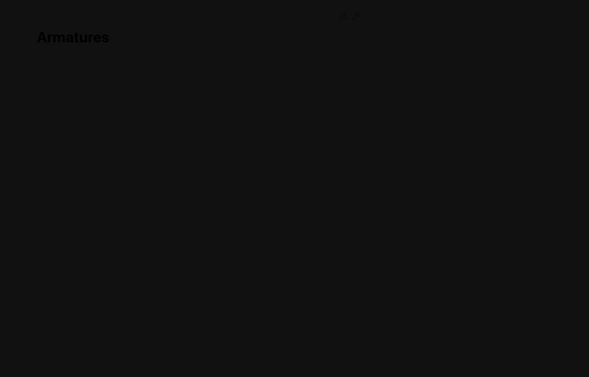
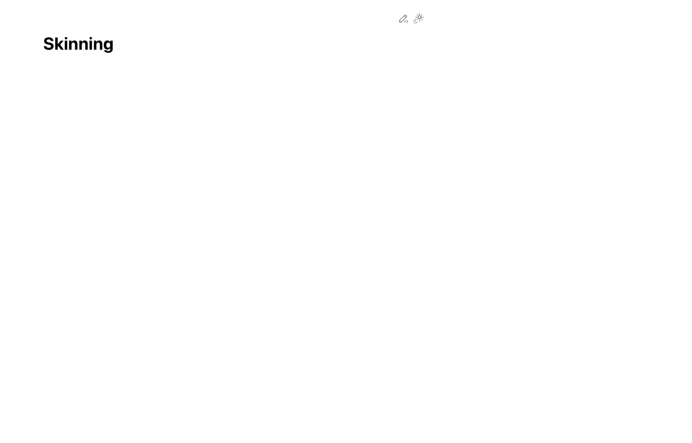

# Week 11: Rigging 기초

## 🔗 이전 주차 복습

> **Week 10의 Animation 개념을 복습하세요.**
>
> 이번 주에 배우는 리깅(Rigging)은 애니메이션의 **전 단계**입니다. 리깅이 완료되면 Pose Mode에서 Keyframe을 삽입하여 캐릭터 애니메이션을 만들게 됩니다. Week 10에서 배운 Keyframe 삽입(I 키), Graph Editor, 이징 개념을 다시 한번 확인하세요.
>
> - [Week 10: Animation 기초](../week10-animation/lecture-note.md)
> - 핵심 복습: Keyframe 삽입 (I 키) / Graph Editor에서 이징 조절 / Timeline에서 프레임 이동

## 학습 목표

- [ ] Armature와 Bone 구조를 이해하고 생성할 수 있다
- [ ] IK(Inverse Kinematics)와 FK(Forward Kinematics)의 차이를 이해한다
- [ ] Weight Painting의 개념을 이해하고 기초적인 조정을 할 수 있다
- [ ] 간단한 로봇 모델에 리깅을 적용하고 포즈를 잡을 수 있다

## 이론 (30분)

### 리깅(Rigging)이란?

- 3D 모델 안에 **뼈대(Armature)**를 넣어 메쉬를 움직이게 하는 시스템
- 현실 세계의 관절과 뼈를 디지털로 구현한 것
- 리깅 없이는 모델을 자연스럽게 움직일 수 없음
- 애니메이션의 필수 전 단계: 모델링 > 텍스처 > **리깅** > 애니메이션

### 캐릭터 리깅 vs 기계(Mechanical) 리깅

리깅 방식은 대상의 특성에 따라 크게 두 가지로 나뉜다.

**캐릭터 리깅:**
- 피부처럼 부드러운 변형 (Smooth Deformation)
- Weight Painting이 필수: 관절 주변에서 메쉬가 자연스럽게 구부러져야 함
- 팔꿈치를 구부리면 팔 메쉬 전체가 부드럽게 따라 변형
- 사람, 동물, 유기체 캐릭터에 적합

**기계/로봇 리깅:**
- 관절 기반, 파츠가 **독립적으로 회전** (Rigid Body)
- 각 파츠를 개별 Bone에 직접 연결 (Bone Parenting)
- Weight Painting이 간단하거나 불필요: 파츠 전체가 하나의 Bone에 100% 영향
- 로봇, 기계, 차량, 무기 등 딱딱한 오브젝트에 적합

> 이 수업에서는 로봇 리깅을 중심으로 진행하지만, 캐릭터 리깅 개념도 함께 이해한다.

### Armature 생성

- **Armature:** Bone(뼈)의 집합체, 뼈대 시스템 전체를 의미
- 생성 방법: Shift+A > Armature > Single Bone
- Armature는 Object Mode에서 하나의 오브젝트로 취급
- 내부의 각 Bone은 Edit Mode에서 편집

### Bone 구조

하나의 Bone은 다음 요소로 구성된다:

- **Head (Root):** Bone의 시작점 (둥근 끝)
- **Tail (Tip):** Bone의 끝점 (뾰족한 끝)
- **Body:** Head와 Tail을 잇는 팔 모양 본체
- **Roll:** Bone의 축 회전 각도 (Ctrl+R로 조정)
- Bone의 방향은 Head에서 Tail로 향함
- Bone의 크기는 시각적 표시일 뿐, 실제 영향 범위와 무관

### Parent-Child 관계

Bone 간의 계층 구조를 설정하여 연쇄적인 움직임을 만든다.

**Connected (연결):**
- Child Bone의 Head가 Parent Bone의 Tail에 물리적으로 연결
- Parent가 움직이면 Child가 자동으로 따라감
- 팔: 상완 > 하완 > 손처럼 이어지는 구조

**Free (자유):**
- Child Bone이 Parent Bone과 물리적으로 분리
- Parent가 움직이면 Child가 따라가지만, 위치가 고정되지 않음
- 어깨와 팔처럼 독립적인 회전이 필요한 경우

**설정 방법:**
- Edit Mode에서 Child Bone 선택 > Properties > Bone > Relations > Parent 설정
- 또는 Child 선택 후 Shift+클릭으로 Parent 선택 > Ctrl+P > Keep Offset / Connected

### Edit Mode에서 Bone 추가

- Bone의 Tail 선택 후 **E (Extrude):** 현재 Bone의 끝에서 연결된 새 Bone 생성
- Shift+A: 독립된 새 Bone 추가
- Bone 선택 후 **Subdivide:** 하나의 Bone을 여러 개로 분할
- **X / Delete:** 선택한 Bone 삭제
- Bone 이름은 Properties > Bone에서 변경 (좌우 대칭 시 .L / .R 접미사 활용)

### IK (Inverse Kinematics)

- **끝에서 당기면** 연결된 뼈가 자동으로 따라오는 방식
- 예: 손을 잡아당기면 팔꿈치와 어깨가 자동으로 회전
- 직관적이고 빠른 포징이 가능
- 컨트롤러(Target)를 움직여서 전체 체인을 조정
- 설정: Pose Mode에서 Bone 선택 > Bone Constraint > Inverse Kinematics

**IK 사용이 편리한 경우:**
- 팔: 손 위치를 지정하면 팔꿈치가 자동 조정
- 다리: 발 위치를 고정하면 무릎이 자동 조정
- 로봇 팔이 특정 위치를 잡아야 할 때

### FK (Forward Kinematics)

- **부모 뼈부터 하나씩 회전**하여 자식 뼈가 따라가는 방식
- 예: 어깨를 회전 > 팔꿈치를 회전 > 손목을 회전
- 각 관절의 각도를 정밀하게 제어 가능
- 추가 설정 없이 기본 동작 방식

**FK 사용이 편리한 경우:**
- 꼬리, 체인, 촉수처럼 흔들리는 구조
- 각 관절의 정확한 각도 제어가 필요할 때
- 애니메이션에서 물리적으로 정확한 움직임이 필요할 때

### IK vs FK 비교 정리

| 항목 | IK (Inverse Kinematics) | FK (Forward Kinematics) |
|------|------------------------|------------------------|
| 조작 방향 | 끝에서 시작으로 | 시작에서 끝으로 |
| 장점 | 직관적, 빠른 포징 | 정밀한 각도 제어 |
| 단점 | 예측 어려울 수 있음 | 하나씩 조정해야 함 |
| 추천 사용 | 팔, 다리 | 꼬리, 체인, 안테나 |
| 설정 | Constraint 추가 필요 | 기본 동작 (설정 불필요) |

### Weight Painting

- 각 Bone이 메쉬에 미치는 **영향 범위**를 색상으로 시각화
- **빨간색 (1.0):** Bone이 메쉬에 완전히 영향 (100%)
- **파란색 (0.0):** Bone이 메쉬에 영향 없음 (0%)
- **초록~노란색:** 중간 영향 (부분적 변형)
- Weight Paint 모드: 메쉬 선택 > Ctrl+Tab > Weight Paint (또는 모드 드롭다운에서 선택)

**캐릭터:**
- 관절 주변에 그라데이션으로 Weight 분배 (부드러운 변형)
- 정교한 Weight Painting이 결과물 품질을 크게 좌우

**로봇:**
- 각 파츠에 해당 Bone의 Weight를 1.0으로 설정 (전체 영향)
- 다른 Bone의 Weight는 0.0으로 설정 (영향 없음)
- 비교적 간단한 Weight Painting

### Pose Mode

- 리깅이 완료된 모델에 **포즈를 잡는 모드**
- Armature 선택 > Ctrl+Tab > Pose Mode (또는 모드 드롭다운)
- Bone을 선택하고 R(회전), G(이동)로 포즈 조정
- **Alt+R:** 선택한 Bone의 회전 초기화
- **Alt+G:** 선택한 Bone의 위치 초기화
- **A > Alt+R > Alt+G:** 전체 포즈 초기화 (Rest Pose로 복귀)

### Pose Library (Asset Browser 활용)

- 포즈를 저장하고 재사용할 수 있는 기능
- Blender 5.0에서는 Asset Browser를 통해 포즈를 관리
- Pose Mode에서 포즈 잡기 > Asset > Mark as Asset으로 포즈 저장
- 저장된 포즈를 Asset Browser에서 드래그하여 적용
- 여러 포즈를 저장해 두면 애니메이션 작업 시 효율적

## 실습 (90분)

### 간단한 로봇 팔 Armature 만들기 (20분)

#### Armature 생성 및 Bone 구조 설정

1. 새 Blender 파일 시작 (File > New > General)
2. 기본 Cube 삭제 (X)
3. Shift+A > Armature > Single Bone
4. Tab으로 Edit Mode 진입
5. 첫 번째 Bone 이름을 "Shoulder"로 변경 (Properties > Bone > Name)
6. Tail 선택 > E(Extrude)로 두 번째 Bone 생성 > 이름: "UpperArm"
7. 다시 Tail 선택 > E로 세 번째 Bone 생성 > 이름: "Forearm"
8. Tail 선택 > E로 네 번째 Bone 생성 > 이름: "Hand"

> **💡 프로 팁:** Bone 이름 규칙을 반드시 지키세요! 좌우 대칭 작업을 위해 `Upper_Arm.L`, `Upper_Arm.R` 형식으로 **.L / .R 접미사**를 붙이세요. 이 규칙을 따르면 Armature > Symmetrize 기능으로 한쪽만 만든 뒤 반대편을 자동 생성할 수 있습니다.

> **💡 프로 팁:** X-Ray 모드(Alt+Z)를 활성화하면 메쉬를 투과해서 Bone을 볼 수 있어 선택과 편집이 훨씬 편합니다. Armature 작업 시 항상 켜두는 것을 추천합니다.

#### Bone 위치 및 크기 조정

1. 각 Bone의 위치를 팔 구조에 맞게 배치
   - Shoulder: 몸통 옆, 수평 방향
   - UpperArm: 어깨에서 아래로
   - Forearm: 팔꿈치에서 아래로
   - Hand: 손목에서 짧게
2. Object Mode로 나가서 Armature의 Viewport Display > In Front 체크 (항상 보이도록)

#### 간단한 메쉬 만들기

1. Shift+A > Mesh > Cylinder로 상완 파츠 생성, 위치/크기 조정
2. 같은 방법으로 하완, 손 파츠를 각각 별도 Cylinder로 생성
3. 각 파츠의 이름을 지정: "UpperArm_Mesh", "Forearm_Mesh", "Hand_Mesh"

### 로봇 다리 Armature 만들기 (15분)

1. 기존 Armature를 선택 > Edit Mode 진입
2. Shift+A로 새로운 Bone 추가 (다리 시작점)
3. E로 Bone 연장:
   - "Hip" > "UpperLeg" > "LowerLeg" > "Foot"
4. 각 Bone을 다리 위치에 맞게 배치
5. 다리용 Cylinder 메쉬를 각 파츠별로 생성
6. 각 파츠 이름 지정: "UpperLeg_Mesh", "LowerLeg_Mesh", "Foot_Mesh"

### Bone에 메쉬 연결 (20분)

#### 방법 A: 기계 리깅 (Bone Parenting) - 로봇에 추천

1. Object Mode에서 메쉬 파츠 하나를 선택 (예: "UpperArm_Mesh")
2. Shift+클릭으로 Armature도 함께 선택 (Armature가 마지막 선택 = Active)
3. Ctrl+P > Armature Deform > With Empty Groups
4. 메쉬 선택 > Properties > Object Data > Vertex Groups에서 해당 Bone의 그룹 확인
5. Edit Mode에서 전체 버텍스 선택 (A) > Vertex Groups에서 해당 Bone 그룹 선택 > Assign (Weight 1.0)
6. 나머지 파츠도 같은 방법으로 각각의 Bone에 연결

#### 방법 B: Automatic Weights (캐릭터에 추천)

1. 모든 메쉬를 선택한 후 마지막으로 Armature 선택
2. Ctrl+P > Armature Deform > With Automatic Weights
3. Blender가 자동으로 각 Bone에 적절한 Weight를 할당
4. 결과가 완벽하지 않을 수 있으므로 Weight Painting으로 수정 필요

> **💡 프로 팁:** Weight Painting 후에는 반드시 **Weights > Normalize All**을 실행하세요. 이렇게 하면 한 버텍스에 대한 모든 Bone의 Weight 합이 1.0이 되어 예측하지 못한 변형을 방지할 수 있습니다.

### Weight Painting 확인 및 조정 (15분)

1. 메쉬 선택 > Ctrl+Tab > Weight Paint 모드 진입
2. Properties > Object Data > Vertex Groups에서 Bone별 Weight 그룹 확인
3. 각 Bone 그룹을 선택하면 해당 Bone의 Weight가 색상으로 표시됨
4. 로봇의 경우:
   - 각 파츠가 해당 Bone에만 빨간색(1.0)이어야 함
   - 다른 Bone에는 파란색(0.0)이어야 함
5. 문제가 있으면 브러시로 수정:
   - **Add 브러시:** Weight 값 증가 (더 많은 영향)
   - **Subtract 브러시:** Weight 값 감소 (더 적은 영향)
   - Weight: 1.0, Strength: 1.0으로 설정하면 한 번에 완전히 칠할 수 있음
6. Armature를 Pose Mode로 전환하여 Bone을 회전하면서 Weight가 올바른지 확인

### Pose Mode에서 포즈 잡아보기 (10분)

1. Armature 선택 > Ctrl+Tab > Pose Mode 진입
2. 팔 Bone을 선택하고 R로 회전하여 팔 들기 포즈
3. 다리 Bone을 선택하고 R로 회전하여 걷는 포즈
4. 여러 Bone을 조합하여 자연스러운 포즈 만들기
5. Alt+R로 개별 Bone 회전 초기화
6. A > Alt+R > Alt+G로 전체 포즈 초기화
7. 마음에 드는 포즈를 만들었으면 Viewport에서 스크린샷

### 간단한 포즈로 Keyframe 적용 (10분)

1. Pose Mode에서 첫 번째 포즈 잡기 (예: 차렷 자세)
2. Timeline에서 Frame 1로 이동
3. A로 모든 Bone 선택 > I > Location & Rotation으로 Keyframe 삽입
4. Frame 30으로 이동
5. 두 번째 포즈 잡기 (예: 팔을 든 자세)
6. 다시 I > Location & Rotation으로 Keyframe 삽입
7. Space로 재생하여 포즈 간 전환 애니메이션 확인
8. 부드러운 보간이 적용되어 자연스럽게 움직이는지 확인

## 핵심 정리

| 개념 | 핵심 내용 |
|------|----------|
| Armature | Bone의 집합체, 뼈대 시스템 |
| Bone | Head-Tail-Body-Roll로 구성된 개별 뼈 |
| 캐릭터 리깅 | 부드러운 변형, Weight Painting 중요 |
| 기계/로봇 리깅 | 파츠 독립 회전, Bone Parenting 활용 |
| IK | 끝에서 당기면 연쇄 자동 조정 (팔, 다리에 편리) |
| FK | 부모부터 하나씩 회전 (꼬리, 안테나에 편리) |
| Weight Painting | Bone이 메쉬에 미치는 영향 범위 시각화 |
| Pose Mode | 리깅된 모델에 포즈 잡기, R/G로 조작 |

### 핵심 단축키

| 단축키 | 기능 |
|--------|------|
| Shift+A > Armature | Armature 생성 |
| E (Edit Mode) | Bone Extrude (연장) |
| Ctrl+P | Parent 설정 (메쉬-Armature 연결) |
| Ctrl+Tab | 모드 전환 (Object/Edit/Pose/Weight Paint) |
| I (Pose Mode) | Keyframe 삽입 |
| Alt+R | Bone 회전 초기화 |
| Alt+G | Bone 위치 초기화 |
| R (Pose Mode) | Bone 회전 |

## 🆕 Blender 5.0 리깅 관련 변경사항

Blender 5.0에서는 리깅 워크플로우에 몇 가지 개선이 있습니다.

### Geometry Attribute Constraint

- Blender 5.0에서 도입된 새로운 Constraint로, Geometry Nodes의 Attribute를 기반으로 Bone을 제어할 수 있습니다
- 기존의 단순한 Parent-Child 관계를 넘어 **절차적(Procedural) 리깅**이 가능
- 이 수업의 범위를 넘지만, 관심 있는 학생은 Blender 공식 문서를 참고하세요

### Pose Library 개선 (Asset Browser)

- Blender 5.0에서는 Asset Browser가 개선되어 포즈 저장/관리가 더 직관적입니다
- Pose Mode에서 포즈를 잡고 > Asset > **Mark as Pose Asset**으로 저장
- 저장된 포즈는 Asset Browser에서 썸네일로 확인하고 드래그하여 적용 가능

### Bone Collections

- 이전 버전의 Bone Layers/Groups가 **Bone Collections**으로 통합되었습니다
- Properties > Armature > Bone Collections에서 관리
- Bone을 기능별로 그룹화하여 표시/숨김을 쉽게 전환할 수 있음 (예: 왼팔, 오른팔, IK 컨트롤러 등)

## ⚠️ 흔한 실수와 해결법

### 1. Apply Transform 없이 Parent 설정

- **문제:** Armature와 Mesh의 Scale이 (1, 1, 1)이 아닌 상태에서 Ctrl+P(Parent 설정)를 하면 메쉬가 엉뚱한 크기로 변형됨
- **해결:** Parent 설정 **전에** Armature와 Mesh **둘 다** 선택 > **Ctrl+A > All Transforms** 반드시 실행
- **확인:** N 패널 > Transform에서 Scale이 (1, 1, 1), Rotation이 (0, 0, 0)인지 확인

### 2. Bone 이름에 .L/.R 빠뜨림

- **문제:** 좌우 대칭 Bone에 ".L", ".R" 접미사를 안 붙이면 Symmetrize(대칭 복사) 기능을 사용할 수 없음
- **해결:** Bone 이름 끝에 반드시 **.L** 또는 **.R**을 붙이세요
  - 올바른 예: `Upper_Arm.L`, `Upper_Arm.R`, `Hand.L`, `Hand.R`
  - 잘못된 예: `Left_Arm`, `Arm_Left`, `ArmL`
- **팁:** 한쪽(.L)만 먼저 완성한 뒤 Edit Mode > Armature > **Symmetrize**로 반대편을 자동 생성

### 3. With Automatic Weights 실패

- **문제:** Ctrl+P > Armature Deform > With Automatic Weights를 실행했는데 "Bone Heat Weighting: Failed to find solution" 에러 발생
- **원인:** 메쉬에 구멍이 있거나, Non-Manifold 엣지가 있거나, 겹치는 Face가 있는 경우
- **해결 방법:**
  1. 메쉬 선택 > Edit Mode > Mesh > Clean Up > **Delete Loose** (떠돌아다니는 버텍스/엣지 제거)
  2. Select > All by Trait > **Non Manifold** (문제 부분 찾기)
  3. 구멍이 있으면 **F 키**로 Face 채우기
  4. 겹치는 Face: Mesh > Clean Up > **Merge by Distance** (거리 기준 버텍스 병합)
- **대안:** Automatic Weights가 안 되면 **With Empty Groups**로 연결 후 직접 Weight Painting

### 4. Weight Painting에서 Normalize 미적용

- **문제:** 한 버텍스에 여러 Bone의 Weight가 합산되어 1.0을 초과하면 예측하지 못한 변형 발생
- **해결:** Weight Paint 모드에서 **Weights > Normalize All** 실행
- **팁:** Weight Painting 할 때 헤더 바의 **Auto Normalize** 옵션을 켜두면 자동으로 정규화됨

### 5. Pose Mode에서 Bone이 선택 안 됨

- **문제:** Armature를 선택했는데 Pose Mode로 전환이 안 되거나, Bone이 클릭해도 선택되지 않음
- **해결:** Object Mode에서 **Armature 오브젝트를 먼저 선택**한 뒤 Ctrl+Tab 또는 모드 드롭다운에서 Pose Mode 진입
- **팁:** Mesh가 선택된 상태에서는 Pose Mode로 전환할 수 없음. 반드시 Armature를 선택

## 📋 프로젝트 진행 체크리스트

이번 주 실습 완료 후 아래 항목을 확인하세요.

### Armature 생성
- [ ] 기본 Armature 생성 완료 (팔: Shoulder > UpperArm > Forearm > Hand)
- [ ] 다리 Bone 추가 완료 (Hip > UpperLeg > LowerLeg > Foot)
- [ ] 모든 Bone에 의미 있는 이름을 부여했는가
- [ ] 좌우 대칭 Bone에 .L / .R 접미사를 붙였는가

### Bone-Mesh 연결
- [ ] Apply Transform(Ctrl+A)을 Armature와 Mesh 모두에 적용했는가
- [ ] Bone Parenting 또는 Automatic Weights로 메쉬를 Armature에 연결했는가
- [ ] Weight Painting이 올바른지 확인했는가 (로봇: 각 파츠에 1.0, 나머지 0.0)

### Pose 테스트
- [ ] Pose Mode에서 각 Bone을 회전하여 메쉬가 올바르게 따라오는지 확인
- [ ] 관절 부분에서 메쉬가 찢어지거나 이상하게 변형되지 않는지 확인
- [ ] Alt+R / Alt+G로 포즈 초기화가 정상적으로 되는지 확인
- [ ] 최소 2가지 이상의 포즈를 잡아 스크린샷 저장

### 추가 (선택)
- [ ] IK Constraint를 팔 또는 다리에 적용해 보았는가
- [ ] Pose Library(Asset Browser)에 포즈를 저장해 보았는가

## 다음 주 예고

**Week 12: AI 활용 리깅 (Mixamo)**
- Adobe Mixamo를 활용한 자동 리깅
- 2000+ 무료 애니메이션 라이브러리 활용
- NLA Editor로 여러 애니메이션 조합
- 복잡한 리깅 작업을 AI로 자동화하여 시간 절약

> 준비: Adobe 계정 가입 (무료) - https://mixamo.com

<!-- AUTO:CURRICULUM-SYNC:START -->
## 커리큘럼 연동 요약

> 이 섹션은 `course-site/data/curriculum.js` 기준으로 자동 갱신됩니다.

- 핵심 키워드: Armature · 본 구조 · 웨이트 페인팅
- 예상 시간: ~3시간

### 실습 단계

#### 1. Armature 추가

인형에 철사 뼈대를 넣는 것처럼, 메쉬 안에 Bone(뼈)을 만들어요. 뼈를 움직이면 연결된 메쉬도 따라와요.

배울 것

- Armature 구조를 이해한다

체크해볼 것

- Shift+A → Armature → Single Bone
- Edit Mode로 본 추가 (E로 Extrude)

#### 2. 메쉬 연결

메쉬(피부)와 Armature(뼈대)를 연결하는 거예요. Ctrl+P로 붙여놓으면 본을 움직일 때 메쉬도 따라와요.

배울 것

- Armature Parent의 개념을 이해한다

체크해볼 것

- Mesh → Armature 순서로 선택
- Ctrl+P → With Automatic Weights
- Pose Mode에서 본 회전해보기 (R키)

### 핵심 단축키

- `Shift + A → Armature`: 뼈대 추가
- `Ctrl + P`: Armature Deform 연결
- `E`: Bone 확장 (Edit Mode)
- `Alt + P`: Parent 해제
- `Ctrl + Tab`: Pose Mode 전환

### 과제 한눈에 보기

- 과제명: 기본 캐릭터 리깅
- 설명: 간단한 캐릭터 메쉬에 Armature를 연결하고 포즈 3가지를 스크린샷으로 제출합니다.
- 제출 체크:
  - 포즈 3가지 스크린샷
  - 리깅된 .blend 파일

### 자주 막히는 지점

- Weight Paint가 이상 → Automatic Weights 재설정

### 공식 문서

- [Armatures](https://docs.blender.org/manual/en/latest/animation/armatures/index.html)
- [Skinning](https://docs.blender.org/manual/en/latest/animation/armatures/skinning/index.html)
- [Weight Paint](https://docs.blender.org/manual/en/latest/sculpt_paint/weight_paint/index.html)
<!-- AUTO:CURRICULUM-SYNC:END -->
